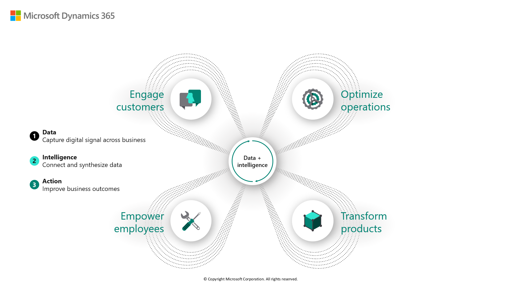


Dynamics 365 business applications allow organizations to digitally transform their organization. They remove the complexity of separate customer relationship management (CRM) and enterprise resource management (ERP) systems by creating modern, modular business applications that work together on a single platform. The applications give organizations the flexibility to adopt technology when they need it to improve business outcomes.

Digital transformation is the integration of digital technology into all areas of a business. The goal of digital transformation is to change how organizations operate and deliver value to customers.

 

|  |  |
| ------------ | ------------- | 
|  | Watch this video to see Microsoft Corporate Vice President James Phillips explain digital transformation. |

> [!VIDEO https://www.microsoft.com/videoplayer/embed/RE4kn34]

### The digital feedback loop

The digital feedback loop is what we call the framework we use to highlight how digital transformation is enabled. At the center of the framework is data. Data is coming out of everything. Every single product at this point is being wired up with telemetry and the ability to collect data. For example, the thermostat at your house knows when you're changing the temperature.

To disrupt and innovate, industries must adopt a strategy that connects their customers, employees, products, and operations as effectively as possible. Organizations need to streamline their business to respond to customer demands, and pool data across the organization so that analytics can help provide insights. 

By taking advantage of Dynamics 365 business applications, organizations can:

- **Engage customers and build relationships:** Fundamentally reimagine how you engage with customers by creating personalized marketing, sales, and service experiences using data and intelligence to improve every interaction.
- **Optimize operations:** Improve service, drive efficiency, and reduce costs with intelligence and prescriptive guidance infused throughout your business processes. 
- **Empower employees:** Hire, engage, and unleash the best talent to do their best work with data and insights surfaced right where they work. 
- **Transform products and services:** Use data as a strategic asset to identify new market opportunities, produce innovative products, and create exceptional customer experiences with a comprehensive view of your customers and operations.

The following image shows how the digital feedback loop helps empower employees, engage customers, optimize operations, and transform products.

> [!div class="mx-imgBorder"]
> 

|  |  |
| ------------ | ------------- | 
|  | Watch this video to see Microsoft Corporate Vice President James Phillips explain how Microsoft apps are purpose-built to support the digital transformation.

> [!VIDEO https://www.microsoft.com/videoplayer/embed/RE4kn35]

Now that we’ve reviewed Microsoft's view of digital business transformation, let’s review at how business applications can help drive your digital transformation.
