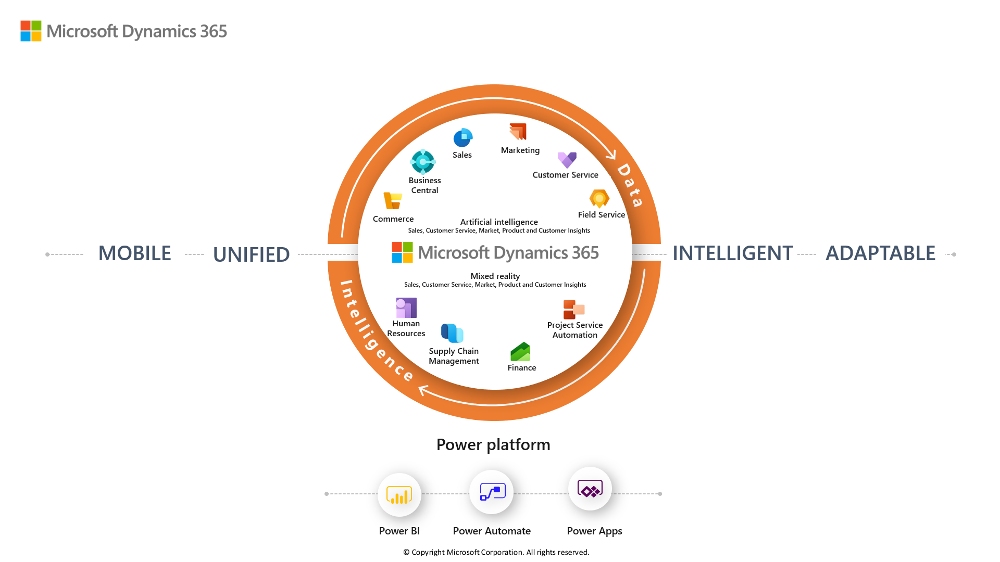

The following graphic shows Microsoft Dynamics 365 built on Power Platform with shared data and intelligence.

> [!div class="mx-imgBorder"]
> ‎

### Model-driven apps 

These Dynamics 365 apps are derived from Customer Relationship Management (CRM). These Dynamics apps are model-driven apps built on the Microsoft Dataverse platform.

- **Dynamics 365 Sales** enables you to build strong relationships with your customers, take actions based on insights, and close sales faster. Use Sales to keep track of your accounts and contacts, nurture your sales from lead to order, create sales collateral, and create marketing lists and campaigns. You can even follow service cases associated with specific accounts or opportunities. 
- **Dynamics 365 Customer Service** allows you to earn customers for life. Build great customer relationships by focusing on excellent customer satisfaction with the Customer Service app. Customer Service provides many features and tools that help you manage the services you provide to customers. 
- **Dynamics 365 Field Service** helps you deliver onsite service to customer locations. The application combines workflow automation, scheduling algorithms, and mobility to set up mobile workers for success when they're onsite with customers fixing issues.
- **Dynamics 365 Marketing** is a marketing-automation application that helps turn prospects into business relationships. The app is easy to use, works seamlessly with Dynamics 365 Sales, and has built-in business intelligence. Use Marketing to create graphical email messages, share information across sales and marketing teams, and more. 

### Finance and Operations apps

These Dynamics 365 applications are derived from Enterprise Resource Planning (ERP).

- **Dynamics 365 Commerce** (formerly Dynamics 365 Retail) delivers a comprehensive omnichannel solution that unifies back-office, in-store, call center, and digital experiences. Commerce enables you to build brand loyalty through personalized customer engagements, increase revenue with improved employee productivity, optimize operations to reduce costs and drive supply chain efficiencies.
- **Dynamics 365 Finance** helps you automate and modernize your global financial operations. Monitor performance in real time, predict future outcomes, and make data-driven decisions to drive business growth. Use Finance to drive strategic financial decisions with artificial intelligence, unify and automate your financial processes, reduce operational expenses, and decrease global financial complexity and risk.
- **Dynamics 365 Human Resources** (formerly Dynamics 365 Talent) streamlines many recordkeeping tasks and automates several staffing processes. These processes include employee retention, benefits administration, training, performance reviews, and change management. Human Resources also provides a framework for human resources staff to manage areas of oversight.
- **Dynamics 365 Supply Chain Management** helps you transform your manufacturing and supply chain operations. Use predictive insights and intelligence from artificial intelligence (AI) and the Internet of Things (IoT) across planning, production, inventory, warehouse, and transportation management. Supply Chain Management can maximize operational efficiency, product quality, and profitability. Use Supply Chain Management to innovate with intelligent manufacturing operations, modernize warehouse management, optimize production performance, maximize the life of your assets, and automate and streamline your supply chain.

### Business Central

- **Dynamics 365 Business Central** is a business management solution for small and mid-sized organizations that automates and streamlines business processes and helps you manage your business. Highly adaptable and rich with features, Business Central enables you to manage your business processes, including finance, manufacturing, sales, shipping, project management, services, and more.

The following products will also be discussed in this course and support Dynamics 365 business applications.

- **Adobe Experience Cloud** delivers exceptional customer experiences. Transform the customer journey and improve sales and marketing return on investment (ROI) when you combine Microsoft Dynamics 365 with Adobe Experience Cloud solutions.
- **AI Builder** allows everyone to work with AI. Give everyone in your organization—whatever their technical experience is—the ability to add AI capabilities to the apps they create and use.
- **Azure DevOps** is a compound of development (Dev) and operations (Ops). DevOps is the union of people, process, and technology to continually provide value to customers. DevOps enables formerly siloed roles—development, IT operations, quality engineering, and security—to coordinate and collaborate to produce better, more reliable products. By adopting a DevOps culture along with DevOps practices and tools, teams gain the ability to better respond to customer needs, increase confidence in the applications they build, and achieve business goals faster.
- **Dynamics 365 Customer Insights** uses an intuitive and flexible customer data platform (CDP) to unlock insights and power personalized customer experiences. Unify all your customer data across the full range of sources to get a single view of customers.
- **Dynamics 365 Customer Voice** lets you capture, analyze, and act on customer and employee feedback with a simple, yet powerful, enterprise survey solution.
- **Dynamics 365 Fraud Protection** helps protect your e-commerce business—and your customers—against fraud to help drive down costs, achieve higher revenue, and improve your customers’ shopping experience.
- **Dynamics 365 Remote Assist** helps you work together from anywhere. Allow technicians to collaborate more efficiently by working together from different locations with Remote Assist on HoloLens, Android, or iOS devices.
- **Dynamics 365 Virtual Agent for Customer Service** provides exceptional customer service with intelligent, adaptable virtual agents. Enable customer service experts to easily create and enhance bots with AI-driven insights.

- **LinkedIn Sales Navigator** unifies the selling experience around relationships. Microsoft Relationship Sales brings together LinkedIn Sales Navigator and Microsoft Dynamics 365 Sales to empower your sellers to drive more personalized and meaningful engagement with buyers.
- **Power Apps portals** allow anyone—either inside or outside your organization—to interact with Dataverse data using portals.
- **Power BI** enables everyone at every level of your organization to make confident decisions using up-to-the-minute analytics.

Now that we’ve reviewed the Microsoft applications that we'll cover in this course, let’s explore how AI supports Microsoft Business Applications.