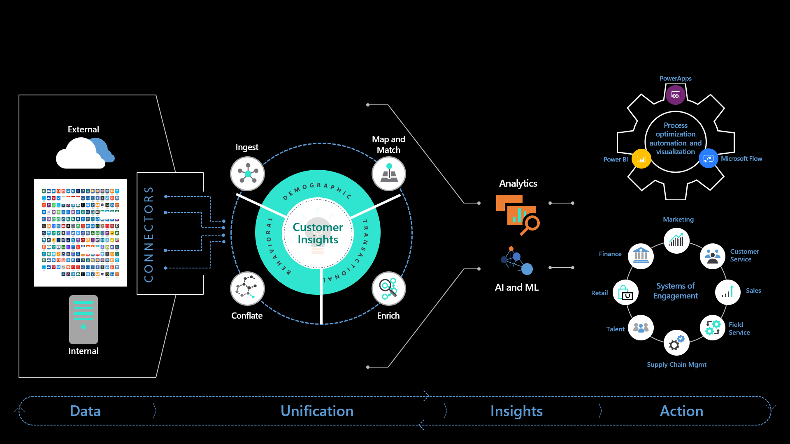
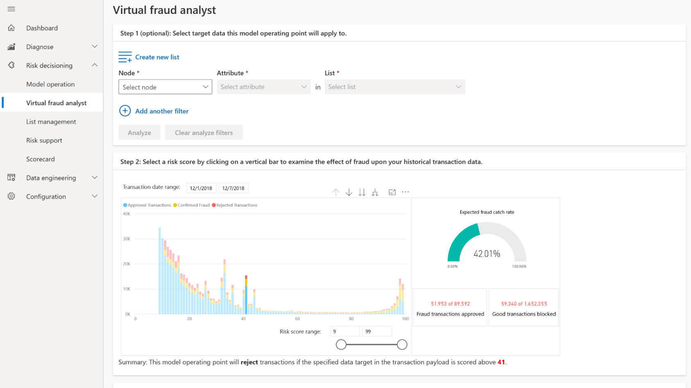
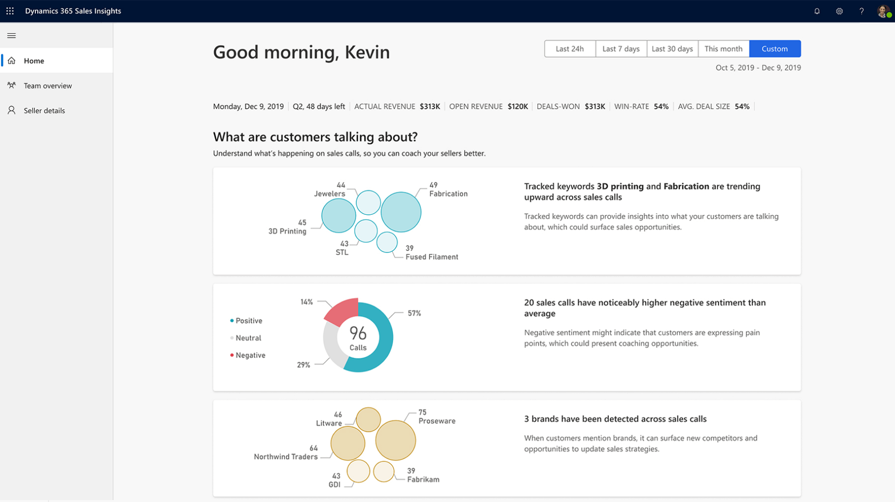
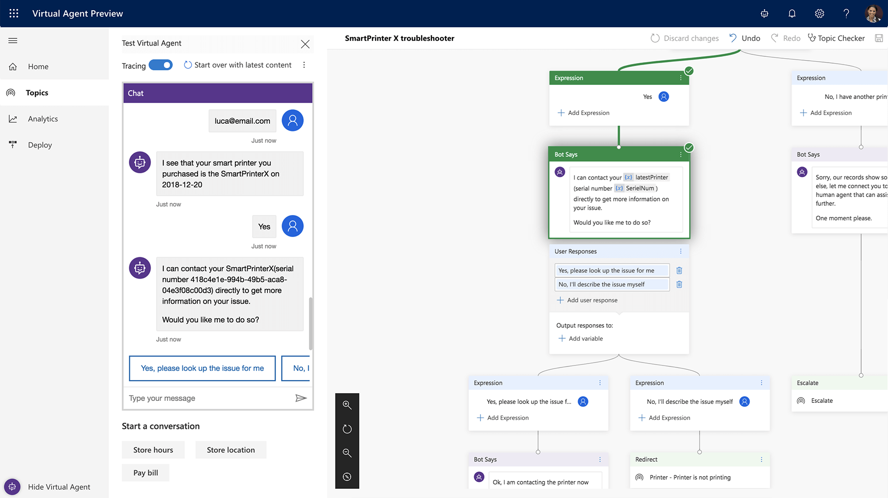
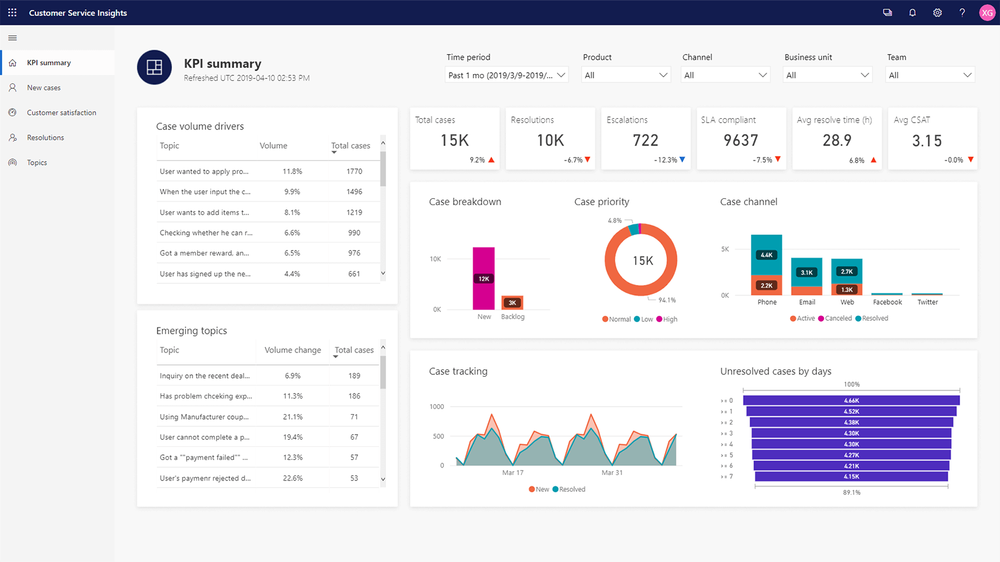

Artificial intelligence (AI) is a set of algorithms that computers use to analyze data and make a conclusion. In some situations, the AI can train itself. The AI can arrive at a conclusion that's based on available data. In other situations, you can train the AI continually with repeated feedback and fine-tuning. The more data the computer has, the more it can make discrete or fine-tuned assumptions. You can then act on those assumptions and conclusions, or you can edit further.

The following image shows how AI runs on Microsoft Dataverse to support Dynamics 365. 

 

Another way of looking at AI is through reasoning, understanding, and interacting:

* **Reasoning:** AI takes lot of data and adds logic so that you can understand and make decisions based on that data. For example, given performance data, AI could learn to find warning signs that a piece of equipment is likely to fail. AI continues to learn and become more accurate over time as you keep feeding it more data.
* **Understanding:** AI enables us to understand and interpret the data of our environment and our world. For example, it helps us find the meaning of text, speech, and images.
* **Interacting:** AI extends human ingenuity and lowers barriers between humans and machines. It allows machines to communicate with humans in a more natural way by recognizing human speech patterns.

When you verbally ask your phone to set a morning alarm, you're using AI.

In the phone example, AI is using natural language understanding. From your speech, the computer understands what you are trying to do and acts. You phone confirms the time you want to wake up and then configures the alarm.

In the streaming service example, AI is using machine learning. The streaming service bases the movie suggestion on your viewing history and all the variables that might influence the suggestion including:

- The type of movie.
- The actors.
- How you rated similar movies.
- What other viewers with a similar movie-viewing experience watch next.
- What you choose not to watch.

In both these cases, the computation that takes place is too complex for a simple set of algorithms.

Every organization can take advantage of pre-built AI services to bring more knowledge to each employee. You can also take advantage of a conversational AI platform with pre-built AI services to power digital agents and bring knowledge to customers. When optimizing business processes with AI, you can use packaged source solutions or create a custom AI solution. When bringing AI to every employee, you need to understand both how employees consume AI, and how new AI models have the potential to turn all employees into data scientists.

**AI Builder** gives everyone in your organization—whatever their technical experience—the ability to add AI capabilities to the apps they create and use. The no code/low code AI is part of the Microsoft Power Platform and requires using the Dataverse.

### AI in Dynamics 365

By using the Dynamics 365 AI, businesses get in-depth insights and can make each touchpoint more relevant and responsive with data-driven insights into customer needs and behaviors.

In Dynamics 365 Commerce, Dynamics 365 Fraud Protection uses AI to protect your e-commerce business—and your customers—against fraud. This protection helps drive down costs, achieve higher revenue, and improve your customers’ shopping experience.

The following screenshot shows the AI supported Dynamics 365 Fraud Protection interface.

> [!div class="mx-imgBorder"]
> 
 
In Dynamics 365 Sales, Dynamics 365 Sales Insights uses AI to increase sales and improve decisions. With AI-powered insights, you can win more deals by enhancing each customer interaction, sales activity, and business decision with sales intelligence.

The following screenshot shows the AI supported Dynamics 365 Sales Insights interface.

> [!div class="mx-imgBorder"]
> 

 
In Dynamics 365 Customer Service, Dynamics 365 Virtual Agent for Customer Service uses AI to provide exceptional customer service with intelligent, adaptable virtual agents. Enable customer service experts to create and enhance bots with AI-driven insights to drive productivity.

The following screenshot shows the AI supported Dynamics 365 Virtual Agent for Customer Service interface.

In Dynamics 365 Customer Service, Dynamics 365 Customer Service Insights uses AI to make better decisions and proactively improve customer satisfaction.

The following screenshot shows the AI supported Dynamics 365 Customer Service Insights interface.

> [!div class="mx-imgBorder"]
> 

In Dynamics 365 Sales, Dynamics 365 Marketing, and Dynamics 365 Customer Service, Dynamics 365 Customer Insights uses AI to create an intuitive and flexible customer data platform (CDP) that unlocks insights and powers personalized customer experiences. Unify all your customer data across the full range of sources to get a single view of customers. 

The following screenshot shows the AI supported Dynamics 365 Customer Insights interface.

> [!div class="mx-imgBorder"]
> 

Now that we’ve explored artificial intelligence (AI), let’s review how mixed reality (MR) blends the physical and digital worlds to support business applications.