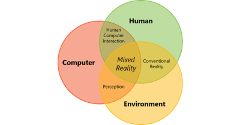
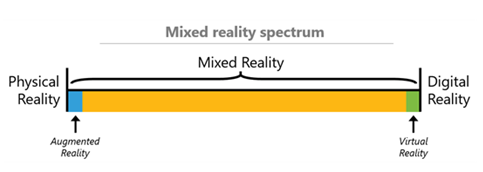
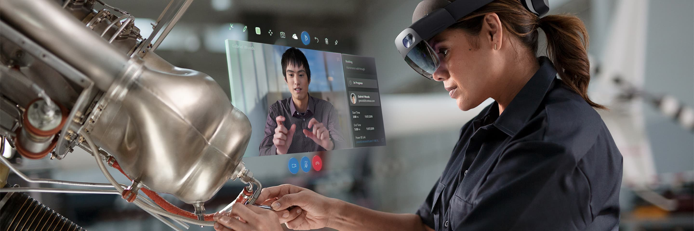
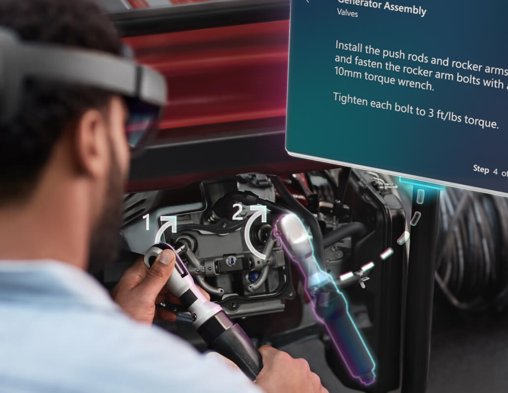
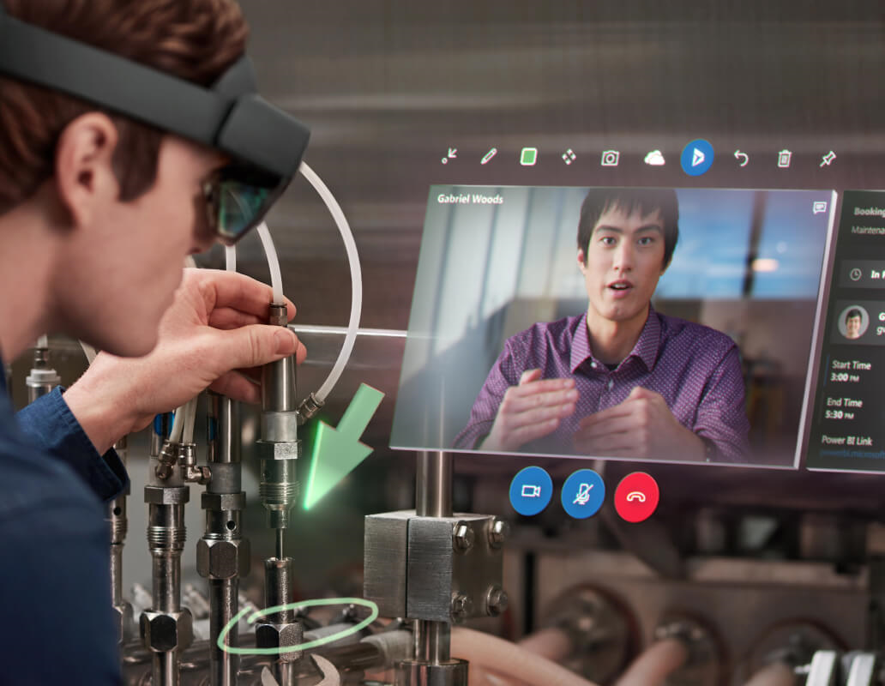


Mixed reality is the result of blending the physical world with the digital world. It's the next evolution in human, computer, and environmental interaction and unlocks possibilities that before now was in our imaginations. It's made possible by advancements in computer vision, graphical processing power, display technology, and input systems.

There are three main components of mixed reality: human input, computer processing, and environmental input. We collect human input through human-computer interaction (HCI). Human input happens through a variety of means such as keyboards, mice, touch, ink, voice, and even Kinect skeletal tracking. The interaction between computer and environments is referred to as perception. We create perception by capturing environmental input such as head tracking, surfaces (spatial mapping), boundaries (spatial understanding), ambient lighting, environmental sound, object recognition, and location.

The following graphic shows how humans, the environment, and computer processing interact. 

> [!div class="mx-imgBorder"]
> 

Combining HCI with perception provides the opportunity to create true mixed reality experiences. Movement that happens in the physical world translates to movement in the digital world. Boundaries in the physical world influence application experiences, such as game play or object placement, in the digital world. 
 
Since mixed reality blends both physical and digital worlds, these two realities define the polar ends of what we refer to as the mixed reality spectrum. On the left-hand side, we have physical reality in which we, humans, exist; on the right-hand side, we have the corresponding digital reality.

The following graphic shows the mixed reality spectrum.

> [!div class="mx-imgBorder"]
> 

- **Near physical reality**: Users remain present in their physical environment and are never made to believe they have left that environment.
- **Fully mixed reality**: These experiences blend the real world and the digital world. 
- **Near digital reality**: Users experience a fully digital environment and are unaware of what occurs in the physical environment around them.
	 
Microsoft’s mixed reality strategy focuses on fully mixed reality. We want to provide a fully immersive mixed reality experience where users can solve real world problems. These experiences might come in the form of augmented training experiences, virtual product design, or virtual collaboration with colleagues.

- **Holographic devices**: These devices are characterized by the device's ability to place digital content in the real world like Microsoft Hololens.
- **Immersive devices**: These devices are characterized by the device's ability to create a sense of presence—hiding the physical world and replacing it with a digital experience. 
	 
Often, it's best to think what type of experience an application or game developer wants to create. The experiences will typically target a specific point or part on the spectrum. 

Dynamics 365 apps have several tools available for collaboration in mixed reality:

 - **Microsoft HoloLens** 
 - **Dynamics 365 Guides**
 - **Dynamics 365 Remote Assist**

### Microsoft HoloLens

By using Microsoft HoloLens, employees can work smarter, view mixed reality, troubleshoot, repair, and perform with confidence and speed. 

They can move freely and pull critical information into view and stay focused on the task, with their hands free to do the work. 

The following image shows a technician with HoloLens using mixed reality.

### Dynamics 365 Guides

Improve training effectiveness and understand how employees are performing with Dynamics 365 Guides—the mixed reality tool for learning.

The following image shows a technician with HoloLens using Guides.

 

### Dynamics 365 Remote Assist

Help employees work together even when they’re worlds apart. Dynamics 365 Remote Assist is the mixed reality tool for instant collaboration.

The following image shows a technician with HoloLens using Remote Assist.

 

Now that we’ve explored the range of Microsoft business applications, let’s review how much of this module you remember with a quick knowledge check.
