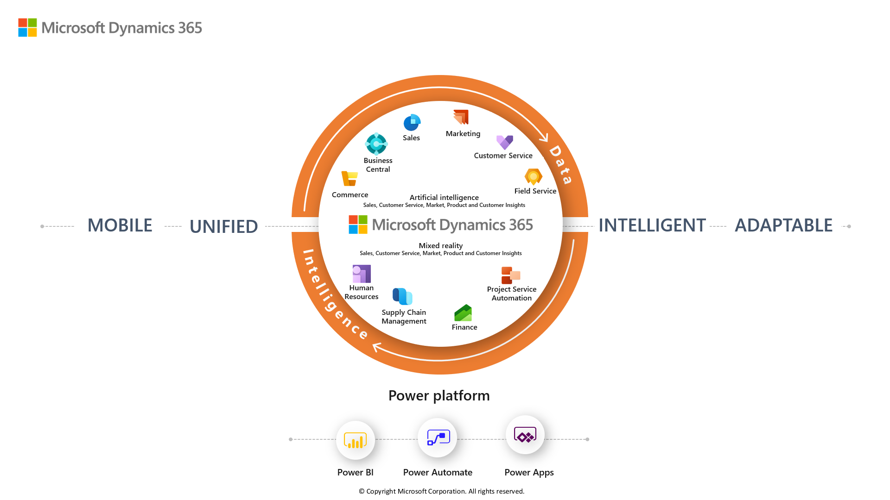

In this module, you were introduced to some of the key capabilities and features available as part of Microsoft Dynamics 365. This introduction included a discussion about the digital transformation and the need to create modern, modular business applications that work together on a single platform. Finally, you learned about the different business applications available as part of customer engagement, finance and operations, and the Power Platform. 

The following graphic shows Microsoft Dynamics 365 built on Microsoft Power Platform with shared data and intelligence. 

> [!div class="mx-imgBorder"]
> 

### Resources
**Dynamics 365**

- Go to the [Microsoft Dynamics 365](https://dynamics.microsoft.com/) home page to learn more.

- Read [Dynamics 365](https://dynamics.microsoft.com/customer-stories/) success stories. 

- Follow the [Dynamics 365 Team Blog ](https://community.dynamics.com/365/b/365teamblog) to stay up to date.

- Read the [Dynamics 365 Documentation](https://docs.microsoft.com/dynamics365/) learn more.

- Plan your [Dynamics 365 Events](https://dynamics.microsoft.com/events/).

- Join the [Dynamics 365 Community](https://community.dynamics.com/) to share your views.

- Review the [Dynamics 365 YouTube Channel](https://www.youtube.com/channel/UCJGCg4rB3QSs8y_1FquelBQ) to see demonstrations. 

 **Model-driven apps**

- Read the [Microsoft Dynamics 365 Sales](https://docs.microsoft.com/dynamics365/sales-enterprise/help-hub/) documentation to learn more.

- Read the [Microsoft Dynamics 365 Marketing](https://docs.microsoft.com/dynamics365/marketing/help-hub/) documentation to learn more.

- Read the [Microsoft Dynamics 365 Customer Service](https://docs.microsoft.com/dynamics365/customer-service/help-hub/) documentation to learn more. 

- Read the [Microsoft Dynamics 365 Field Service](https://docs.microsoft.com/dynamics365/field-service/user-guide/) documentation to learn more.

**Finance and Operations apps**

- Read the [Microsoft Dynamics 365 Human Resources](https://docs.microsoft.com/dynamics365/talent/talent-welcome/) documentation to learn more.

- Read the [Microsoft Dynamics 365 Commerce](https://docs.microsoft.com/dynamics365/retail/index/) documentation to learn more.

- Read the [Microsoft Dynamics 365 Finance](https://docs.microsoft.com/dynamics365/finance/index/) documentation to learn more. 

- Read the [Microsoft Dynamics 365 Supply Chain Management](https://docs.microsoft.com/dynamics365/supply-chain/index/) documentation to learn more.

**Business Central**

- Read the [Microsoft Dynamics 365 Business Central](https://docs.microsoft.com/dynamics365/business-central/index/) documentation to learn more.

 **Artificial intelligence**

- Follow the [AI for Business Applications Team Blog](https://blogs.microsoft.com/blog/2018/09/18/announcing-new-ai-and-mixed-reality-business-applications-for-microsoft-dynamics/?azure-portal=true) to stay up to date.

- Follow the [AI and Retail Team Blog](https://blogs.microsoft.com/blog/2019/09/23/announcing-new-microsoft-dynamics-365-ai-driven-insights-applications-and-our-vision-for-the-future-of-retail/?azure-portal=true) to stay up to date.

**Mixed reality**

- Read the [Microsoft HoloLens](https://docs.microsoft.com/hololens/) documentation to learn more. 

- Read the [Mixed reality](https://dynamics.microsoft.com/mixed-reality/overview) website to learn more.

- Read the [Mixed reality](https://docs.microsoft.com/dynamics365/mixed-reality) documentation to learn more.
