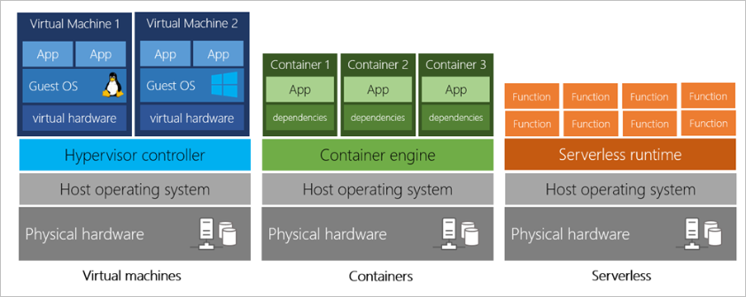

The goal of cloud computing is to make running organizations easier by allowing them to focus on what they do and what they’re best at. Cloud providers deliver the purchasing, support, and maintenance of computing resources as a service. Now organizations are free from the need to manage their computing facilities, and can focus their energy, time, and resources more fully on their strategic objectives.

Think of cloud computing as renting resources, including storage space, CPU cycles, or another company's computers. You typically don't pay a fixed amount and pay only for the cloud services you use.  This situation helps you lower your operating costs, run your infrastructure more efficiently, and scale as your business needs change. Every business is unique and has different needs. To meet those needs, cloud computing providers offer a wide range of services.

Companies providing these services are referred to as cloud providers. Some example providers include Amazon, Google, and Microsoft. 

Microsoft is a leading global provider of cloud computing services for businesses of all sizes. Microsoft’s cloud computing service is flexible and cost-efficient, helping every business, whether it's a small start-up or a large enterprise.

The cloud provider handles the physical hardware required to execute your work, and for keeping it up to date. The computing services offered tend to vary by cloud provider. 
However, typically they include: 
- **Compute power**: Microsoft Azure servers and Dynamics 365 business applications.
- **Storage**: Files and databases.
- **Networking**: Secure connections between the cloud provider and your company.
- **Analytics**: Through performance data and telemetry visualizations.

In the next section, we will discuss briefly the two most common services that all cloud providers offer, namely compute power and storage.

## Compute power

When sending an email via Microsoft Outlook via a browser or perhaps when calling in to hear your messages, you're interacting with cloud-based servers that are processing each request and returning a response. 

As consumers, we're all dependent on the computing services provided by the various cloud providers that make up the internet.

When you build solutions using cloud computing, you can choose how you want work to be done, based on your resources and needs. When considering control over resources, there are three popular options: virtual machines (VM), containers, and serverless computing.
- **Virtual machines**: A VM is an emulation of a computer just like your desktop or laptop you're using now. Each VM includes an operating system and hardware that appears to the user like a physical computer running Microsoft Windows or other operating systems such as Linux. You can then install whatever software you need to do the tasks you want to run in the cloud.
   
   The difference is that you don't have to buy the hardware or install the operating system (OS). The cloud provider runs your virtual machine on a physical server in one of their datacenters, often sharing that server with other isolated and secure VMs. With the cloud, you can have a VM ready to go in minutes and at a cost less than a physical computer.
- **Containers** provide a consistent, isolated execution environment for applications. They're like VMs, except they don't require a guest operating system. Instead, the application and all its dependencies are packaged into a container, and then an environment is used to execute the app. This configuration allows the container to start up in just a few seconds, because there's no OS to boot and initialize. You only need the app to launch.
- **Serverless computing** lets you run application code without creating, configuring, or maintaining a server. The idea is that your application is broken into separate functions that run when triggered by some action. This configuration is ideal for automated tasks. For example, you can build a serverless process that automatically sends an email confirmation after a customer makes an online purchase.
   
   The serverless model differs from VMs and containers in that you only pay for the processing time used by each function as it executes. VMs and containers have costs while they're running, even if the applications on them are idle. The serverless architecture doesn't work for every application, but when the app logic can be separated into independent units, you can test and update the units separately, and launch them in microseconds, making this approach the fastest option for redeployment.
   
   The following graphic illustrates the three types of cloud computing solutions.

> [!div class="mx-imgBorder"]
>   

## Storage

The advantage to using cloud-based data storage is you can scale to meet your needs. If you find that you need more space to store your video clips, you can pay a little more and add to your available space. In some cases, the storage can even expand and contract automatically, so you pay for exactly what you need at any given point in time.

Most devices and applications read and/or write data. Here are some examples:
- Looking up the price of an online item (website is hosted on VM1).
- Sending an email.
- Leaving a voicemail.
- Storing video clips (save video clips on VM2).

In all these cases, data is either read (looking up a price), written (leaving a voice message), or visual (watch a video clip). The type of data and the format it's stored in can be different in each of these cases. Cloud providers typically offer services that can handle all these types of data.

Now, let's review cloud computing services..
