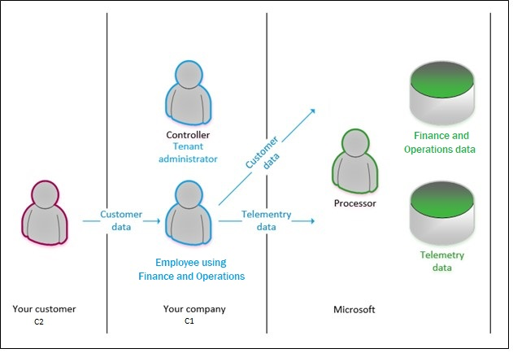

When selecting a cloud provider to host your solutions, you should also understand how that provider can help you follow your industry’s regulations and standards. Some questions to ask a potential provider include:

- How compliant is the cloud provider when it comes to handling sensitive data?
- How compliant are the services offered by the cloud provider?
- How can I deploy my own cloud-based solutions to scenarios that have accreditation or compliance requirements?
- What terms are part of the privacy statement for the provider?

## Compliance offerings

 Some of the compliance offerings include: 

* **Criminal Justice Information Services (CJIS)**: Any US state or local agency that wants to access the FBI's CJIS database is required to adhere to the CJIS Security Policy. Azure is the only major cloud provider that contractually commits to conformance with the CJIS Security Policy. The policy commits Microsoft to adhere to the same requirements that law enforcement and public safety entities must meet.
* **Cloud Security Alliance (CSA) STAR Certification**: Azure, Intune, and Microsoft Power BI have obtained STAR Certification, which involves a rigorous independent third-party assessment of a cloud provider's security posture. This STAR certification is based on achieving ISO/IEC 27001 certification and meeting criteria specified in the Cloud Controls Matrix (CCM). This certification demonstrates that a cloud service provider:

    -    Conforms to the applicable requirements of ISO/IEC 27001.
    -    Has addressed issues critical to cloud security as outlined in the CCM.
    -    Has been assessed against the STAR Capability Maturity Model for the management of activities in CCM control areas.

* **General Data Protection Regulation (GDPR)**: The European Union's General Data Protection Regulation (GDPR) sets a new global standard for privacy rights, security, and compliance for the citizens and residents of the European Union (EU). The GDPR governs the handling and use of personal data of EU citizens and residents. Enforcement of the GDPR began May 25, 2018, and there are significant consequences for non-compliance. Read the GDPR section for a more detailed discussion of the GDPR.
* **EU Model Clauses**: Microsoft offers customers EU Standard Contractual Clauses that provide contractual guarantees around transfers of personal data outside of the EU. Microsoft is the first company to receive approval from the EU's Article 29 Working Party that the contractual privacy protections Azure delivers to its enterprise cloud customers meet current EU standards for international transfers of data. This approval ensures that Azure customers can use Microsoft services to move data freely through Microsoft's cloud from Europe to the rest of the world.
* **Health Insurance Portability and Accountability Act (HIPAA)**: HIPAA is a US federal law that regulates patient Protected Health Information (PHI). Azure offers customers a HIPAA Business Associate Agreement (BAA), stipulating adherence to certain security and privacy provisions in HIPAA and the Health Information Technology for Economic and Clinical Health (HITECH) Act. To assist customers in their individual compliance efforts, Microsoft offers a BAA to Azure customers as a contract addendum.
* **International Organization for Standardization (ISO) and the International Electrotechnical Commission (IEC) 27018**: Microsoft is the first cloud provider to have adopted the ISO/IEC 27018 code of practice, covering the processing of personal information by cloud service providers.
* **Multi-Tier Cloud Security (MTCS) Singapore**: After rigorous assessments conducted by the MTCS Certification Body, Microsoft cloud services received MTCS 584:2013 certification across all three service classifications:

    -    Infrastructure as a service (IaaS)
    -    Platform as a service (PaaS)
    -    Software as a service (SaaS)

Microsoft was the first global cloud solution provider (CSP) to receive this certification across all three classifications.

* **Service Organization Controls (SOC) 1, 2, and 3**: Independent third-party auditors audit Microsoft-covered cloud services at least annually against the SOC report framework. The Microsoft cloud services audit covers controls for data security, availability, processing integrity, and confidentiality as applicable to in-scope trust principles for each service.
* **National Institute of Standards and Technology (NIST) Cybersecurity Framework (CSF)**: NIST CSF is a voluntary framework that consists of standards, guidelines, and best practices to manage cybersecurity-related risks. Microsoft cloud services have undergone independent, third-party Federal Risk and Authorization Management Program (FedRAMP) Moderate and High Baseline audits and are certified according to the FedRAMP standards. Additionally, after a validated assessment by the Health Information Trust Alliance (HITRUST), a leading security and privacy standards development and accreditation organization, they certified Office 365 to the objectives specified in the NIST CSF.

### GDPR

The GDPR gives EU citizens data subject rights (DSRs) that let them perform the following actions:
- View their personal data.
- Correct errors in their personal data.
- Erase their personal data.
- Object to processing of their personal data.
- Export their personal data.

To determine responsibilities for compliance, the GDPR identifies the following roles:
- **Data controller**: The controller controls personal data and determines how it's used. The responsibilities of the controller include but are not limited to collecting, maintaining, directing actions, protecting, modifying, and deleting personal data. The controller either adds users to the system, grants access to the system, and collects data from data subjects, or has employees who complete these tasks on the company's behalf. The burden of understanding the process for GDPR requests and carrying out a GDPR request rests with the controller.
- **Data processor**: The processor provides services to, and processes data for, the data controller. The processor performs actions for the controller. The processor makes it possible for the controller to follow GDPR, but has no ownership of the data and doesn't respond directly to DSR requests.
- **Data subject**: A data subject is a natural person whose personal information is being used.
- **C1**: C1 is a Microsoft direct customer (IT Admin in the Enterprise Cloud).
- **C2**: C2 is C1's customer.

For Finance and Operations apps, Microsoft acts as a processor. As a data processor, Finance and Operations apps provide processes and features that help you comply with your GDPR obligations as a data controller.

The following illustration shows the flow of data from your customer to the application database, and the roles that you and Microsoft play in that process. For each application, the controller is the tenant administrator, and Microsoft is the processor. In this scenario, the data is sent to the processor (Microsoft), who then processes the data by storing it, retrieving it, sorting it, and so on.

When a data subject chooses to submit a DSR, the data subject makes the request to the controller. Data subjects won't approach Microsoft to exercise their rights for data that your business has collected. As the processor, Microsoft assists the controller by providing features, or just by making sure that the actions are possible. In other words, the controller accepts and responds to a DSR request, and the processor assists with or enables the compliance request. 

Now let's review the different types of cloud services.
