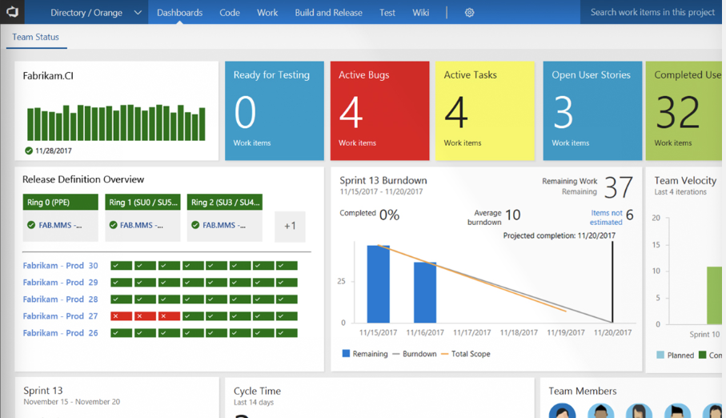

Once you've established your cloud computing strategy and contracted with your cloud computing vendor, you’ll need to start deploying apps and data. There are a couple of tools that can help you with this step: Azure DevOps (ADO) and Microsoft Dynamics Lifecycle Services (LCS). 

Microsoft provides a subscription-based model of Dynamics 365. With this option, you can access Dynamics 365 via the cloud, without having to invest further in your IT network hardware and software licensing. There's no local deployment of the application, and your users can access Dynamics 365 from multiple browsers. This access can be critical for remote or off-site staff.

However, Dynamics 365 Finance and Dynamics 365 Supply Chain Management (previously known as Dynamics 365 Finance and Operations) can also be deployed on-premises, which means an organization can deploy the applications locally.

For the following Dynamics 365 applications, you should use LCS for deployment: 

* Dynamics 365 Finance
* Dynamics 365 Supply Chain Management
* Dynamics 365 Commerce
* Dynamics 365 Human Resources

For other Dynamics 365 business applications, such as the following list, your primary deployments will be online using a standard development-test-production set of environments:

* Dynamics 365 Sales
* Dynamics 365 Customer Service
* Dynamics 365 Marketing
* Dynamics 365 Field Service

You're also able to create a trial environment and give it a test drive, which allows you to get your system up and running in a matter of days, not weeks, or months. You no longer have to worry about ongoing server maintenance or license fees. You can purchase your user licenses directly online, without going through a vendor. You can easily add more users online as you need them and as your business grows.

There are multiple types of environments for Dynamics 365 business applications. The type of environment indicates the purpose and determines the environment characteristics:

* **Trial**: Trial environments to support short-term testing needs and are automatically cleaned up after a short period of time.
* **Sandbox**: Non-production environments and when associated with a Microsoft Dataverse database instance offer features like reset.
* **Production**: Used for permanent work in an organization. It can be created and owned by an administrator or anyone licensed with a Power Apps license.
* **Default**: A non-custom production environment. Each tenant will have a default environment created automatically.
* **Developer**: Developer environments are created by users with the Community Plan license. They're only for use by the owner. Sharing with other users isn't possible in these environments.

### Azure DevOps

Azure DevOps helps your team release Dynamics 365 projects in a more efficient, cooperative, and stable manner. 

DevOps is the union of people, process, and products to enable continuous delivery of value to your end users. With Azure DevOps, you can build, test, and deploy any application, either to the cloud or on premises. DevOps practices enable transparency, cooperation, continuous delivery, and continuous deployment become part a cornerstone of your application lifecycle management plan.

The following screenshot is an example of the Team Status Dashboards that gives the team an all up view of their progress.

> [!div class="mx-imgBorder"]
> 

 
Azure DevOps has several features that are tailored to support application lifecycle management on Dynamics 365 projects. Azure DevOps is also free to get started. Some of the key Azure DevOps features include:

* **Work item planning and tracking**: Useful for coordinating across teams and stakeholders. Allows planning to identify scope, execute plan and tracking work as it progresses.
* **Version control**: Allows tracking customizations to Dynamics 365 and allows setting up a repeatable build and release process.
* **Build and release automation**: Can be helpful for automating everything from exporting of Dataverse solutions for backup, to compiling developer-built components. The release automation can take solutions and developer assets and coordinate deploying to test and production environments. These deployments can also take advantage of approval checkpoints as appropriate. Microsoft has released a preview of Power Apps build tools that include several Azure DevOps tasks for automating deployment of CDS Solutions. 

For Dynamics 365 projects, Azure DevOps provides a flexible framework to support a healthy application lifecycle management process. Teams can customize Azure DevOps to support their unique work style and project requirements. 

### Lifecycle Services (LCS)

Dynamics Lifecycle Services (LCS) helps you manage the application lifecycle of your Microsoft Dynamics 365 Finance or Microsoft Dynamics 365 Supply Chain Management implementations. LCS is an Azure-based collaboration portal that provides an environment and a set of regularly updated services. LCS provides a collaborative workspace that customers and their partners can use to manage Finance and Supply Chain Management projects. LCS supports you from pre-sales to implementation phase and finally to the production environment, either on the cloud or on-premises. With checklists and tools, LCS helps you manage the project, including pre-built methodologies to help with implementation.

LCS supports greater predictability, collaboration, and structural procedures for the administration of application management. As a Microsoft Azure-based collaborative portal, it provides consistently updated services that can help with the application lifecycle of Dynamics implementations. The goal of LCS is to move towards predictable, repeatable, and high-quality implementations by simplifying and standardizing the implementation process. 

Now that we have covered cloud concepts and cloud deployment, let’s review how much of this module you remember with a quick knowledge check.
