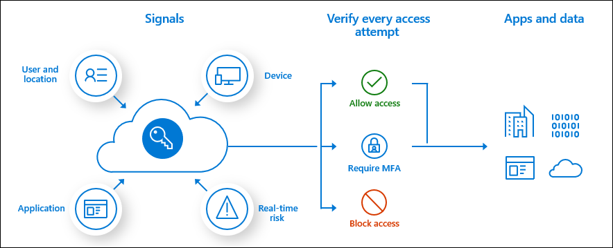

Administrators have two primary goals:

- Empower users to be productive whenever and wherever.
- Protect the organization's assets.

You can achieve both goals with authentication.

Only authenticated users, who have user rights in Dynamics 365, can establish a connection. Dynamics 365 uses Microsoft Azure Active Directory (Azure AD) as a primary identity provider. To access the system, you must provision users in a Dynamics 365 instance, and they should have a valid Azure AD account in an authorized tenant.

By taking advantage of Azure AD for user authentication, Dynamics 365 is just another application that users can interact with. Organizations get the full feature set of Azure AD to protect all their applications, while making it as convenient as possible for users to move between applications.

Azure AD authenticates internal and guest users. Users are subject to any policies implemented that can limit where and when they can access Dynamics 365, including conditional access. Once Azure AD authenticates the user, each Dynamics 365 application handles authorization for data use and services within the application.

#### Hybrid identity

Microsoft helps organizations with hybrid clouds systems to enforce their policies uniformly, and simplifies life by avoiding having to deal with separate identity solutions in on-premises and the cloud.

Hybrid identity with Azure AD uses one of three authentication methods: password hash synchronization, pass-through authentication, or federation.

#### Azure AD conditional access 

Azure AD uses conditional access to bring signals together, to make decisions, and enforce organizational policies.

The following graphic shows how conditional access uses signals to make an access decision and follows it up with enforcement.

Conditional access policies, at their simplest, are *if-then* statements. If users want to access a resource, then they must complete an authentication action. For example, a payroll manager wants to access the payroll application and must use multi-factor authentication to access it.

By using conditional access policies, you can apply the right access controls to keep your organization secure. You can further control Dynamics 365 and Power Platform applications access by using the Azure AD conditional access feature.

Conditional access brings multiple signals together to decide if a user can access an application. Signals can include user or group membership, IP location, device, application, and real-time risk detection. With these signals, you can configure conditional access policies to enforce organizational policies. Outcome of policies can be to block or grant access with additional requirements like multi-factor authentication or the device being marked compliant as necessary.

#### Guest access

In addition to internal organization users, you can invite guests from other Azure AD tenants to access environments, participate in business processes, and collaborate in Dynamics 365 applications.

Organizations use this feature to allow vendors and partners to access the same applications without requiring them to switch identities to your organization's account.

Other external users, which have a less collaborative relationship, can access Dynamics 365 data through the Power Apps Portals, using an identity authenticated by Azure AD B2C. You can configure Power Apps Portals to authenticate business to consumer (B2C) users, and grant them specific data access based on their contact record entitlements. By using Azure AD B2C, organizations can authenticate external users using standard protocols like Open ID Connect and OAuth 2.0.

### Single sign-on (SSO)

Single sign-on (SSO) adds security and convenience when users sign in to applications in Azure Active Directory (Azure AD). It provides users the security and convenience of accessing multiple Azure AD applications within the same tenant with a single sign-in.

The SSO system maps Microsoft Windows accounts to back-end credentials. SSO simplifies the management of user IDs and passwords, both for users and administrators. It enables users to access back-end systems and applications by signing in only one time to the Windows network.

Users can launch applications from the Office 365 portal or the Azure AD MyApps panel. Customers that have existing on-premises servers can take advantage of the hybrid identity capabilities of Azure AD to allow users to access both on-premises and cloud applications. Hybrid identity creates a common user identity for authentication.

Microsoft Identity and Access Management offer the following benefits:

- Enable strong authentication: Reduce the risk of security breaches with strong authentication. Turn on the multi-factor authentication (MFA) options to protect your users from 99.9 percent of identity attacks.
- Enforce intelligent access policies: Use cloud-powered AI and machine learning signals to protect against identity risk before providing access automatically. Limit access, not productivity, and use adaptive policies to protect data.
- Monitor and audit access: Manage your identities efficiently and securely by ensuring the right people have the right access to the right resources. Protect, monitor, and audit access to critical assets while helping ensure employee productivity.
- Connect and protect your applications: Grant one-click access to all on-premises and cloud applications with SSO and free your workforce from having to remember and enter individual account passwords.

Now let's review data loss prevention.
