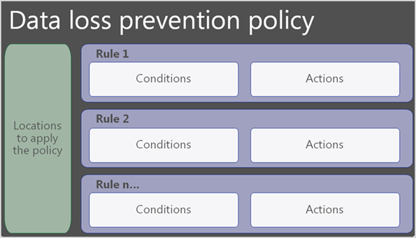

As an administrator, your organization’s data is one of the most important assets you're responsible for safeguarding. The ability to build applications and automation that use the data allows your company to be successful. However, every application and automation potentially expose your data. The primary purpose of Data Loss Prevention (DLP) policies is to put rules in place that prevent data leakage.

For example, combining Microsoft Dataverse data with Twitter data in the same Power Automate flow might not follow organization policies. It's possible that the employees of an organization who are building Power Automate flows may not realize that some of the data is from a sensitive data source. With a DLP policy, you can prevent such data loss.

To follow business standards and industry regulations, organizations must protect sensitive information and prevent its inadvertent disclosure. Sensitive information can include financial data or personal data, such as social security numbers or health records. Applications and automation are increasingly becoming more connected across multiple data sources and multiple services. These services might be external third-party services and might even include social networks.

Users often have good intentions, but they might overlook the potential for exposure from data leakage. Power Apps and Power Automate allow rapid build and rollout of these high-value applications. Users can measure and act on the data in real time, while maintaining data security.

Organizations' administrators must safeguard their data. They can set up DLP policies that help protect organizational data from unintended exposure. These policies function as guardrails to help prevent users from unintentionally exposing the data.

You can set DLP policies at the environment and tenant level. It offers flexibility to craft policies that are sensible and don't block productivity.

With a DLP policy, administrators can:
- Identify sensitive information across many locations, such as Dynamics 365 business applications, OneDrive for Business, and Microsoft Teams.
- Prevent the accidental sharing of sensitive information. For example, you can identify any document or email with a health record that's shared with people outside your organization. You can then block access to that document automatically or block the user from sending the email.
- Monitor and protect sensitive information in the desktop versions of Excel, PowerPoint, and Word.
- Help users learn how to stay compliant without interrupting their workflow.
- Educate your users about DLP policies and help them remain compliant without blocking their work. For example, if users try to share documents with sensitive information, a DLP policy can both send them an email notification and show them a policy tip that allows them to override the policy if they have a business justification. The same policy tips also appear in Outlook, Excel, PowerPoint, and Word.
- View DLP reports showing content that matches your organization's DLP policies.

The following graphic shows options for data loss prevention.

To assess how your organization is following a DLP policy, find the number of matches each policy and rule has over time. If a DLP policy allows users to override a policy tip and report a false positive, you can also view what users have reported.

|  |  |
| ------------ | -------------| 
||Watch this video to see how Dynamics 365 and Power Platform address data loss security.|

> [!VIDEO https://www.microsoft.com/videoplayer/embed/RE4iefR ]

Now that we've reviewed data loss, let's explore security for model-driven apps.
