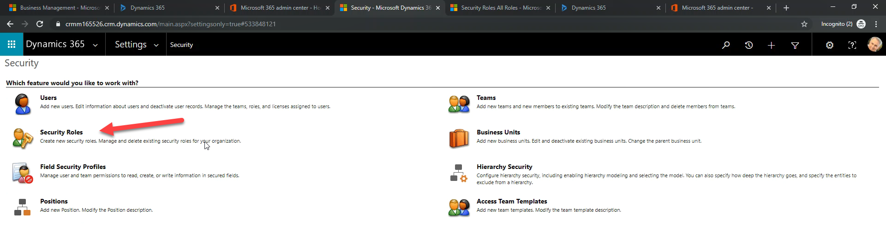
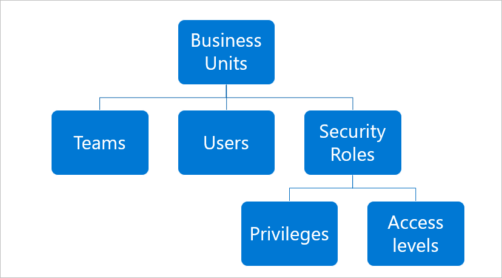
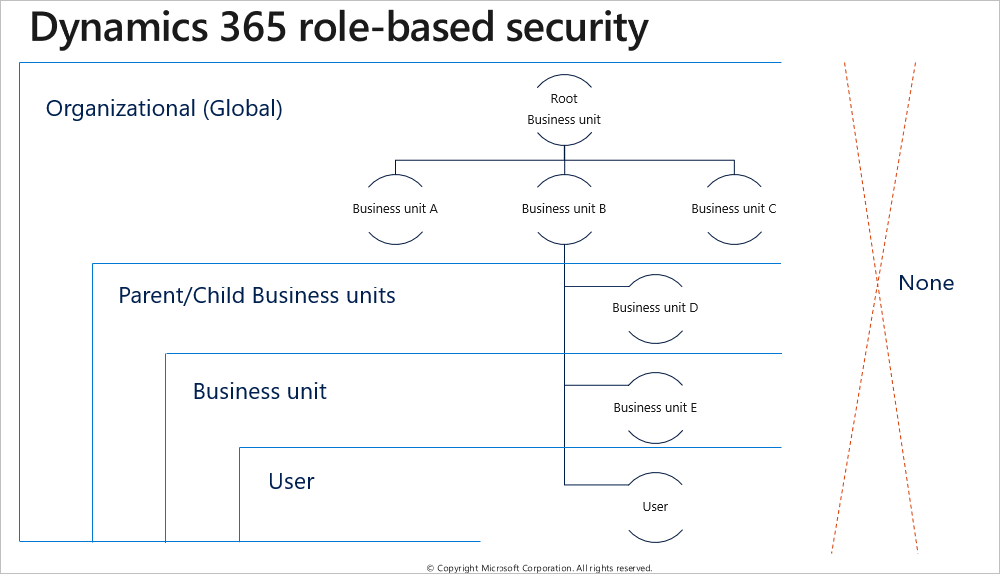
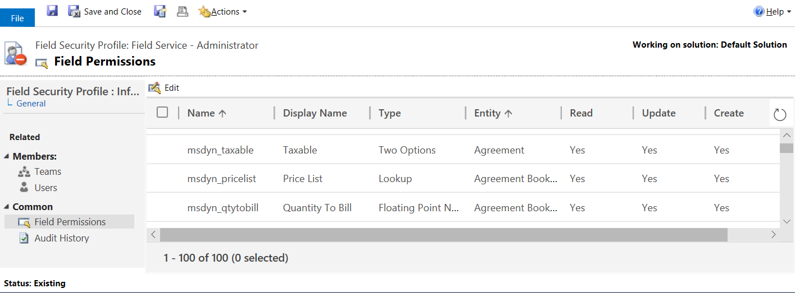
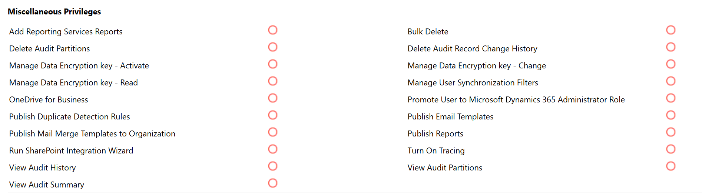
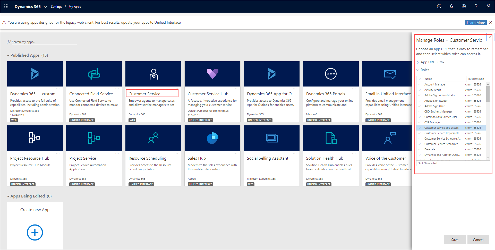
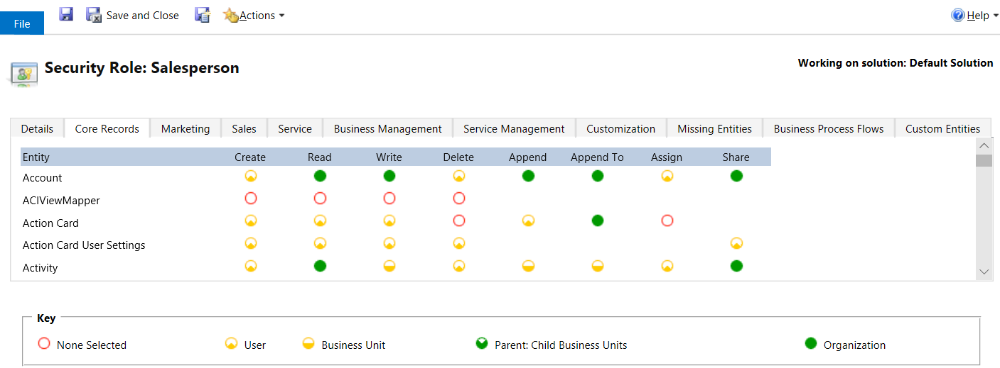

Proper controls on access to data are a vital part of any business. When you understand the security architecture of Dynamics 365 business applications, you can customize security to fit the requirements of your business easily.

All Dynamics 365 applications offer ways to define and enforce access and privileges. These privileges not only secure access to data, but can determine if a user’s role allows running of automations, such as Power Automate, against a particular type of record.

The model-driven apps share the same role-based security model, even though they each serve a different audience and purpose. As model-driven applications, these apps share security role functionality with Dataverse. In these apps, security roles combine to give the user the *most* access defined in their collection of roles, access teams, and business units. 

When you set up security roles in a Dynamics 365 model-based app, you can restrict access so users only have the information they need to fulfill their role.

You use the security model to protect the data integrity and privacy in a customer engagement organization. The security model also promotes efficient data access and collaboration. The goals of the model are as follows:

- Provide a multi-tiered licensing model for users.
- Grant users' access that allows only the levels of information required to do their jobs.
- Categorize users and teams by security role and restrict access based on those roles.
- Support data sharing, so that you can grant users access to objects they don't own for a one-time collaborative effort.
- Prevent users from accessing objects they don't own or share.

Security in Dynamics 365 is based on security roles, which you create within business units.

The following screenshot shows where to set Dynamics 365 security roles.

> [!div class="mx-imgBorder"]
> 

- A **business unit** is all or part of an organization. 
    > [!NOTE]
    > Dynamics 365 creates a default business when you install it. This business unit is the root business unit, and it can't be deleted or disabled–only renamed.
- A **security role** is a collection of privileges and access levels.
- An **entity** is a collection of records, such as a sales deal or prospect.
- **Privileges** allow users in a role to take actions on records in an entity.
- **Access levels** determine the scope of entities and records a user can take actions on, from most restrictive to least restrictive. 

The following graphic shows the Dynamics 365 security roles hierarchy.

> [!div class="mx-imgBorder"]
>  

Every user must:

- Have only one business unit assigned.
- Have a security role to sign in.

Users can have more than one security role. If they do, the role with the broadest permissions will override roles with lesser permissions. 

### Business units

Dynamics 365 uses business units to differentiate the various areas of your company that may have different security names. It will create a business unit that applies to your entire organization. This business unit is the root business unit. In smaller organizations, it may be all you need. 

A business unit is a group of users that have similar security and access needs. You can create business units by function or geography. Large organizations with multiple customer bases often use multiple business units to control data access and define security roles. Users can access records in their own business unit only.

For the sake of simplicity, we recommend that you manage security using security roles and create only those business units that are necessary to meet your organization's security needs. 

When you create business units, they're the children of the root business unit. You can add users and teams to either the root business unit or to the child business units. Remember that security roles are specific to the business units. So, if users move from one business unit to another, they'll lose their security roles. You'll have to assign users at least one role in the new business unit or they will lose access to Dynamics 365.

### Role-based security

Roles are groups of permissions that you can assign to a user to grant them access and various capabilities. Based on their role, a user may have read-only access or have full access to read, change, and delete records in an entity. Roles are granular and you can assign them to one or more entities.
 
Roles can also control certain actions like the ability to create a custom entity or option sets. Also, users can be associated with one or more roles. Associating a user with a role gives them access to data and functionality within that role. 

#### Predefined roles

Dynamics 365 includes predefined security roles, each of which is a set of privileges to make security management easier. The bulk of the privileges define the ability to create, read, write, delete, and share records of a specific entity type. Each privilege also defines how broadly the privilege applies: at the user level, business unit level, the entire business unit hierarchy, or across the entire organization.

For example, if you sign in as a user assigned the salesperson role, you have the privileges to read, write, and share accounts for the entire organization. However, you can only delete account records that you own. You don't have privileges to do system administration tasks such as installing product updates or adding users to the system.

A user assigned to the vice president of sales role can do a wider set of tasks and has a greater number of privileges than a user assigned to the salesperson role. For instance, the vice president can read and assign any account to anyone in the system. A user assigned the salesperson role can't.

There are two roles that have broad privileges: system administrator and customizer. To minimize misconfiguration, limit the use of these two roles in your organization to staff responsible for administering and customizing customer engagement. However, you can also edit the roles or create new roles if needed.

### Teams 

A team is a security role that crosses business units. A team gives the same permissions and access to users in different organizations. You can use a team to allow users in different business units to work with the same entity such as a large customer.

### Hierarchy security

You can use the hierarchy security model for accessing data based on the user’s position in the company hierarchy. You gain a granular access to records with this added security. For example, hierarchical security can allow managers to access the records of their reports for approval or to work with their reports on the records.

### Record-based security

You can use record-based security to control user and team rights to do actions on individual records. This security applies to instances of entities (records) and is provided by access rights. The owner of a record can either share or grant access to a record to another user or team. Once they share or grant access, users must choose which rights they're granting. For example, the owner of an account record can grant read access to that account information, but not grant write access.

Access rights apply after user privileges. For example, if a user doesn't have the privileges to read account records, they'll be unable to view any account, whatever of the access rights another user might grant them through sharing.

#### Scenario

You combine business units, role-based security, record-based security, and field-based security to define the overall access to information that users have.

**For example:** You can assign all your salespeople to a sales security role with one set of permissions and access levels, and all your service representatives to a service security role with a different set of permissions and access levels. You can then create a team that crosses business unit boundaries and provide it with access to a specific customer. As a result, you can have sales and customer representatives working on the same customer records with the team level of permissions and access. 

## Role-based security in model-driven apps

Dynamics 365 Sales, Dynamics 365 Customer Service, Dynamics 365 Marketing, and Dynamics 365 Field Service are model-driven apps. While each model-driven application serves a different audience and purpose, the role-based security model works the same across each of them.

As model-driven applications, these apps share security role functionality with Microsoft Dataverse. In model-driven apps, security roles combine to give the user the most restrictive access defined in their collection of business unit, roles, and teams.
 
The following graphic shows the structure of role-based security. 

> [!div class="mx-imgBorder"]
>   

The colored circles on the security role settings page define the access level for that privilege. Access levels determine how deep or high in the organizational business unit hierarchy the user can do the specified privilege. The following table lists the levels of access in the app, starting with the level that gives users the most access.

|  |  |   
| ----| -----|  
|  |**Global.** This access level gives a user access to all records in the organization, whatever of the business unit hierarchical level that the instance or the user belongs to. Users who have global access have deep, local, and basic access automatically. Because this access level gives access to information throughout the organization, restrict it to match the organization's data security plan. This level of access is for managers with authority over the organization. The application refers to this access level as **organization**.| 
| |**Deep.** This access level gives a user access to records in the user's business unit and all subordinate business units. Users who have deep access have local and basic access automatically. Because this access level gives access to information throughout the business unit and subordinate business units, restrict it to match the organization's data security plan. This level of access is for managers with authority over the business units. The application refers to this access level as **parent: child business units**.|
||**Local.** This access level gives a user access to records in the user's business unit. Users who have local access have basic access automatically. Because this access level gives access to information throughout the business unit, restrict it to match the organization's data security plan. This level of access is for managers with authority over the business unit. The application refers to this access level as **business unit**.|
||**Basic**. This access level gives a user access to records that the user owns, objects shared with the user, and objects shared with a team that the user is a member of. This level is the typical level of access for sales and service representatives. The application refers to this access level as **user**.|
||**None.** This level has no access.|

### Record-level privileges

Power Apps and model-driven apps use different record-level privileges that determine the level of access a user has to a specific record or record type.

|  |  |   
| ----| -----| 
|**Privilege**|**Description**|
|**Create**|Required to make a new record. Users can create records depending on the access level of the permission defined in their security role.|
|**Read**|Required to open a record to view the contents. Users can read records depending on the access level of the permission defined in their security role.|
|**Write**|Required to update a record. Users can change records depending on the access level of the permission defined in their security role.|
|**Delete**|Required to permanently remove a record. Users can delete records depending on the access level of the permission defined in their security role.|
|**Append**|Required to associate the current record with another record. For example, a user can attach a note to an opportunity if the user has Append rights on the note. The records users can append depends on the access level of the permission defined in their security role. If there are many-to-many relationships, you must have Append privileges for both entities being associated or disassociated.|
|**Append To**|Required to associate a record with the current record. For example, if a user has Append To rights on an opportunity, the user can add a note to the opportunity. The records users can append depends on the access level of the permission defined in their security role.|
|**Assign**|Required to give ownership of a record to another user. Users can assign records depending on the access level of the permission defined in their security role.|
|**Share**|Required to give access to a record to another user while keeping your own access. Users can share records depending on the access level of the permission defined in their security role.|

The owner of a record or a person who has the share privilege on a record can share a record with other users or teams. Sharing can add read, write, delete, append, assign, and share privileges for specific records.

### User and Team privileges

- **User privileges:** These privileges are part of the security role assigned to the users. Users can create and access records created or owned by the users with the basic access level.
- **Team privileges:** These privileges are part of the team assigned to the users. Team members who don't have user privileges of their own can only create records with the team as the owner, and they can access records owned by the team with the basic access level.

### Field-based security

You can use field level security to restrict access to high business impact fields in an entity to specified users or teams. Like record-based security, it applies after privileges. For example, a user may have privileges to read an account, but can't see specific fields in all accounts.

If you need more granular control for a field, you can configure field level security. Administrators can find the field(s) that need added protection and mask the data contained in the field. The field will still be visible on the form record. However, the data contained will only be visible to users explicitly given access using field level security profiles. You can secure most system fields and all custom fields using field level security. 

 The following screenshot shows the permissions UI to set field level security.

> [!div class="mx-imgBorder"]
>   

Dynamics 365 enforces security for users across the application. If a user doesn't have access to an entity, they'll not be able to see those records in a grid view, a chart, a report, a related record, or in an Advanced Find query.

The same situation applies for data secured with field level security. If you set an entity permission to restrict based on record ownership or business unit, users can review aggregate data in a report or dashboard. However, they won't be able to drilldown into detailed records that define the aggregate data.

Each application comes with predefined security roles. If these roles don't meet your needs, you can customize the roles. You can also create custom security roles. We recommend that you copy a system role before customizing it to leave the predefined role intact.

### Custom entities

If you created any custom entities as part of the data model, you need to consider the roles. None of the predefined roles, except for the system administrator, will include privileges to access data in custom entities. You can use the layered approach to add these privileges. Start with an empty custom role and only include the privileges for the custom entities included in your app. You can then include this custom role in your solution and enable custom functionality by adding this role to the existing users.

### Task-based privileges

In addition to record level privileges, security roles have various task-based privileges that users can do. In general, these privileges are on or off and not based on business unit or other organizational considerations.
 
The following screenshot shows the permissions UI to manage privileges in model-driven apps.

> [!div class="mx-imgBorder"]
>  

You often use these apps in combination, sharing common records such as customer contacts or accounts. In addition to defining the user roles themselves, you can also define which roles can access any given application.

Dynamics 365 Customer Service will have security roles defined to process support cases, with related contacts or accounts.
  
Dynamics 365 Sales will have security roles to secure opportunities, also with access to related contacts or accounts. You can allow customer service representatives to access their required records in that application and allow sales staff access in their application. Both sets of users can complete their necessary tasks in their own application while also accessing the common customer records shared by the applications.
 
 The following screenshot shows the permissions UI to manage roles in model-driven apps.

> [!div class="mx-imgBorder"]
> 

### User experience

Users' experience in the application is the combined result of their defined security roles, team memberships, and app licenses. Using security roles to limit users' access to records can improve their in-app experience by removing clutter that isn't part of their requirements.

You grant users access and privileges at the entity level. You can't grant access to individual records. If a user's combined roles don't allow access to a record, or the ability to do actions with the record, then the user can't work with the records outside of the scope of their defined roles. All application users need at least one security role assigned to access the application. It can be a role assigned to either the user or their team.

The following graphic shows the security roles for a salesperson.

> [!div class="mx-imgBorder"] 
>   

Let's explore the slightly different security used by the Finance and Operations applications.
