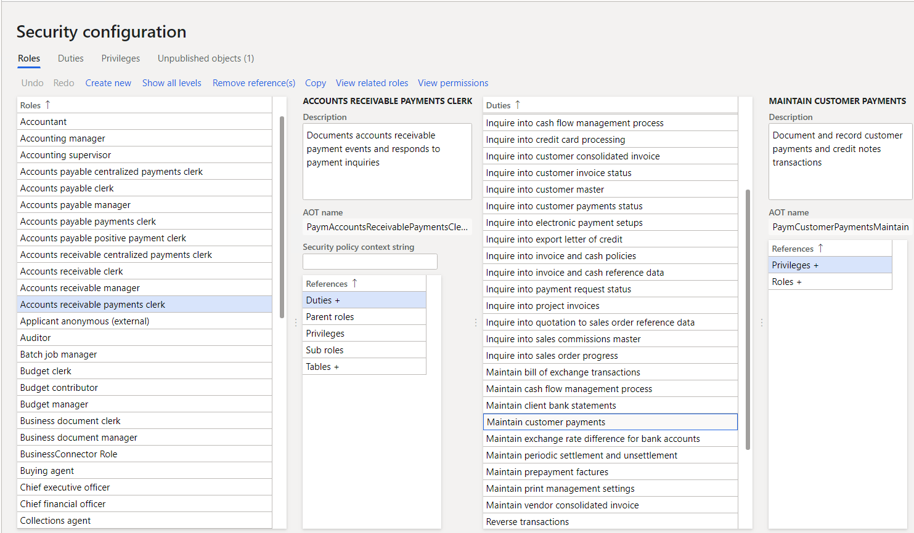
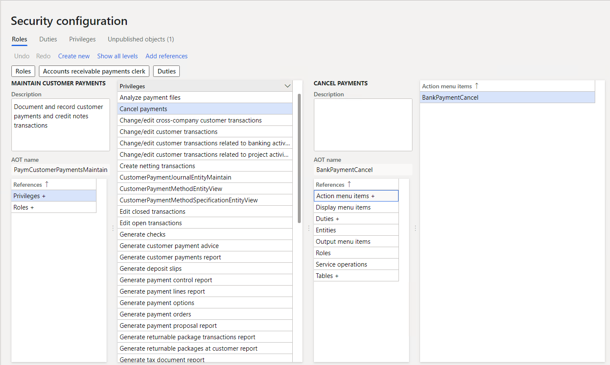
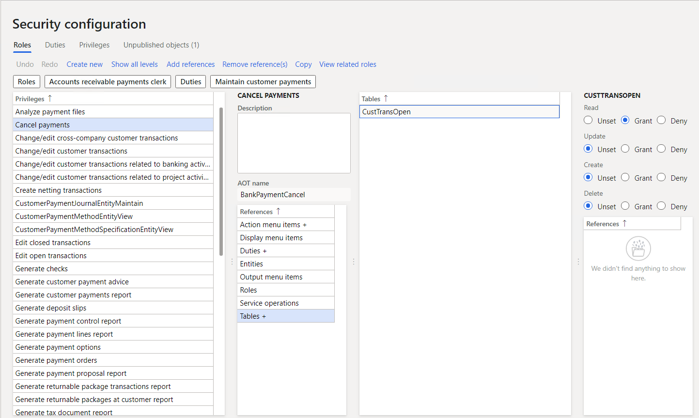
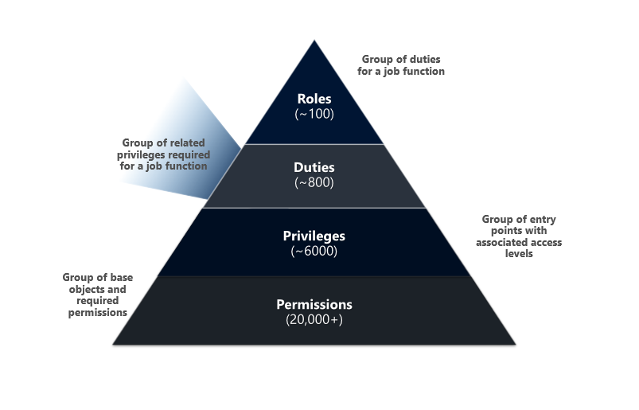
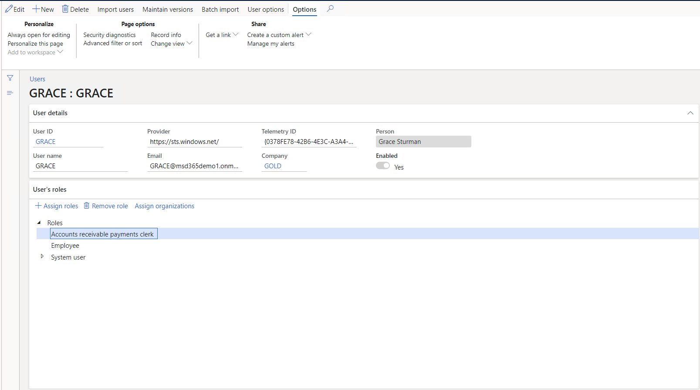

 The Finance and Operations apps use a slightly different security model than the model-driven apps. These apps have an array of security and configuration options to:
- Keep your sensitive data safe.
- Keep users focused on their responsibilities.
- Keep the system as streamlined as possible.

The Finance and Operations apps include: Dynamics 365 Finance, Dynamics 365 Commerce, Dynamics 365 Human Resources, and Dynamics 365 Supply Chain Management.

In these apps, individual security permissions combine into privileges, and privileges combine into duties. The administrator grants security roles access to the program by assigning duties and privileges to those roles.

Finance and Operations apps use context-based security to determine access to securable objects. When a privilege is associated with an entry point, you specify a level of access. The authorization subsystem detects the access at run time when users access an entry point. It applies the correct level of access to the securable object that the entry point leads to. This functionality ensures that you don't assign more permissions for a user than you need to.

Knowing how to implement different security options helps companies cover their security requirements. When you understand the security architecture, you can customize security to fit the requirements of your business easily.

You define a user’s experience with the collective settings of **duties, privileges, permissions, authentication, and authorization**.

### Duties  

‎Duties correspond to parts of a business process. The administrator assigns a duty to one or more security roles. Duties have privileges to do specific actions. For example, the *maintain bank transaction*s duty has the generate deposit slips privilege and the cancel payments privilege. 

You can assign both duties and privileges with security roles. However, we recommend that you use duties to grant access.

The following screenshot shows the security configuration screen for assigning duties to roles.

> [!div class="mx-imgBorder"]
> 

### Privileges  

‎A privilege specifies the level of access needed to do a job, solve a problem, or complete an assignment. It also has permissions to individual application objects, such as user interface elements and tables. For example, the *cancel payments* privilege has permissions to the menu items, fields, and tables that you need to cancel payments.

Apps provide privileges for all features by default. The administrator can change the permissions that are associated with a privilege or create new privileges.

You can assign privileges directly to roles. However, for easier maintenance, we recommend that you assign only duties to roles.

The following screenshot shows the security configuration screen for assigning privileges to roles.

> [!div class="mx-imgBorder"]
> 

### Permissions 

‎Permissions give access to individual securable objects, such as menu items and tables. Privileges include permissions and represent access to tasks, such as posting a journal and processing credits and collections. Duties include privileges and represent parts of a business process, such as maintaining cash and bank transactions. You can assign both duties and privileges to roles to grant access.

You access each function in these applications, such as a form or a service, through an entry point. Menu items, web content items, and service operations are entry points.

The following screenshot shows the security configuration screens for assigning permissions to privileges.

> [!div class="mx-imgBorder"]
> 

### Authorization  

‎Authorization is the control of access to the app. Once you're authorized, security permissions control access to individual elements of the program including: 
- Menus and menu items.
- Action and command buttons.
- Reports.
- Service operations.
- Web URL menu items and web controls.
- Fields in the Finance and Operations apps client.

The security model is hierarchical, and each element in the hierarchy is a different level of detail. Role-based security aligns with the structure of the business. You assign users to security roles based on their responsibilities and their participation in business processes. The administrator grants access to the duties that users in a role do, not to the program elements that users must use.

The following graphic shows the hierarchy of roles, duties, privileges, and permissions.

> [!div class="mx-imgBorder"]
> 

### Role-based security in Finance and Operations apps

In role-based security, access isn't granted to individual users, only to security roles. You assign users to roles. A user assigned to a security role gets access to the set of privileges that is associated with that role. **A user who isn't assigned to any role has no privileges**.

You must assign all users to at least one security role to have access to Finance and Operations apps. The security roles that you assign to a user determine the duties that the user can do and the parts of the user interface that the user can view.

The following screenshot shows the security settings screen for a single user.

> [!div class="mx-imgBorder"]
> 

Because rules can be set up for automatic role assignment, the administrator doesn't have to be involved every time a user's responsibilities change. After security roles and rules have been set up, business managers can control day-to-day user access based on business data.

The apps have security roles by default. All functionality in Finance and Operations apps is associated with at least one of the default security roles. The administrator can assign users to the default security roles, modify the default security roles to fit the needs of the business, or create new security roles. The default roles aren't arranged in a hierarchy.

### Segregation of duties

Different users might do specific tasks because of your security or policies. In Dynamics 365 Finance and Operations apps, you can set up rules to separate tasks that different users must do. This concept is segregation of duties. It reduces the risk of fraud and helps you detect errors or irregularities.

For example, you might not want the same person to acknowledge the receipt of goods and process payment to the vendor. You can also use segregation of duties to enforce internal control policies.

You can use segregation of duties to follow regulatory requirements, such as those from Sarbanes-Oxley (SOX), International Financial Reporting Standards (IFRS), and the United States Food and Drug Administration (FDA).

The apps have default duties. The administrator can change the privileges that are associated with a duty or create new duties.

Now that we've learned how to manage security in Finance and Operations apps, let's review security in Dynamics 365 Business Central.
