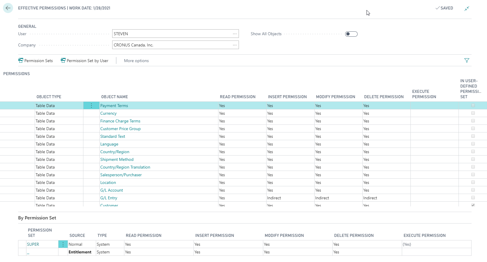

Dynamics 365 Business Central is a stand-alone product for small to medium-sized businesses. It has a self-contained security system that allows you to control which objects a user can access within each database or environment. You can specify for each user whether they can read, change, or enter data in the selected database objects.

In Business Central, there are two levels of permissions to database objects:

* Overall permissions according to the license, also referred to as the entitlement.
* Detailed permissions as assigned from within Business Central.

To make it easier to manage permissions for multiple users in Business Central, you can organize permissions in user groups and assign or change one permission set for many users in one action.

You can define what users see in the user interface and how they interact with their permitted functionality with pages. You do it with profiles that you assign to different types of users according to their job role or department.

If you don't want to restrict a user's access more than already defined by the license, you can assign a special permission set called super to the user. This permission set ensures that the user can access all objects specified in the license.

You assign users permission sets depending on the plan assigned to the user in Office 365. You can then assign permission sets to the users to define which database objects and which UI elements, they can access, and in which companies. It's easier to assign the permission sets to user groups and then assign users to those groups when you want to assign permissions to multiple users.

A permission set is a collection of permissions for specific objects in the database. You must assign all users one or more permission sets before they can access Business Central. From the user card page, you can open the effective permissions page to see which permissions the user has, and which permission sets grant those permissions. 

The following screenshot shows the security configuration screen for assigning effective permissions.

> [!div class="mx-imgBorder"]
> 

Business Central allows you to add or edit permissions manually. You can also have permissions generated from your actions in the UI automatically. When you edit a permission and the related permission set, the changes will also apply to other users that have the permission set assigned.

Business Central has predefined permission sets, system, and extension. You can't create or edit these types of permission sets or the permissions within them. However, you can copy them to define your own permission sets and permissions. You can edit the permission sets that users create.

Business Central has predefined permission sets. You can also add new permission sets tailored to meet the needs of your organization.

Now that we've covered both cloud security and security in the Dynamics 365 apps, let's review how much you remember with a quick knowledge check.
