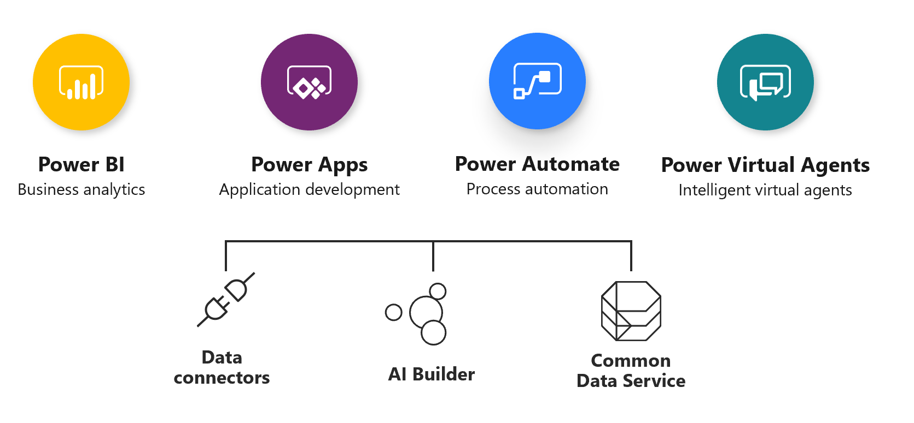
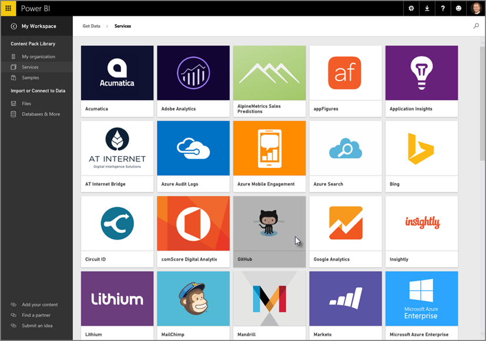

Organizations need flexibility when developing business solutions to fit their needs. They need to deploy business solutions tailored to their organization that are accessible on different platforms and types of devices and offer customized analytic and reporting options. So, the organizations' users work less and do more.

Microsoft Power Platform is a business application platform. It improves productivity across your business with an integrated application platform that combines Power BI (business intelligence), Power Apps, and Power Automate. But it's more than just the sum of its parts. Connect them together—and to Dynamics 365—and build complete business solutions.

Power Platform supports and extends Microsoft 365, Dynamics 365, Azure, and third-party services and applications. Power Platform offers low-code automation, actionable data-driven applications, and customizable business logic that can improve business processes, systems, and flows. Use it to model data for analysis and surface insights. 

The following graphic shows Power Platform apps and supporting services.

> [!div class="mx-imgBorder"]
> 

### Who uses Power Platform?

- **Analysts:** Go from data to insight to action quickly. Connect to hundreds of sources, prep data with ease, and create beautiful reports in minutes. 
- **Business users:** Always be knowledgeable. View dashboards on the web or on your phone, get alerts when data changes, and drill into the details. Your data is always available. 
- **IT:** Simplify management, achieve compliance, and keep data secure while giving people access to the insights they need.
- **Developers:** Bring your apps to life with data. Embed interactive data visuals and deliver compelling reports with high fidelity, on any device.
 
Power Platform integrates business data from a wide variety of Microsoft and third-party data sources and extends Microsoft Dynamics 365 business applications. It's made up of applications designed to help create dynamic visualizations from data hosted on internal and external sources, build custom apps, and automate workflows. 

The following graphic illustrates the capabilities of Power Platform and how it can drive innovation.

  
   
Power Platform enables users and organizations to analyze, act, and automate on the data to transform their businesses. It enables you to build and share apps. Your users can use the apps in a browser or on a mobile device. You can also embed your apps in SharePoint, Power BI, or Teams.
   
Let’s learn about the Power Platform components and their add-on value when used in organizations. 
 
## Microsoft Power BI

Power BI is a business analytics service that delivers insights to enable fast, informed decisions. It helps you harness data and turn it into actionable insights. Power BI connects to hundreds of data sources using standard connectors and unlimited data sources using custom connectors. 

Power BI simplifies how you derive insights from transactional and observational data. It also helps you create a data culture where employees make decisions based on facts, not opinions. 

Power BI helps you collect data and show it as visually immersive, captivated, and interactive insights. The insights allow you to drill down and analyze financial and operational data. 

An advantage of Power BI is the ability to include data sources, from a simple Excel spreadsheet to a collection of cloud-based and on-premises hybrid data warehouses. You can connect to your data sources, visualize what’s important, and share the information with anyone you want because it scales across your organization with built-in governance and security. 

In the following figure, we used Salesforce, Explorer, Access, Excel, SQL databases, Mailchimp, and Dynamics 365 business applications to create a Power BI dashboard.

> [!div class="mx-imgBorder"]
> 

- Transform data into stunning visuals that you can share on any device.
- Explore and analyze data on-premises and in the cloud all in one view visually.
- Create and share customized dashboards and interactive reports collaboratively.

Following are important reasons why organizations should use Power BI to manage data visualizations:

- Create and share interactive data visualizations across global datacenters, including national clouds to meet your compliance and regulation needs.
- Apply sensitivity labels in familiar Office 365 apps like Word, Excel, PowerPoint, and Outlook to Power BI data.
- Help prevent exposure of sensitive data by blocking risky user activities in real time, with Microsoft cloud app security.

Following are benefits organizations gain from using Power BI:

- Gain leading sensitivity classification and data loss prevention capabilities to keep your data secure and compliant even when it’s exported.
- Find and share insights with hundreds of data visualizations, built-in AI capabilities, tight Excel integration, and prebuilt and custom data connectors.
- Reduce the added cost, complexity, and security risks of multiple solutions with an analytics platform that scales from individuals to the organization.

Power BI for Office 365 cloud service works with model-driven apps in Dynamics 365 to provide a self-service analytics solution. 

It refreshes the data displayed automatically. Your organization has a powerful new way to work with data with Power BI Desktop or Office Excel Power Query for authoring reports, and Power BI for sharing dashboards and refreshing data from model-driven apps in Dynamics 365.
 
Power BI has dashboards and tiles to build visualizations using both browser-based, mobile, and desktop tools. When you need to see data analysis in the context of an opportunity record, you can consume Power BI tiles in other applications such as Dynamics 365 Sales. You can also embed canvas apps on Power BI dashboards. 

### Power BI Tools

Power BI consists of:

- A Microsoft Windows desktop application called Power BI Desktop.
- An online software as a service (SaaS) called the Power BI service.
- Mobile Power BI apps that are available on Windows phones, tablets, Apple iOS, and Google Android devices. 
 
The following graphic illustrates the set of Power BI tools.

> [!div class="mx-imgBorder"]
>   

You can create powerful and stunning visualizations of data with the Power BI building blocks. The primary building blocks in Power BI include: 

- **Datasets:** A dataset is a collection of data from a single or multiple sources that Power BI uses to create its visualizations. You can get data from hundreds of data connectors to build immersive, visual dashboards.

     
  
- **Visualizations:** A visualization is a visual representation of data, like a chart or a color-coded map. 
- **Reports:** A report is a collection of visualizations that appear together on one or more pages. 
- **Dashboards:** A dashboard is a collection of visuals on a single page that you can share with others. Often, it's a selected group of visualizations that provide quick insight into the data or story you're trying to present. 
 
How you take advantage of Power BI depends on your role on a project or a team. You might only view reports and dashboards, but your number-crunching, business-report-creating coworker might use Power BI extensively to publish reports, which you then view. Other coworkers in sales might use their Power BI phone apps to check progress on their sales quotas and drill into new sales lead details. 

## Microsoft Power Apps

Power Apps is a suite of apps, services, connectors, and a data platform. It provides a rapid application development environment to build custom apps for your business needs. 

You can use Power Apps in several different types of scenarios including:

- **Individual/Team productivity applications:** In self-service scenarios, users can optimize what they do every day and express their processes in the form of a Power Apps application or Power Automate automation. You can share these apps with other team members and promote them to be broader enterprise assets.
- **Custom apps that work with model-driven apps in Dynamics 365:** These applications are the quickest way to tackle common business scenarios like customer engagement, while still allowing you to tailor it to your company’s individual requirements. You can build custom apps and flows to embed into or extend model-driven apps in Dynamics 365.
- **Dynamics 365 Sales** and **Dynamics 365 Customer Service:** We built these applications on and deployed them in the Power App environment. We used Dataverse for data storage and core platform services. 
- **Custom Apps for SharePoint, Outlook, Teams, and Excel:** You can also embed Power Apps into the applications users already use. This situation often increases user adoption because they don’t have to learn a new application from what they're already using. 
- **Mission critical line-of-business applications:** Using the same tools and techniques Microsoft uses to build model-driven apps in Dynamics 365, enterprise customers can build their own line-of-business applications and solve broader more complex problems. 
- **Apps from AppSource:** In addition to Microsoft-built apps, third-party ISVs can also build on top of the Power Apps platform. You can find these apps in the AppSource marketplace. You can install these apps into your existing environment.

The benefits of using Power Apps include:

- Allowing users to build feature-rich, custom business apps with minimal logical expressions.
- Providing rich business logic and flow capabilities to transform manual business processes to digital, automated processes.
- Allowing users to run seamlessly in browsers and on mobile devices with a responsive design.

You can use Power Apps to build both canvas and model-driven applications and Power Apps portals. Both types of applications use data and can have a custom user experience, but they're designed differently. A canvas application uses a visual builder that is user experience driven. Model-driven applications use data that is relevant for the user. Power Apps Portals are web portals that surface data stored in Dataverse to employees or users outside the organization. 

### Canvas apps
You can build an app by dragging elements onto a canvas to match your business process and data. You can create canvas apps without writing code in a traditional programming language such as C#. You can create Excel-like expressions for specifying logic and working with data. Canvas apps can integrate business data from a wide variety of Microsoft and third-party sources. When you’re done, share your app so that users can run it in a browser and on a mobile device, or embed your app in SharePoint, Power BI, or Teams.

### Model-driven apps
You can build an app based on data and the data model. This approach is a component-focused approach to app development. Its design doesn’t require code and the apps you create can be simple or complex. The system determines much of the layout for you by the components you add to the app, unlike canvas apps, where the designer has complete control over app layout. If you don't need a custom design and your data is in Dataverse, you can generate a model-driven app from your business data and processes it automatically. You can model forms, views, and other components, and the default UI adjusts to phones, laptops, and other devices automatically.

### Power Apps Portals
With Power Apps Portals you can extend your app solutions to internal and external audiences such as communities, customers, partners, and employees. You can create external-facing websites that allow users outside your organizations to sign in to view data and run applications. Users can sign in with a wide variety of identities, and then create and view data in Dataverse.

Power Apps Portals allow you to quickly create a website and customize it with pages, layout, and content. You can:

- Reuse page designs through templates.
- Add forms and views to display key data from Dataverse.
- Publish to users.

The benefits of using portals include:

- Storing data in Dataverse so you don't need to create a connection from Power Apps as you do with data sources such as SharePoint, model-driven apps in Dynamics 365, or Salesforce. You only need to specify the entities that you want to show or manage in the portals.
- Designing portals with the Power Apps Portal Studio using the what you see is what you get editor.

You can create portals in either a new environment or your existing environment.

Starter portals are pre-configured portal solutions to accelerate deployment. You can customize Power Apps Portals, but starter portals provide a pre-configured environment suitable for specific scenarios. Available starter portals include:

- Custom portal
- Community portal
- Customer self-service portal
- Employee self-service portal
- Partner portal

## Microsoft Power Automate

Power Automate is a cloud-based SaaS offering that allows you to automate repetitive business processes with its no-code/low-code platform. It lets computers do what they do best. You can build more than just simple flows. Power Automate can:

- Send reminders on past due tasks.
- Move business data between systems on a schedule.
- Talk to over 275 data sources or any publicly accessible API.
- Automate tasks on your local computer like computing data in Excel. 

Power Automate makes it practical and simple for line-of-business users to build flows that automate time-consuming business tasks and processes across applications and services. In addition to personal productivity uses, you can also use Power Automate as part of line-of-business applications that follow a more formal application life cycle. These applications can range from small departmental applications to enterprise mission critical applications. Often, a central IT group manages and promotes these applications from their development into test and production environments.

With Power Automate, you can confidently scale flows across your organization in an environment founded on industry-leading security and compliance. From simple tasks to complex enterprise-wide processes, Power Automate helps you

- Increase your productivity by automating repetitive, manual tasks.
- Reduce the risk of human error.
- Allow your employees to focus on the strategic work that drives your business forward.

You can create you own flows or use the template flows included with Power Automate. You can build flows that guide users on a defined path to complete their tasks within a model-driven app. With flows, you can ensure users follow organization expectations and policies. Users' actions within a flow can also trigger other automation flows.

### Example of flow steps in Power Automate

The following screenshot shows the flow designer in Power Automate.

> [!div class="mx-imgBorder"]
> 

Power Automate allows you to model business processes and automate flows in your apps and services.

### Common uses for flows with Power Automate

Following are examples of common uses of Power Automate flows:

- Send all POs above a certain value to a manager for approval.
- Use the backlog or a schedule to trigger recurring processing.
- Expire all records older than seven days.
- Use data or service events to send a follow-up email.
- Use a record or file creation to start a new prospect process. 
- Add context to a flow triggered by a mobile user selection.
- Select a button to create a To Do item that includes the customer information from the current appointment.
- Select a button to launch a flow in the background that aggregates data from multiple sources.
- Collect recent purchase history automatically before any meeting with a customer.

When you create a flow in Power Automate, you can choose from several type os flows.

**Automated flows:** This flow does one or more tasks automatically after it's triggered by an event. For example, you can create a flow that emails you when someone sends a tweet that has a keyword that you specify. In this example, sending the tweet is the event and sending the email is the action. Common triggers include create, update, and delete events.

The following screenshot shows the configuration of a flow trigger.

> [!div class="mx-imgBorder"]
> 

Human resources changing a prospect record from pending to hired can trigger a complex flow. The flow can update the payroll and IT databases, and inform facilities, security, and the manager that a new employee is joining the team. The flow could even send an email to the team the day before the new employee starts so they can welcome the new employee to the company.

**Instant flows:** These flows are also known as button flows because you can trigger them when you select a button. There are repetitive tasks that we all wish we could accomplish by selecting a button. For example, you want to remind your team to join the daily team sync, or you want to start a new Visual Studio Online build of your code base after you've been notified that there are no more check-ins planned for the day. Instant flows allow you to do these and other tasks by selecting a button on your mobile device.

**Scheduled flows:** When tasks need to occur at a specified time, you can create a scheduled flow. The flow will follow the recurrence schedule you configure.

The following screenshot shows the start screen for configuring a scheduled flow.

> [!div class="mx-imgBorder"]
> 

**Business process flows:** With a business process flow, you can help ensure that people enter data consistently and follow the same steps every time they work with a customer. For example, you might want to create a business process flow to have everyone manage customer service requests the same way, or to require that people get approval for an invoice before submitting an order. 

The following screenshot shows the flow designer for a business process flow.

> [!div class="mx-imgBorder"]
> 

### Data connectors

Data is at the core of most apps, including those apps you build in Power Apps. We store data in a data source, and you bring that data into your app by creating a connection. The connection uses a specific connector to talk to the data source. Power Apps has connectors for popular services and on-premises data sources, including:

- SharePoint
- SQL Server
- Office 365
- Salesforce
- Twitter

A connector provides tables of data or actions. Some connectors provide only tables, some provide only actions, and some provide both. Your connector may be either a standard or custom connector.

There are hundreds of data connectors available, and with the help of a professional developer you can make your own custom connectors. 

### AI Builder

Not every organization has data scientists on staff, but every organization could benefit from the power of artificial intelligence with their own data. AI Builder is a new Power Platform capability that allows you to easily automate processes and predict outcomes to help improve business performance. AI Builder is a solution that brings the power of AI through a point-and-select experience. Using AI Builder, you can add intelligence to your apps even if you have no coding or data science skills.

The following screenshot shows you the AI Builder selection screen.

> [!div class="mx-imgBorder"]
> 

AI Builder offers models that users can train and models that are pre-trained.

|  |  |
| ------------ | ------------- | 
|  | Watch this video to see how AI Builder works.|
 
> [!VIDEO https://www.microsoft.com/videoplayer/embed/RE4iefV]

#### Pre-trained models

You can add pre-trained models to your Power Apps and Power Automate flows. Users don't train or interact with these models. A maker adds them to their applications.  
‎​  
‎**Business Card Reader​**​   

‎You can pull contact information from business cards, store the information in your database, and import it into your CRM system.​ This ready-to-use component is on contact forms in Dynamics customer engagement apps and is available to use in canvas apps in the maker experience.

|  |  |
| ------------ | -------------| 
||Watch this video to see more on how AI Builder works.|

> [!VIDEO https://www.microsoft.com/videoplayer/embed/RE4iefS]

## Power Virtual Agents

Power Virtual Agents provides exceptional customer service with intelligent, adaptable bots. A bot is a computer program that uses conversational artificial intelligence (AI) and can conduct text conversations with your customers to direct them to what they need without requiring human intervention. 

Bots are a great way to answer simple, repetitive questions from your customers. Bots also help customers with common tasks like finding out how to return or exchange an item, join your rewards program, or cancel an order. Customer service bots save your agents time and your company money by freeing your agents to focus on more complex problem-solving and manage valuable customer interactions.

The following screenshot shows the Power Virtual Agent UI.
 
> [!div class="mx-imgBorder"]
>   
  
Bots can also interact with customers quickly and effectively any time of the day, any day of the week.

SaaS-based Power Virtual Agents remove the gap between the subject matter experts and the development teams building the bots. It removes the complexity of exposing teams to the nuances of conversational AI and the need to write complex code. This development automation minimizes the IT effort required to deploy and maintain a custom conversational solution. You can create and enhance bots with AI-driven insights easily. You can develop customer service bots using a guided, no-code graphical interface, without the need for data scientists or developers.

You can check how your bots are doing by using conversational metrics and dashboards. You can also get in-depth, AI-driven insights to improve their performance.
 
Now let's turn our attention to the Dataverse.