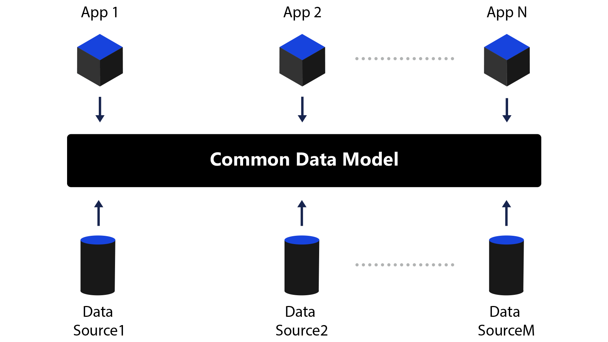
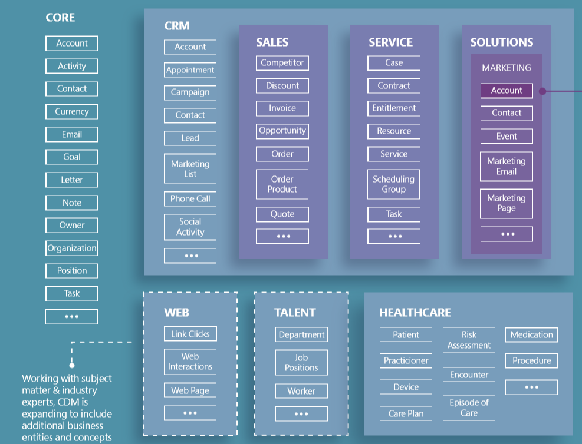
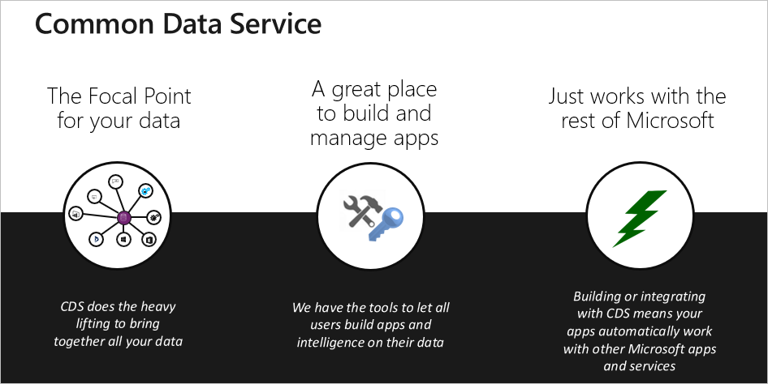

If you’ve ever had to use data from multiple systems and applications together, you know that a common data store with common data elements can save effort, streamline development, and enable faster analytics. Without sharing and understanding the same data, each application—or data integration project—requires a custom implementation. Custom implementations consume time, cost money, and require repeated effort. 

Microsoft Dataverse, using the Common Data Model, simplifies this process. Dataverse provides a shared data store and language for business and analytical applications to use. This sharing enables data and application interoperability spanning multiple channels, service implementations, and vendors. 

Dynamics 365, Power Platform, and custom applications can access Dataverse's shared data store. The shared store allows the applications to use the same data set and avoids the problems created by duplicate and different data stores. 

## Benefits of the Common Data Model

The Common Data Model standard defines a common language for business tables. It covers the full range of business processes across sales, services, marketing, operations, finance, talent, and commerce and for the customer, employee, and product tables at the core of a company's business processes. 
 
The following graphic illustrates the Common Data Model.

> [!div class="mx-imgBorder"]
>   
  
A table is a set of records used to store data, just like how a table stores data within a database. A table is:

- **Unified:** A single view of data built on one data model.
- **Intelligent:** Supporting AI-driven insights.
- **Enhanced:** Allowing more powerful applications and services.

The **Common Data Model** offers the following benefits:

- **Structural and semantic consistency** across applications and deployments.
- **Simplified integration and disambiguation of data** that’s collected from processes, digital interactions, product telemetry, people interactions, and so on.
- **A unified shape** where data integrations can combine existing enterprise data with other sources and use that data to develop apps or derive insights.
- **Ability to extend the schema and Common Data Model standard tables** to tailor the model to your organization.

You can use the Common Data Model to create data repositories that use the Common Data Model metadata system. You can also transform your existing data into the Common Data Model standard schema. Either way, the efficiency that you get from standardization can speed up and streamline whatever you do next with your data.

Its metadata system enables consistency of data and its meaning across applications and business processes such as PowerApps, Power BI, Dynamics 365, and Azure, which stores the data.

In addition to the metadata system, the Common Data Model includes a set of standardized, extensible data schemas from Microsoft and its partners. The collection of predefined schemas includes tables, columns, semantic metadata, and relationships. The schemas simplify the creation, aggregation, and analysis of data with commonly used concepts and activities, such as account and campaign.

This following graphic shows elements of the standard tables.

> [!div class="mx-imgBorder"] 
>   
  
**Dataverse** has a Common Data Model, consisting of standard table definitions including:
- **Foundation:** The foundation tables have information that is relevant to every other table group. This group has tables such as address and currency.
- **People, organizations, and groups:** These tables encompass a rich set of people and organizations that you might interact with, including employees, contractors, donors, volunteers, fans, alumni, and families.
- **Purchasing:** The purchasing tables let you create purchasing solutions.
- **Sales:** The sales tables let you create complete sales solutions, from tracking leads and opportunities, to following through with contacts, to accepting and delivering orders, to sending invoices.
- **Case management:** The case management tables manage issues from your customers, including tracking, escalation, and documentation.

## Benefits of Dataverse

Dataverse manages business data that supports interconnected business application and processes. It also lets you store and manage data securely that's used by business applications. 
 
The following graphic outlines the benefits of Dataverse.

  
  
Dataverse is a business data engine that enables rapid application creation, integration, and automation. It's built on Microsoft cloud data storage technologies and takes advantage of them as appropriate based on the data and processing needs. Other key benefits of Dataverse include:

- **Easy to manage:** Stores both the metadata and data in the cloud. You don't need to worry about the details of how it's stored.
- **Easy to secure:** Stores data securely so that users can see it only if you grant them access. Role-based security allows you to control access to tables for different users within your organization.
- **Access your Dynamics 365 data:** Stores data from your Dynamics 365 applications in the Dataverse allowing you to build apps that take advantage of your Dynamics 365 data and extend your apps using Power Apps.
- **Rich metadata:** Uses data types and relationships directly within Power Apps.
- **Logic and validation:** Defines calculated columns, business rules, workflows, and business process Power Automate flows to ensure data quality and drive business processes.
- **Productivity tools:** Increases productivity and ensures data accessibility with tables available within the add-ins for Microsoft Excel.

It's easier to bring your data together and create powerful apps using Dataverse because it's a compliant and scalable data service and app platform that’s integrated into Power Apps.

## Common Data Model versus Dataverse 

The standard table design in a Dataverse database is based on an open data model standard called Common Data Model. Common Data Model is a logical design that includes a set of standardized, extensible data tables and relationships that Microsoft and its partners have published in an industry-wide initiative called the Open Data Initiative. This collection of predefined tables, columns, semantic metadata, and relationships form the basis of Common Data Model.

| **Term** | **Definition** |
| - | - | 
| Application or app | An application is a defined collection of features and data on the Dynamics Power platform. Microsoft has first-party applications like Sales and Customer Service. Makers can design and build entirely custom solutions on the Power Platform, and they can also customize the first-party applications. | 
| Business unit | Business units provide structure for grouping users. You can use business units to mimic an organization's department structure. | 
| Column | A column, also called an attribute, is a single piece of data for an entity. Several types of columns are available including text, currency, and numeric values. | 
| Data model | A data model is the definition of the data and its relationships within the Power Platform. | 
| Environment | Environments are containers that you use to manage data, apps, flows, connections, and other assets, and permissions to allow organization users to use the resources. | 
| Form | A form is an element of the user experience in Dynamics 365. A form can contain many elements designed to allow a user to see and interact with data. | 
| Metadata | Tables, columns, and the relationships between the tables within Dataverse are metadata. Metadata has all the information necessary for Power Platform to use underlying entities and data. | 
| Records | A record is how a user sees data in Dynamics 365, often via a form or a view. | 
| Region | As a cloud service, you can deploy Dynamics 365 in various locations or regions globally. You can stage feature rollout and product updates for deployment based on regions. | 
| Security Role | A security role is the definition of a user’s access and privileges in Dynamics 365. A user’s experience in an application is the result of the combined privileges of their collection of security roles. | 
| Sitemap | The sitemap defines the user’s navigational experience. | 
| Solution| A solution is a collection of customizations that you can move from one instance to another. For example, you can create a solution in your test environment and move it to production. | 
| Table | A table is a container for data like a table in a traditional database. Each table has a set of columns. | 
| Tenant | A tenant is the account you create in the Microsoft Online Services environment when you sign up for a Dynamics 365 subscription. A tenant has uniquely named domains, users, security groups, and subscriptions and can contain multiple Dynamics 365 instances. | 
| User | A user is a licensed individual that can interact with data in Dynamics 365. | 
| View | A view is the collection of records of a single type in Dynamics 365 also called a grid or a list. Views can be read-only or editable. Views respect the user’s security roles and only display the data the user has privileges to interact with. | 
| Web resource | Web resources are building blocks used when you build forms. These web resources can be a single image file or a custom HTML page or component. | 

We reviewed the Common Data Model and its applications to the Power Platform via Dataverse. The Common Data Model provides a standard common language and data model with the goal of unified, intelligent, and enhanced data that communicates across channels, environments, and business processes. Within Power Platform, you'll commonly work with Dataverse, which supports Dynamics 365 and Power Apps.

## Analytics

Dataverse allows you to connect to your data using Power BI Desktop to create reports and publish them to Power BI. From Power BI, you can use reports in dashboards, share reports to other users, and access cross platform reports on Power BI mobile apps.

## Extensibility

You can adapt and extend the Common Data Model schema easily using the same metadata system to describe tables, relationships, and semantic meaning. Use the open source standard definitions alongside your customized schema to meet your unique business need. Dataverse is the underlying data platform for Power Apps that has the core functionality such as server-side logic (plug-ins and workflows), business process flows, a highly sophisticated security model, and an extensible platform for developers to build apps.

While it's possible to build an application with code using Dataverse as your data source, most projects will use either model-driven apps or canvas apps to generate the user experience. 

You can build model-driven apps on Dataverse and can only connect to a Dataverse environment. You store all the data that defines a model-driven app within Dataverse.

Because Dataverse includes capabilities for people to configure custom business logic without writing code, developers can fill in the spaces between existing features, however, it may not provide the functionality you need to meet a requirement. Fortunately, Dataverse allows developers to extend the common functionality with code when necessary.

## Interoperability

Building an app typically involves data from more than one source. While you can do data integration at the application level, integrating data into a common store allows for easier app development and a single set of logic to maintain and operate. Dataverse integrates data from multiple sources into a single store. You can use the store in Power Apps, Power Automate, and Power BI along with data already available from your Dynamics 365 applications.

Other key benefits of integrating data include:

- **Scheduled integration with other systems:** You can synchronize data kept in another applications with Dataverse regularly allowing you to take advantage of other applications data in Power Apps.
- **Transform and import data using Power Query:** You can transform data when you import it into Dataverse via Power Query from many online data sources, a common tool used across Excel and Power BI.
- **One-time import of data:** You can import and export Excel and CSV files for one-time or infrequent use into Dataverse.

You build Dynamics 365 model-driven applications on Dataverse, and other applications can use it as part of their integration and extensibility efforts. Dataverse along with the Dynamics 365 applications implement the Common Data Model. 

You can import Dataverse data from other data sources using Power Query to transform the data. You can export data from Dataverse including the ability to export to both Azure SQL and Azure Data Lakes for further processing.

You can publish business events from Dataverse allowing near real-time integration with other systems. Business triggers for Power Automate also allow orchestrations of automations across Dataverse and other systems and services using the public connectors or custom connectors.

## Consistency

You store data within Dataverse in a set of tables. By defining a set of over 200 standard business tables, the Common Data Model makes it easier for both you and third parties to build apps. You can tailor the model to your specific business needs by extending with custom tables and columns.

A table is a set of records used to store data, just like how a table stores data within a database. Dataverse includes a base set of standard tables that cover typical scenarios. You can also create custom tables specific to your organization and populate them with data using Power Query. Developers can use Power Apps to build rich applications using this data.

The standard table design in a Dataverse database is based upon an open data model standard called Common Data Model. 

The open data initiative is a jointly developed vision by Microsoft, Adobe, and SAP. The initiative resulted in the Microsoft Common Data Model that is supported in Dataverse, Dynamics 365, Power Apps, Power BI, and upcoming Azure data services, directly accruing value towards the Open Data Initiative.

This collection of predefined tables, columns, semantic metadata, and relationships form the basis of the Common Data Model.

Now let's turn our attention to reporting in Dynamics 365.