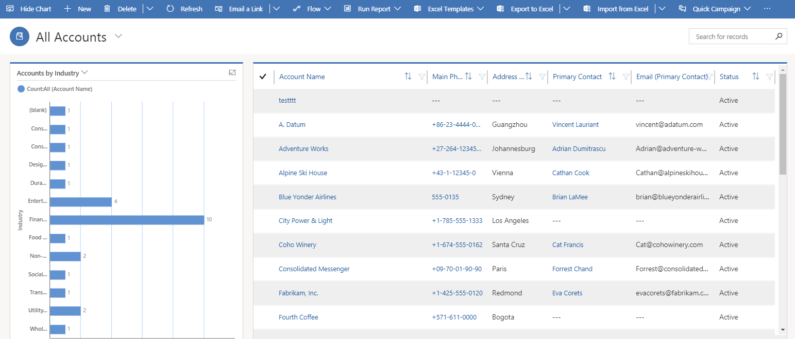
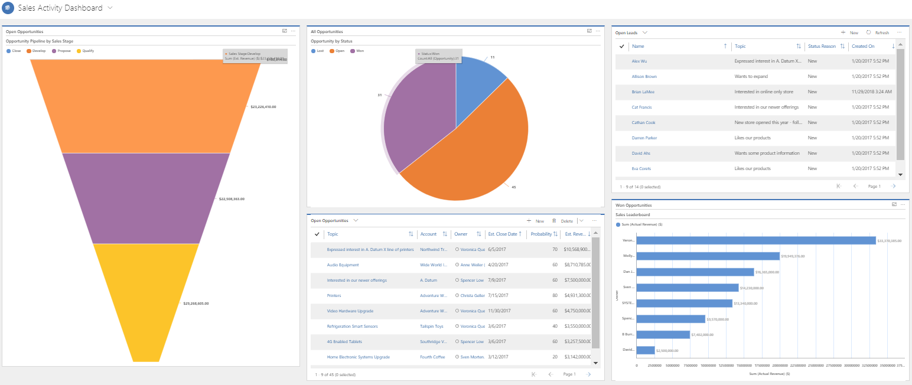
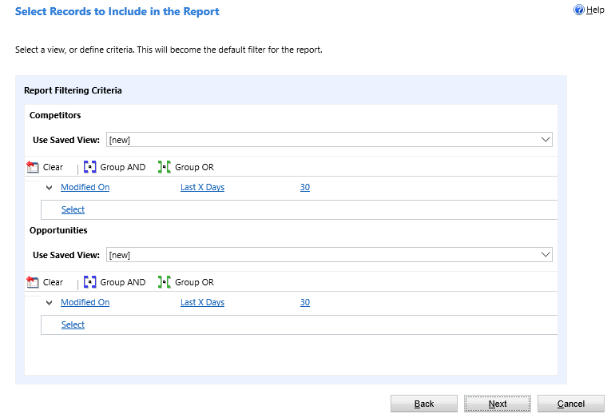

Dynamics 365 apps have built-in reporting options and configurable custom options. These options are in addition to the Power BI functionality and reporting we review elsewhere in this course.

|  |  |
| ------------ | ------------- | 
|  | Watch this video to see how reporting address the needs of business roles and functions. |
 
> [!VIDEO https://www.microsoft.com/videoplayer/embed/RE4ijs1]

## Reporting in model-driven apps

All the reporting options in model-driven apps are configurable and enforce established security roles for data access.

### Views

When you create views, you create analytics based on the data that is important to you. When you view records, you can apply filters to drill down into the detail that is important to you.

### Charts

Charts are quick and actionable visualizations of your data. The charts are interactive so you can continue to drill down into relevant data. You can also place charts on dashboards and view them in line with the data they're displaying.

The following screenshot shows and example of a Dynamics 365 Sales chart.

> [!div class="mx-imgBorder"]
> 

### Dashboards

Both standard and interactive dashboards offer a combination of charts and views in an easy to consume experience. Dashboards are a collection of:

- Views.
- Charts.
- Iframes.
- Web resources.
- Graphical reports, charts, or views that give you a high-level overview of data all in one diagram. 

The following screenshot shows and example of a Dynamics 365 Sales dashboard.

> [!div class="mx-imgBorder"]
> 

### Reports

Model-driven apps include system reports that you use to gain insights into how your business is doing. You can use these reports as is or customize them for your needs. You can also use the Report Wizard to create custom reports. The Report Wizard is an easy to use tool that helps you create your own reports.

The following screenshot shows and example of a Dynamics 365 Sales Report Wizard.

> [!div class="mx-imgBorder"]
> 

## Reporting in Finance and Operations apps

Financial reporting has 22 default financial reports. Every report uses the default main account categories. You can use these reports as is or as a starting point for your financial reporting needs. In addition to the traditional financial statements, the default reports include reports that show the different types of financial reports that you can create.

| **Report** | **Description** |
| - | - | 
| Actual versus Budget—Default | View detailed balance information for all accounts for the original budget and compare the revised budget to actuals that have a variance. | 
| Detailed Trial Balance—Default | View balance information for all accounts that have debit and credit balances, and the net of the balances, with the transaction date, voucher, and journal description. | 
| Summary Trial Balance Year Over Year—Default |View balance information for all accounts that have opening and closing balances, and debit and credit balances with their net difference for the current year and the past year. | 
| Weekly Sales and Discounts—Default| Gain insight into sales and discounts for each week in a month including a four-week total. | 
| Financial Captions JE and TB Review—Default| View an overview of the balances and activity for the asset, liability, owner’s equity, revenue, expense, gain, or loss financial captions. | 

## Reporting in Dynamics 365 Business Central

With Business Central, you can use reports to print or display information from a database. You can structure and summarize information to print documents, such as invoices. For example, you can create a report that lists all customers and the orders added by each customer. Also, you can create a report automatically filled with the relevant information for an invoice.

You can also use reports to process data without printing or displaying the content. For example, you can use a report to automate updating all prices in an item list.

Business Central offers four ways to report on your data including:

- Use prebuilt reports in Business Central.
- Create new reports using the Business Central report designer.
- Export data to Excel.
- Use Power BI.

Now that we have covered Power Platform, the Common Data Model, Microsoft Dataverse, and reporting across the Dynamics 365 apps, let's see how much you remember with a quick knowledge check.
