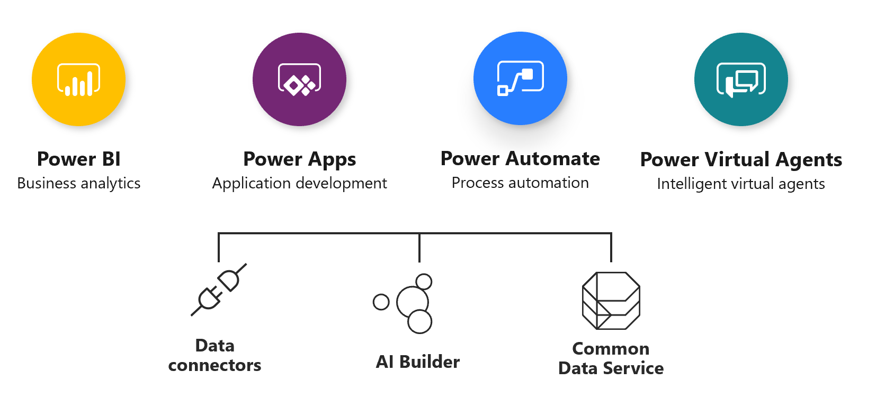

In this module, we reviewed the ways that using the Power Platform can automate, connect, store, manage, and report on your data. First, we looked at Power Automate, which allows you to model business processes and automate workflows and your apps and services. We discussed the Common Data Model, which is a unified, intelligent, and enhanced standard that defines a common language for business entities. Next, we reviewed the Power Platform and how this low-code platform combines the use of Dynamics 365 applications. We built Power Platform on the Microsoft Dataverse, which manages your data to support interconnected business applications and processes. Finally, we reviewed the built-in reporting options available with Dynamics 365 apps, including views, charts, and dashboards and the 22 default financial reports in Finance and Operations applications.

The following graphic shows the Power Platform apps and supporting services.

> [!div class="mx-imgBorder"]
> 

### Resources
**Power Platform**

- Read about [Power Platform](https://powerplatform.com/)

- Read about [Power Apps](https://docs.microsoft.com/powerapps/) 

- Read about [Power Automate](https://docs.microsoft.com/power-automate/index)

- Read about [Common Data Model](https://docs.microsoft.com/common-data-model/)

**Power BI**

- Check out the [website](https://powerbi.microsoft.com/) 

- Complete the [learning](https://powerbi.microsoft.com/learning/) 

- Read the [documentation](https://docs.microsoft.com/power-bi/) 

- Review [pricing](https://powerbi.microsoft.com/pricing/) 

- Join the [community](https://community.powerbi.com/) 

- Watch videos on [YouTube](https://www.youtube.com/user/mspowerbi)

- Get an overview on [reporting](https://docs.microsoft.com/dynamics365/finance/general-ledger/financial-reporting-getting-started)

**Power Apps** 

- Check out the [website](https://powerapps.microsoft.com/) 

- Read the [Blog](https://powerapps.microsoft.com/blog/) 

- Read the [documentation](https://powerapps.microsoft.com/tutorials/getting-started/) 

- Join the [community](https://aka.ms/powerapps-community) 

- [Suggest ideas](https://aka.ms/powerapps-ideas) 

- Watch [webinars](https://docs.microsoft.com/powerapps/webinars-listing)

- Read up on [product updates](https://powerapps.microsoft.com/blog/category/new-features/)

- Get familiar with [new features](https://powerapps.microsoft.com/blog/category/new-features/)
 
- Get familiar with the [industry accelerators](https://docs.microsoft.com/common-data-model/industry-accelerators)

- Take [guided learning](https://powerapps.microsoft.com/guided-learning/) 

- Watch [YouTube playlist](https://www.youtube.com/playlist?list=PL8IYfXypsj2DU3EwoaeBYiuuQTvcscJfo)

- Review [Licensing / Pricing](https://powerapps.microsoft.com/pricing/)

**Power Automate** 

- View the [website](https://flow.microsoft.com/) 

- Read the [blog](https://ms.flow.microsoft.com/blog/) 

- Read the [documentation](https://docs.microsoft.com/power-automate/getting-started) 

- Join the [community](https://aka.ms/flow-community) 

- [Suggest Ideas](https://aka.ms/msflow-ideas) 

- Watch [webinars](https://flow.microsoft.com/blog/category/webinars/)

- Read up on [product updates](https://us.flow.microsoft.com/blog/category/product-updates/)

- Take [guided learning](https://flow.microsoft.com/guided-learning/) 

- Watch [YouTube Playlist](https://www.youtube.com/playlist?list=PL8nfc9haGeb55I9wL9QnWyHp3ctU2_ThF)

- Review [Licensing / Pricing](https://flow.microsoft.com/pricing/)

**Microsoft Dataverse** 

- Visit [Dataverse documentation portal](https://aka.ms/commondataservice)

- Get familiar with [feature updates](https://powerapps.microsoft.com/blog/category/common-data-service/)

- Read the [blog](https://powerapps.microsoft.com/blog/category/common-data-service/) 

**AI Builder**

- Read the [documentation](https://docs.microsoft.com/ai-builder/overview) 

- Try the [Hands On Learning Lab](https://docs.microsoft.com/ai-builder/learn-ai-builder) 

- Review [Licensing](https://docs.microsoft.com/ai-builder/administer-licensing)

- Get more information on [model types](https://docs.microsoft.com/ai-builder/model-types)

- Read up on [AI for Business Applications](https://blogs.microsoft.com/blog/2018/09/18/announcing-new-ai-and-mixed-reality-business-applications-for-microsoft-dynamics/)

- Read up on [AI and Retail](https://blogs.microsoft.com/blog/2019/09/23/announcing-new-microsoft-dynamics-365-ai-driven-insights-applications-and-our-vision-for-the-future-of-retail/)

**Data Connectors**

- Review the [Dynamics 365 Connector Reference](https://docs.microsoft.com/connectors/dynamicscrmonline/)

- Read up on [custom connectors](https://docs.microsoft.com/connectors/custom-connectors/)

- Visit the [Azure Data Factory](https://docs.microsoft.com/azure/data-factory/connector-dynamics-crm-office-365)

**Reporting**

- Read the [Guide](https://docs.microsoft.com/dynamics365/customerengagement/on-premises/analytics/reporting-analytics-with-dynamics-365) | [Overview](https://docs.microsoft.com/dynamics365/customerengagement/on-premises/analytics/get-started-writing-reports) | [Customize in CE](https://docs.microsoft.com/dynamics365/customerengagement/on-premises/customize/customize-organize-reports) | [Report Wizard in CE](https://docs.microsoft.com/dynamics365/customerengagement/on-premises/basics/create-edit-copy-report-wizard)