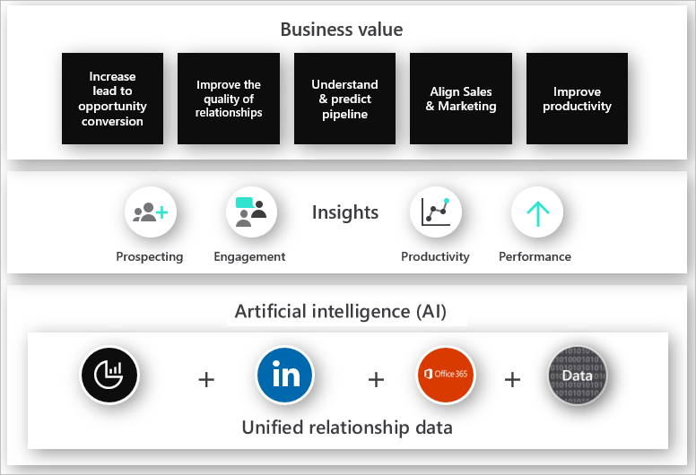

One of the consequences of living in the digital age is that we deal with a great deal of information. As a result, we're often short on attention and driven to distraction. Sellers must navigate data, processes, and tools, while making sense of conflicting or unclear expectations. 

The key considerations for delivering an intelligent sales and marketing solution include:

- Do your systems effectively engage with your customers?
- Do you think you need effective tools to send the right messages at the right time to your customers?
- Do you have a 360-degree view of your customer’s activities and insights?

Dynamics 365 Sales helps you modernize sales productivity and face the challenges of the digital age. It lets sellers work less and achieve more including: 

- Taking advantage of data-driven technologies to understand customer needs allowing sellers to build strong relationships with their customers, take actions based on insights, and close sales faster. 
- Keeping track of accounts and contacts, nurturing sales from lead to order, creating sales collateral, creating marketing lists and campaigns, and following service cases associated with specific accounts or opportunities.
- Helping sales managers take informed action and build better relationships with their customers. 

As a result, sellers can overcome the distractions and complexity to regain focus and sales momentum.

With Dynamics 365 Sales and its sales automation capabilities, sellers can:

- **Sell smarter with contextual insights:** With automated lead and opportunity scoring, sellers can spend more time negotiating deals, and less time trying to find potential sales opportunities. As they communicate with their customers, Dynamics 365 Sales analyzes items like emails to allow sellers to be more proactive with future communication. It gives sellers personalized talking points and the next best actions based on past interactions automatically.
- **Build relationships with authentic and personal engagement:** You can see how customer information relates or groups by viewing accounts, products, or users in hierarchical charts. You can then select a tile in the chart to get the full details and navigate to the info you’re interested in. 
- **Free up more time for selling:** Digital transformation is real. Across every industry vertical, organizations are rethinking their business processes and entire segments are reorganizing. They can enhance key application scenarios by connecting the system of record with the LinkedIn data graph and insights. They can build custom applications powered by LinkedIn Sales Navigator intelligence, enhancing business processes with data about people, organizations, and relationships. Through personalized recommendations, sellers are given suggestions for the most relevant content to use in different instances based on what they're doing in the application. Targeted sales playbooks can execute automatically to ensure sellers are doing the right tasks and putting the right information in the hands of potential customers based on the type of deal. 
- **Boost sales productivity:** Take advantage of modern mobile applications and familiar tools like Microsoft Outlook, Excel, SharePoint, and Teams that work seamlessly with Dynamics 365 Sales to simplify collaboration across selling teams, and build on the skills and tools sellers already have.

### Scenario

Tina and Bob are sales managers at a retail company. Their goal is to turn relationships into revenue. What they care most about is:

- Generating actionable insights for specific and measurable improvements.
- Building stronger relationships between sellers and buyers.
- Enabling their teams to achieve the revenue goals with an efficient sales process. 
- Coaching their teams to sell effectively and stay ahead of the competition.
- Spending their time where it matters most, and helping their teams do the same, by focusing on relationship building with customers and not entering data in their legacy CRM system.

Dynamics 365 Sales creates opportunities for deeper engagement with customers. It helps Tina and Bob and their sellers by:

- Enabling smarter selling with embedded insights.
- Allowing sellers to build relationships with authentic and personal engagement.
- Boosting seller and sales manager productivity with tools.
- Improving sales performance with AI-driven insights to grow sales and innovate with a sales solution built to evolve.

Tina and Bob want to:

- Streamline and strengthen lead tracking.
- Optimize the opportunity management process.
- Enable a faster and consistent customer experience. 

They also want their sales teams to understand their customers with a 360-degree view across all marketing, sales, and service activities. Dynamics 365 Sales gives their teams all these capabilities. It also guides their sellers to their next best action at the right time.

Dynamics 365 Sales helps Tina and Bob with:

- Robust, lead tracking tools. 
- Live dashboards with contextual data.
- Integration with productivity tools plus process guidance.
- Consolidated customer data that yields individual insights. 
- Machine learning-based recommendations from embedded intelligence, driven by profile data.

With Dynamics 365 Sales, organizations can unify relationship data and processes by integrating Dynamics 365 Sales with LinkedIn Sales Navigator. Sellers get valuable, embedded insights from Sales Navigator directly in Dynamics 365 Sales. The insights help sellers focus on the right prospects and customers, find, and connect with members of the buying committee, and engage with relevance. With up-to-date, contextual insights, sellers can understand the buying organizations and their buyers quickly.

When organizations unify relationship data and processes by integrating Dynamics 365 Sales with LinkedIn Sales Navigator, sellers get valuable, embedded insights from Sales Navigator directly in Dynamics 365 Sales. 

The insights help sellers focus on the right prospects and customers, find, and connect with members of the buying committee, and engage with relevance. With up-to-date, contextual insights, sellers can understand the buying organizations and their buyers quickly.

## Benefits of Dynamics 365 Sales

Dynamics 365 Sales provides value by automating sales processes and integrating with Dynamics 365 Marketing, on any device. 

Dynamics 365 Sales allows sellers to:

- Follow guided business processes, so you know which steps to take next to close deals faster. You can tailor these business processes for your organization's needs.
- Manage customers and deals wherever you are, on any device.
- Increase productivity by using familiar tools. We integrated Dynamics 365 Sales with Office 365.
  Create new leads and view sales data in Dynamics 365 Sales while working in Outlook. 
- Use SharePoint to store and view documents like presentations and notes in the context of a record. Anyone working on the opportunity can view the documents.
- Open sales data in Excel, make changes, and save the changes back to Dynamics 365 Sales all without switching between applications.
- Get actionable insights and suggestions based on how you work. For example, if you have an opportunity closing next week, the assistant will send you a reminder to connect with your customer.
- Find all activities such as appointments and phone calls related to a customer or opportunity in one central place. Dynamics 365 gives you the context you need to do your job.

Dynamics 365 Sales allows sales managers to:

- Accelerate their team's performance by using real-time analytics based on historical data and predictive information.
- Monitor results and give feedback and coaching, in real time.
- Use immersive Excel and prebuilt templates to analyze data quickly without leaving Dynamics 365 Sales.

Dynamics 365 Sales' out-of-the box features support sales functions for organizations of all sizes. We architected Dynamics 365 Sales so that you can configure it to support your organization's specific or changing needs easily. 

The following graphic illustrates the business value of sales automation.

  

Sales teams can increase conversion and win rates with lead and opportunity scoring based on advanced scoring models for likelihood to convert and buy. Sellers experience higher response rates through warm introductions from colleagues who already have active relationships with prospects as shown by Office 365 activities.

Sellers can also tailor engagements with embedded insights that recommend personalized talking points based on Office 365 data and next best steps based on Dynamics 365 Sales, LinkedIn, and Office 365 data. 

Dynamics 365 Sales also reveals to sellers when and how customers interact with their emails. It allows sellers to be more proactive and responsive in their communications. This feature goes back to what buyers want from sellers—excellent communications. 

Dynamics 365 Sales makes the process of building sales contracts quicker and more efficient by taking advantage of the following sales delivery and collaboration tools:

- **Sales playbooks:** Apply repeatable proven winning sales techniques and contextual reference materials based on details defined in a sales opportunity such as the size of the deal, estimated close date, and more.
- **Embedded Office 365 Tools:**  Take advantage of embedded tools like Excel and Word that sellers use every day to help build details, analyze deal details, and communicate with customers.
- **Microsoft Teams integration:** Engage subject matter experts (SMEs) and collaborate with colleagues across business functions and geographies. Sellers can access data directly from within a Team workspace, providing access to all of Microsoft Teams collaboration abilities. Gain an understanding of customer engagement and manage marketing at every touchpoint social, mobile, chatbots, web, or catalogs.
- **Teams mobile app:** Enables users to make its business processes available on mobile devices. 

  All your team conversations, files, meetings, apps, Dynamics 365 Sales records, and more are together in a single shared workspace, and you can take it with you on your mobile device. You can sign into the app and begin to run business processes at once.

  Teams mobile app users of an organization can:
    - Collaborate on a set of records like active opportunities through conversation and access records on the go using the Dynamics 365 Teams.
    - Access Sales Hub data while on the go using phones or tablets.
    - Do tasks on the go such as searching for your customer's contacts to read about their details.

- **Product catalog:** Build sales quotes by adding products directly from a dedicated product catalog that can function stand alone or be integrated with enterprise resource planning (ERP) applications, such as Dynamics 365 Finance or Dynamics 365 Supply Chain Management. Automated pricing options can update pricing details automatically.
- **Customized pricing and discounting:** Attach the most appropriate pricing based on who the customer is, current promotions, or the sales scenario with multiple price lists.
- **Product families:** Extend the product catalog functionality with a central area to define common properties such as sizing and coloring options for all products in a product family. You can link products together to provide greater support in common sales scenarios such as cross selling, product substitution, or upselling.
- **Power Platform:** Execute business processes and speed up activities such as approval processes across line-of-business applications with Power Automate. Power Automate allows you to embed automation items directly into Dynamics 365 forms. 
- **SharePoint and OneDrive integration:** Take advantage of the document storage and versioning capabilities of SharePoint and OneDrive for Business to help with document collaboration. The capabilities let you see who is working on and editing documents. It also gives you deeper insights into what documents customers are accessing when you use them to store Share attachments.
- **Quote management:** Generate quotes directly from details stored in a sales opportunity. You can manage the entire sales negotiation process with easy quote revisions, and quote delivery using familiar formats such as Word documents or PDFs.
- **Sales orders:** Create sales orders directly from quotes when deals move forward. With sales automation, you can open or close related supply chain items as the attached quote record is closed.
- **Invoices:** Create invoices from fulfilled sales orders. Dynamics 365 tracks the status of the invoice when the customer pays it.

Now that we've looked at some of the components that make up Dynamics 365 Sales, let’s examine how they can be taken advantage of in common selling scenarios.
