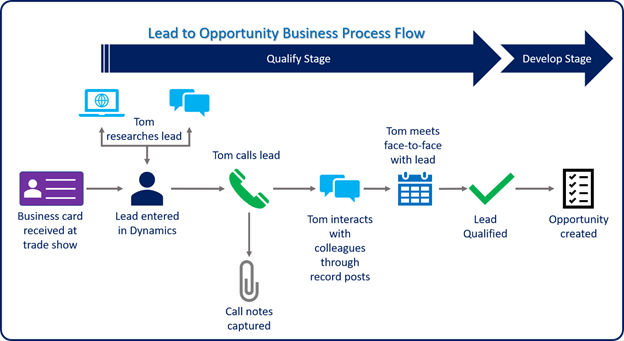

Building a healthy pipeline can be one of the most difficult and time-consuming tasks that sellers and managers do. Sales pipelines affect everything from manufacturing schedules to staffing decisions.

You can use Dynamics 365 Sales built-in features to support sales functions, such as qualifying leads and managing sales opportunities, to build a healthy sales pipeline. You can configure its features to support your sales organization’s unique and changing needs easily. 

The following graphic shows the lead-to-opportunity business process flow.

Dynamics 365 Sales gives you the tools and guidance necessary to maximize your ability to convert leads into sales opportunities. The image shows how Dynamics 365 Sales helps Tom through the entire lead qualification process including:

- Capturing information about a sales lead.
- Engaging with the lead.
- Qualifying the lead as an opportunity.

Let’s examine the Dynamics 365 Sales tools that help with lead qualification and pipeline management including:

- **Business card scanner:** Lets you find and create leads and contacts in Dynamics 365 Sales while in the field. You can identify if there's a past relationship with the customer and decide what your course of action should be.
- **Business process flows:** Guides you through each stage of your organization's procedures. You know exactly what is required in each stage of the procedure and are equipped with the necessary data and tools to execute it.
- **Relationship Assistant:** Finds important information about what your customers are doing now, such as providing reminders of upcoming activities for a sales lead or notifying you when customers are doing something that could affect a potential deal.
- **Record timeline:** Lists all related communication activities with your leads. You can review all communications from a single point, generate outreach such as phone calls and emails, and interact with team members from the lead's record.

You can also use Dynamics 365 Sales to manage your sales pipeline. Dynamics 365 Sales lets you find and capture lead information quickly. Business process flows guide you through each stage of the sales process and help you complete sales-related activities quickly and efficiently.

By taking advantage of built-in automation tools and business process guidance, you can take advantage of proven and repeatable techniques to find, manage, and qualify leads.

Dynamics 365 Sales allows you to enhance your organization’s pipeline management for greater predictability and sales forecasting. By combining key components, such as business process flows and the Assistant, with an organization’s proven sales methodology, you can disqualify any leads that aren't a good fit quickly. You can also convert leads that are a good fit into sales opportunities that populate the sellers’ sales pipeline. 

|  |  |
| ------------ | ------------- | 
|  | In this video, you’ll review how Dynamics 365 Sales helps you manage your sales pipeline through its lead management capabilities. |
 
> [!VIDEO https://www.microsoft.com/videoplayer/embed/RE4hQUn]

Dynamics 365 Sales also allows sales managers to review metrics using dashboards and built-in customizable charts and views. It gives sales managers real-time visibility into an individual's or team's performance across the entire organization. 

Once you have found sales opportunities and populated your sales pipeline, you need to turn those opportunities into revenue.
