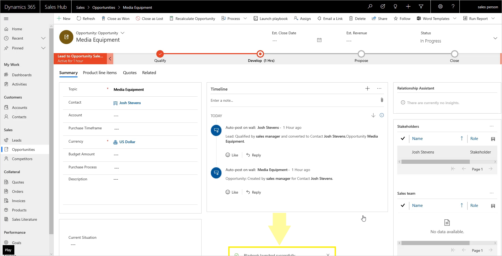

Dynamics 365 Sales lets you create and deliver quotes to customers easily and turn those quotes into sales orders and invoices. It helps you build, quote, and deliver sales contracts that are the best fit for your customers.  

You can integrate Dynamics 365 Sales with ERP applications including:

- Dynamics 365 Finance
- Dynamics 365 Supply Chain Management
- Dynamics 365 Business Central.

This integration lets you use the sales management tools in Dynamics 365 Sales to manage the process you use to sell including:

- Identifying what to sell.
- Defining the details.
- Managing the negotiation process.

You can use Dynamics 365 Sales to build and deliver sales contracts to your customers. You build sales quotes by using the integrated product catalog and contacting the right subject matter experts (SMEs) to help build the quotes. You can also take advantage of integrated collaboration tools such as Microsoft Teams. Creating a contract is simple, thanks to Dynamics 365 and its automated processes and real-time collaboration capabilities.     

By taking advantage of Dynamics 365 Sales features, such as the product catalog, quotes, orders, and invoices, you can make creating, managing, and completing sales orders simple and repeatable. Dynamics 365 Sales finds products and services that meet the customer's needs at a sales opportunity level. You can use, change, or remove the product and services throughout the entire lifecycle of the deal. By using collaboration tools, you can create a workspace where internal resources, partners, and customers can work together to create the best solution for the customer. Once you've identified the best playbook, you can apply proven sales plays to increase the likelihood of winning the deal. By using Dynamics 365’s contract management capabilities, you can increase sales productivity and accelerate overall sales performance.

## Sales playbooks

Playbooks in the Sales Hub app are a terrific way to automate repeatable processes and respond to external events. With playbooks, automation can trigger a play that creates a set of tasks and activities to remedy a situation. 

Sales managers or users with a playbook administrator role can create playbook templates for common business scenarios. The templates use playbook categories to define the event or scenario. For example, the event could be the departure of a decision-maker from an organization. The playbook defines the organization’s response to that event. You can follow the organization’s and industry best practices in the form of playbook activities. 

The following screenshot shows a playbook.

|  |  |
| ------------ | ------------- | 
|  | In this video, you’ll review how Dynamics 365 Sales helps build and deliver sales contracts to customers. |
 
> [!VIDEO https://www.microsoft.com/videoplayer/embed/RE4hLHS ]

As you learned in the video, you can use the Dynamics 365 product catalog, sales order processing, and collaboration tools to build, quote, and deliver personalized sales contracts to customers. 

Now let's learn about relationship management.
