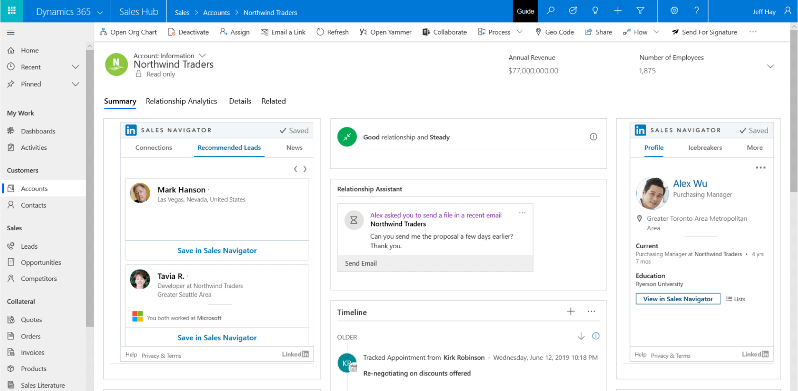

In a digital sales environment, it's important for you to reduce distractions and stay on top of your priorities. Relationships have always been key to winning in sales. In the past, you focused on knowing the customer and building authentic one-on-one relationships. Problems arise when there are disparate systems that you must navigate to get the information and insights you need to build strong relationships.

When crucial data about relationships and accounts is in silos—CRM systems, social networks like LinkedIn, and productivity and email systems—it’s impossible to obtain meaningful and actionable insights for establishing and keeping strong customer relationships. You are overwhelmed with too much information and not enough insight. 

You understand the unique needs of your customer and focus on maintaining a high level of engagement with the buyer throughout the sales process. 

With the introduction of technology, organizations have experienced significant increases in productivity. In the pursuit of productivity, you have become removed from customers. Over time, you have shifted away from building relationships to executing transactions, at a time when customers expect more authentic and personal interactions. Always plugged in to mobile devices and social media, customers are more informed and have more power and influence. It’s no wonder customers today are more demanding, have higher expectations, and are less satisfied with the sales experience. 

With Dynamics 365 Sales, organizations can move beyond disconnected data to gain real, measurable business value including:

- **Data:** Realizing business value begins by breaking down data silos to create unified and complete relationship data across Dynamics 365, LinkedIn, and Office. 
- **AI:** You can employ powerful and prebuilt AI with Dynamics 365 to derive value from the unified relationship data. You can even adapt the AI for your specific needs.
- **Insights:** The AI augments your ability to prospect and engage by finding the highest potential prospects and opportunities and specific actions to move relationships forward. Dynamics 365 Sales can also automate time-consuming, repetitive admin work to free up your time. In addition, performance insights allow managers to deliver proactive and data-driven coaching and decision making. 
- **Business value:** Sales teams can exceed customer expectations and increase sales revenue and profitably. With Dynamics 365, you finally have the insights to make measurable gains such as shorter time to quota and higher conversions, all while increasing sales productivity. 

We designed Microsoft Relationship Sales Solution (MRSS) to help you stay focused on making smart moves toward building more business. MRSS combines the intuitive ease-of-use of Dynamics 365 Sales with LinkedIn Sales Navigator. It's infused with embedded intelligence to give you personalized information at the right time, with built-in predictive lead scoring.

MRSS allows you to see holes in the sales pipeline, understand which leads might be primed to plug those holes, and which relationships might need a little nurturing. You can find and prioritize the leads that are most likely to convert to a sale easily. Once the needs are part of the sales pipeline, the relationship sales solution offers suggestions to guide the sales process. 

Thanks to embedded intelligence, you get recommendations for the right type of interaction to further the relationship. Whether it's a call, an email, or reaching out through a trusted mutual connection, you get actionable insights that help you move deals forward. 

It's all done seamlessly in the background, thanks to the connection between Dynamics 365 and Outlook. Outlook has LinkedIn integration. You can view LinkedIn profiles and other social data without leaving your inbox. The integration ensures you're talking to the right people at the right times.

With MRSS, you can avoid outside distractions and stay focused on finding and managing opportunities. You spend more time on building and maintaining relationships. 

Dynamics 365 Sales makes it easier for you to build long-term relationships with your customers. By incorporating AI capabilities and integrating with common selling tools, you have a complete tool set that works with you across each stage of the selling process. You can use existing connections to help you connect with and qualify sales prospects faster, and better understand your customers and develop targeted sales content to engage with them.

## LinkedIn Sales Navigator and MRSS

Microsoft combines Dynamics 365 Sales, Power BI apps, and LinkedIn Sales Navigator for you and your customers’ selling success.

This solution has many features and capabilities including:

- Displaying LinkedIn information on existing leads and accounts in Dynamics 365 through the Sales Navigator widget.
- Synchronizing between Sales Navigator and Dynamics 365 daily, so that leads, contacts, and accounts  present in Dynamics 365 are visible within Sales Navigator.
- Writing select Sales Navigator activities to Dynamics 365 with a single choice.

The LinkedIn Sales Navigator allows you to view LinkedIn information about leads, contacts, accounts, and opportunities. With unified relationship data, you get a view of relationships and can deliver the authentic and personalized engagement today’s customers demand.

### Take advantage of the power of your network

With LinkedIn Sales Navigator and Dynamics 365, you can:

- **Find sales prospects:** Locate and research potential sales prospects with Sales Navigator’s advanced search capabilities to gain a deeper understanding of the overall with details such as news headline information, recent activities, and job changes. 
- **Facilitate introductions:** Use icebreakers to find common connections between you and your prospect. Use those connections to facilitate introductions.
- **Connect with prospects:** Get easy access to LinkedIn InMail and increase the probability of reaching your customer and create customized sales content through PointDrive. You can view detailed statistics, such as what information is being accessed, who is accessing it, and for how long.
- **Data validation:** Keep the organizational structure of your matched leads up to date. Dynamics 365 Sales uses information from LinkedIn to validate the information on records and allows you to check on pending opportunities, or have a useful icebreaker when getting in touch with a lead.

By using both LinkedIn Sales Navigator and Dynamics 365 Sales together, you can find LinkedIn details such as news, common connections, and related records in Dynamics 365 records. It allows you to view member profiles directly in leads, contacts, accounts, and opportunities. You can also unify the relationship data and your processes, so you can build trust and manage relationships at scale easily.

You can build custom model-driven applications with LinkedIn Sales Navigator, enhancing business processes with data about people, organizations, and relationships.

The LinkedIn Sales Navigator integration allows you to display the contact's profile and the company profile. You can find mutual contacts, to improve introductions with leads, track interests, and post articles for customers. You can also review people within their company connected to your customers and find the best path to a warm introduction. Understanding related leads helps you map out stakeholders in the buying process.

The following screenshot shows the integration between Dynamics 365 Sales and LinkedIn Sales Navigator.

> [!div class="mx-imgBorder"]
>   

The icebreaker function allows you to view common networks. This insight allows you to have the right information to take the correct step with customers.

LinkedIn Sales Navigator also lets you view recent activity and shared articles. The information helps you stay informed about your customers' interests to improve relations with them. It also allows you to assess prospective customers, find mutual connections, and assess their activity in Dynamics 365 Sales. The integration connects the system of record with the LinkedIn data graph and insights.

You can keep track of your customers and their needs. You can get real-time alert when customers change jobs, connect with someone in their network, or are mentioned in the news.

You also get recommend next best actions to build relationships with embedded insights based on the customer and their interaction with data from LinkedIn, Dynamics 365, and Office 365.

|  |  |
| ------------ | ------------- | 
|  | In this video, you’ll learn how Relationship Management helps you target which sales items to pursue and providing relevant guidance during that process. |
 
> [!VIDEO https://www.microsoft.com/videoplayer/embed/RE4hYHe]

As you learned in the video, by using Dynamics 365 Sales Insights, you ensure that you're building healthy relationships with customers by understanding how to engage with them to ensure that you're maximizing the overall impact of the communication. 

With LinkedIn Sales Navigator, you can reduce the effort to manually track customers, and your connections on LinkedIn regularly fetch the information to ensure customer information is up to date.

Now let's review Dynamics 365 Sales Insights and its suite of features that analyze your customer-interaction data in Dynamics 365 Sales.
