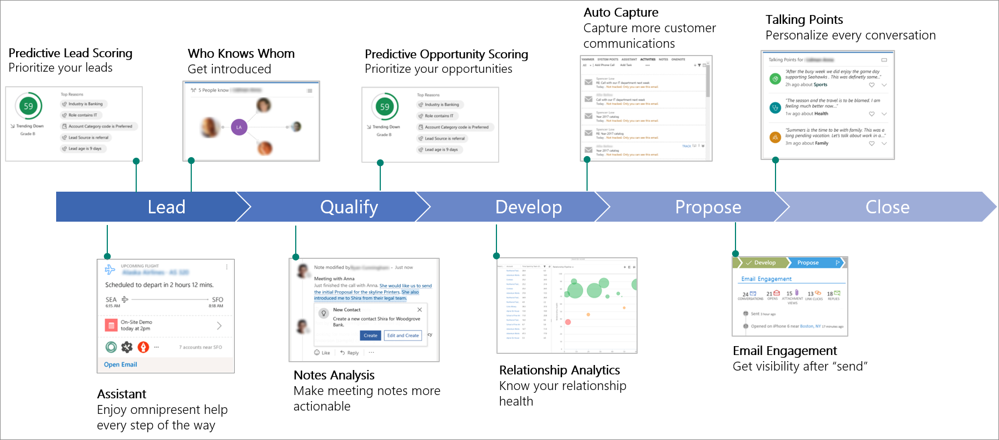
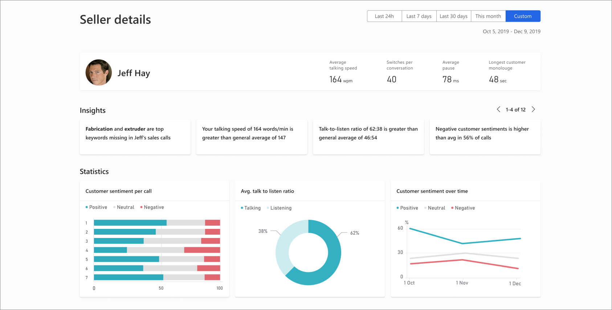

The Dynamics 365 Sales Insights application is a suite of features that analyze the customer-interaction data stored in your Dynamics 365 Sales and Office 365 databases continuously. The analysis helps you understand your business relationships, evaluate your activities with earlier successes, and choose the best path forward. Also, it allows you to build strong relationships with customers, take actions based on insights, and close opportunities faster.

Dynamics 365 Sales Insights can accelerate your organization’s sales performance with real-time analytics based on historical data and predictive information. You find out what is and isn’t working with your sales calls using conversation intelligence. It transcribes and analyzes customer emotion, sentiment, conversation content, and speaking style automatically. Dynamics 365 Sales Insights helps discover what customers are responding well to, so you can replicate successful call strategies across your sales team.

Dynamics 365 Sales Insights increases conversion and win rates by using machine learning to prioritize leads and opportunities with the highest likelihood to convert and buy. You can also create procedures that minimize routine tasks and optimize email and phone interactions by identifying what your customers are thinking. With targeted insights and repeatable call strategies, you can not only increase the overall sales output of your sales team, but you can also ensure brand loyalty today and in the future.

Dynamics 365 Sales Insights uses AI to prioritize leads and opportunities with the highest likelihood to convert and buy increasing your win rates. You can also create procedures that minimize routine tasks and optimize email and phone interactions by identifying what your customers are thinking. With targeted insights and repeatable call strategies, you can not only increase the overall sales output of your sales team, but you can also ensure brand loyalty today and in the future. 

With Dynamics 365 Sales Insights, you can take advantage of AI throughout the entire sales lifecycle to get context-based insights on the current situation. The following image is an example of a sales lifecycle. During each phase, you can use relevant Dynamics 365 Sales Insights components to help your sales team.

 

Let’s examine some of the key components that are available including:

- **Assistant (free):** The assistant feature combines and analyzes the information from Dynamics 365 Sales and generates action cards that are displayed in Dynamics 365 Sales on mobile devices and as a carousel or column in your web-based dashboard. 
- **Auto capture (free):** The auto capture feature analyzes your email messages in Microsoft Exchange to find all messages that might be relevant to your work in sales. It looks for messages to or from relevant email addresses and gives you the relevant messages in Dynamics 365. 
- **Email engagement (free):** The email engagement feature helps you create more effective email messages and learn how your contacts are interacting with them. Keep informed of your email and prioritize those prospects or customers that are most engaged. 
- **Assistant with Studio (full capabilities):** The assistant with studio feature has the assistant feature capabilities and enhanced features that allow you to create and display custom insight cards. You use Studio to create the custom insight cards through Microsoft Flow. After you create the cards, you can configure prioritization and who can review the cards. 
- **Relationship analytics:** The relationship analytics feature gathers information from Dynamics 365 Sales for key performance indicators (KPIs) and activity histories. It displays the information in a graphical representation. 
- **Predictive lead scoring:** The predictive lead scoring feature helps you focus on revenue generation efforts by giving you a lead score based on past selling efforts. The score helps you prioritize your efforts on quality opportunities. 
- **Notes analysis:** The notes analysis feature monitors notes that you enter about meetings or discussions with your customers and it gives you intelligent suggestions. 
- **Talking points:** The talking points feature displays topics that you can use to start a conversation with your customer such as sports, vacation, family, and entertainment. 
- **Who knows whom:** The who knows whom feature gives you details from your colleagues' emails, meetings, and engagements about  potential leads that you're going to interact with. By having someone who can introduce you to leads, you're more likely to obtain a meeting with them. 
- **Predictive opportunity scoring:** The predictive opportunity scoring feature helps you to focus on revenue generation efforts by giving you a score to prioritize efforts on quality opportunities. Dynamics 365 Sales Insights analyzes details from previously won and lost opportunities to generate the scoring model.
- **Dynamics 365 assistant for Microsoft Teams:** The Dynamics 365 assistant for Microsoft Teams feature gives you in-context and timely guidance across the sales lifecycle so that you can spend more time building relationships with your customers. 

> [!NOTE]
> The Dynamics 365 assistant app for Microsoft Teams is currently in preview.

Dynamics 365 Sales Insights allows you to achieve more, onboard, coach, and motivate your sales team with fun team competitions that energize and engage everyone. Using Dynamics 365 Sales Insights, you can:

- Increase sales performance.
- Train your sales team faster.
- Coach more effectively with AI-driven insights.
- Help busy sales leaders proactively flag at-risk deals.
- Gain visibility into conversations.
- Give actionable feedback through built-in coaching tools.

The following screenshot is the Dynamics 365 Sales Insights coaching tool.

 

The Dynamics 365 Sales Insights coaching tool can pinpoint emerging customer needs to help you grow your business. It helps you stay ahead of the market with insights derived from brand and competitor mentions. You can get answers in real time with natural language questions and answers based on sales and conversation data.

With Dynamics 365 Sales Insights, you can:
- Help sales managers drive performance with pipeline analysis, deal insights, relationship analytics, and conversation intelligence.
- Discover emerging customer needs, competitive dynamics, and market trends with AI-driven insights.
- Find at-risk deals, gain visibility into conversations, and provide actionable feedback through built-in coaching tools.

Backed by artificial intelligence, Dynamics 365 Sales with Sales Insights equips you with tools to close more deals and maintain a long healthy relationship with your customers. It gives you the right information at the right time such as reminders, recommendations, and next step suggestions. 

### Sales Insights application

We designed this application to help you keep track of your daily work. The Dynamics 365 Sales Insights application delivers AI driven insights from your customer. To achieve the insights, it gives you information through key performance indicators (KPIs) for pipeline and deals and intelligent call data KPIs through conversations intelligence.

The Dynamics 365 Sales Insights features and coupled with data and insights from Dynamics 365 and Office 365, help you manage intelligently, answer you most important business questions quickly, and make strategic sales decisions.

> [!NOTE]
> You must buy a Dynamics 365 Sales Insights license to use Dynamics 365 Sales Insights features.

The Dynamics 365 Sales Insights application has predictive insights to help you guide your business and your team towards success.

With Dynamics 365 Sales Insights, you can:

- Learn about trending topics, competitive trends, and brand mentions. Dynamics 365 Sales Insights bases the insights on what customers are talking about on sales calls. The insights help you launch sales trainings or design new sales motions for your organization.
- Review unique behavioral patterns of the top sellers and bring those best practices and learnings to the rest of your team. You can also track important deals that need attention and guide your sales team to bring those deals to a healthy state.
- Review KPIs understand the current state of the business quickly.
- Find which team members need guidance by reviewing insights in the Teams overview page.
- Personalize your coaching for team members by reviewing the customer sentiments and the conversation style of team members to maximize success.
- Drill down into an individual team member to get a quick view of the specific team member. You can also review high-level insights and sentiments across each conversation, drill further into a specific conversation, review the transcript of the conversation, and then leave coaching comments to provide assistance. It gives you an easy and efficient way to close the coaching loop. It allows your team members to review the comments left by coaches or sales managers.
- Review related opportunities for a conversation in context without switching applications. You can ask the system for additional information about your sales data using natural conversational language, such as, "What is the quality of our leads?" It gives you a visualization of the answer. Suggested questions help you uncover trends and drive better performance.

|  |  |
| ------------ | ------------- | 
|  | In this video, you’ll learn how Sales Insights can help you analyze data from sales calls. |
 
> [!VIDEO https://www.microsoft.com/videoplayer/embed/RE4hOhz]

The video showed how to provide your team with a deeper understanding of their organization. Taking advantage of the analytics provided, you can train and coach your entire sales staff. You can find what works, and make sure you train the sales staff accordingly.

Now let's take a look at Forms Pro.
