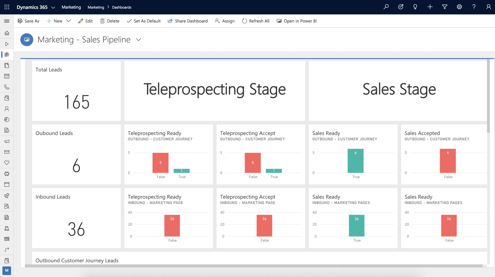

Dynamics 365 Marketing helps you plan, automate, and monitor the full customer journey. Prospects travel from discovery, through nurturing, and onward to become marketing-qualified leads.

As you engage with leads through marketing initiatives, not all leads are going to respond the same. Some leads will identify with your organization and will be more likely to respond to communication they receive. Other leads may not be as invested and won't respond or engage as often. Marketing lets you prioritize which leads to focus on with customizable lead scoring rules. These rules tell you which leads are most engaged based on how they interact with your marketing campaigns automatically.

Dynamics 365 Marketing helps you to create, nurture, and prioritize leads. You can run targeted, multi-channel campaigns and personalize each customer’s journey to generate more sales-ready leads. By personalizing the customer experience, you can predict the customer’s intent, get a holistic view of your customers, and orchestrate a connected, personalized journey. 

With Dynamics 365 Marketing, you can build relationships at scale and gain credibility by finding stakeholders and decision-makers.

Dynamics 365 Marketing also helps you gain strategic insights to make better decisions and improve the performance of your marketing business processes. These insights help you improve automated marketing performance with AI-driven insights, lead scoring, and custom dashboards.

You can target and connect with LinkedIn audiences by importing leads generated using LinkedIn’s lead tools. We bundled this feature with Dynamics 365 Marketing but is also available as an add-on for other Dynamics 365 products.

As contacts interact with your marketing initiatives, you'll generate leads to represent expressions of interest made by those contacts. You might generate a lead manually after a meeting or phone conversation, or you might allow the system to generate the leads automatically. You generate leads in one of the following ways:

- Use Dynamics 365 Marketing to create a lead and link it to a new or existing contact manually.
- Import leads from a file that you map to a new or existing contact or account manually.
- Sync leads from LinkedIn Lead Gen Forms and match them to a new or existing contact or create a new linked contact.
- Create a lead with the create-lead tile in a customer journey. You can link the leads to either a new or existing contact or account, depending on the tile and customer journey settings.
 
Dynamics 365 Marketing can also create a lead when a customer opts in from either a landing page or an event registration. It will match the lead to a new or existing contact or account.

## Integration with Dynamics 365 Sales

You can create a single customer record across marketing and sales. Shared records mean that when marketing hands off to sales, the sales team knows everything about the customers and their history with the brand.

Since  Dynamics 365 Marketing integrates with Dynamics 365 Sales, you can connect sales and marketing functions. The connection helps you set up automated follow-up sales activities for your marketing campaigns to ensure you're tracking the progress of every lead. 

Custom email messages and marketing pages allow you to better communicate and interact with your prospects and customers. You can combine the emails and pages into interactive customer journeys. The journeys help you develop and nurture leads through personalized experiences. For example, you can send an email to a customer segment that includes links to different product marketing pages. Depending on which link customers select, you may send more targeted communications. 

The following image shows the integration between the marketing and the sales pipelines. 

> [!div class="mx-imgBorder"]
> 

Now let's turn to lead qualification.
