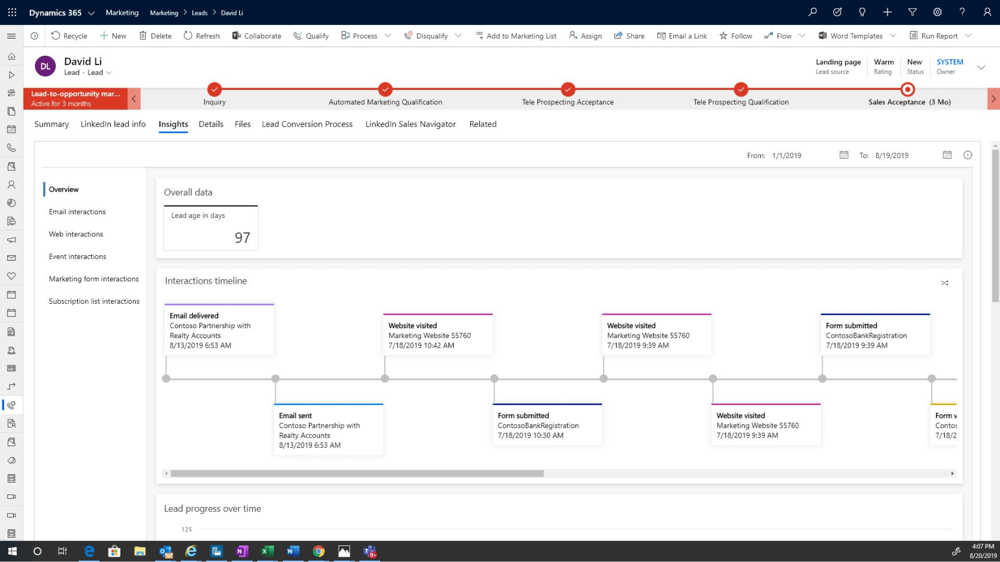

Dynamics 365 Marketing nurtures leads through a qualification process and then gives qualified leads to the sales team.

With Dynamics 365 Marketing, you can easily create automated multichannel campaigns, using the *Customer journey designer*. You define the path that specific leads in different demographics follow to qualification or create leads from prospect submissions made on custom landing pages automatically. As contacts interact with your marketing initiatives, you can create leads manually or automatically. Dynamics 365 scores the contacts based on their interactions with your campaigns.

The following screenshot is a lead qualification screen.

> [!div class="mx-imgBorder"]
> 

With Dynamics 365 Marketing, you can:

* **Create a single view of prospects:** You can unify data across contacts, leads, and customers with Dynamics 365 Marketing and Dynamics 365 Sales.
* **Target the right people:** You can find, target, and close top accounts with personalized, account-based content and nurture activities.
* **Prioritize leads:** You can create customized lead-scoring models and sales readiness grades that find leads across all touch points easily. 
* **Increase productivity:** You can use marketing automation features to give promising leads to the sales team and drive follow-ups automatically.
* **Boost productivity and simplify collaboration:** You can use familiar Office 365 tools, shared calendars, and cross-team visibility to improve the handling of campaigns and leads.

With Dynamics 365 Marketing, you can create custom lead scoring models easily based on how customers interact with your organization. This scoring ensures that you're focusing your efforts on what you consider to be the best leads.
 
|  |  |
| ------------ | ------------- | 
|  |In this video, you’ll learn how you can create and apply lead scoring models to assist in lead qualification. |

> [!VIDEO https://www.microsoft.com/videoplayer/embed/RE4hQUo]

As you learned in the video, Dynamics 365 Marketing makes it easy to find and target the right leads. With customized lead scoring models, you can also create customer segmentation. 

Dynamics 365 Marketing gives you options for generating, managing, nurturing, and qualifying leads. These options include:

- Creating leads by reviewing your marketing sales pipeline dashboard.
- Using a multi-channel campaigns to target leads.
- Managing and qualifying leads to sales.

Next, we'll examine how to guide leads through qualification by creating customer journeys.
