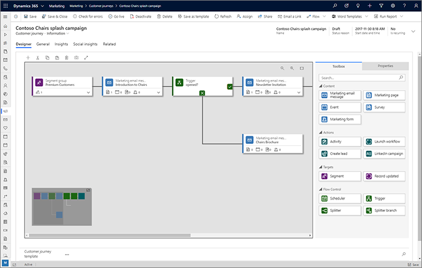

With Dynamics 365 Marketing, you can create powerful customer journeys tailored to the products you're marketing and your campaign objectives. The customer journey includes customers:

- Discovering your product
- Evaluating whether it meets their needs
- Looking for a good offer
- Making a purchase. 

Dynamics 365 Marketing allows you to visualize and automate that journey. Customer journeys create a model that guides a targeted marketing segment through the process. The guidance includes automated messaging, activity generation, interactive decision points, and more.

Using Dynamics 365 Marketing lets you select how simple or complex a customer journey might be. Emails, task assignments, business workflows, decision points, and internal action items can feed customized customer journeys.

The following graphic shows the designer screen for an automated customer journey.

With customer journeys, you can:

* **Attract the right prospects** by creating campaigns that target specific customer segments across multiple channels including email marketing, web landing pages, events, telemarketing, SMS integration, LinkedIn integration, and other custom channels.
* **Create customer reusable campaign assets quickly** with automation features such as configurable templates, reusable content blocks, and design tools. You can create a vast library of marketing content that you can take advantage of across different customer journeys. Tools like Power Automate can help streamline content approvals and easily integrate with third-party content management systems.
* **Personalize customer journeys** by taking advantage of customer preferences and their past interactions. You can create personalized customer journeys and sync and nurture LinkedIn leads automatically with the Dynamics 365 Connector for LinkedIn Lead Gen Forms app.
* **Run business unit-level marketing** and reuse shared campaign content to define the audiences you target. 

|  |  |
| ------------ | ------------- | 
|  | In this video, you’ll learn how you can create a customer journey. |

> [!VIDEO https://www.microsoft.com/videoplayer/embed/RE4hW4c] 

### Journeys

As you learned in the video, you use Dynamics 365 Marketing to build rich customer marketing campaigns by including items like customer segments and pre-defined email templates. As a result, your leads are better qualified and easier to turn into sales revenue. 

From simple single-email campaigns to complex, interactive customer journeys, Dynamics 365 Marketing provides a graphical, journey modeler. Using the journey modeler, you can create a full journey process. You're also able to assign tasks and trigger business workflows. Your customers’ needs and preferences drive the process, making the journey comfortable and enjoyable for them.

The success of any customer journey depends on ensuring that the journey is targeting the right prospects.

Now let's review to customer segmentation.
