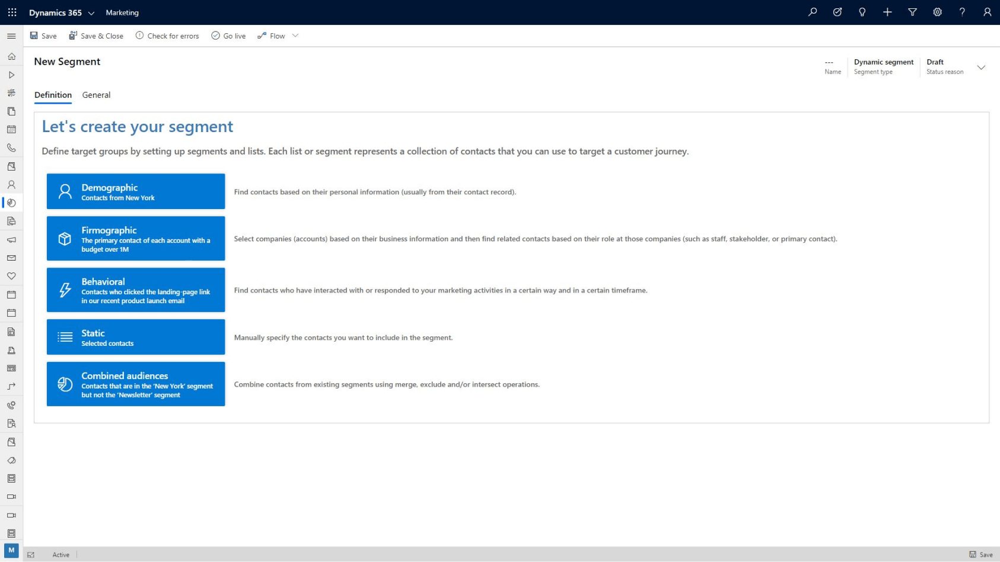

One of the first and most important decisions you'll make when you design a marketing piece is to choose the correct audience. Once you select your audience, you can tailor the message to best appeal to that group of people.

You usually generate marketing campaigns focused on your products or services, especially new products, and send it to existing customers based on their past buying history, organized in segments. 

A market segment is the collection of contacts that you target with a customer journey. In some cases, you'll target all the contacts you have. In most cases, you'll choose who you want to target based on demographic or firmographic data and other considerations.

Unlike marketing lists, you base marketing segments on marketing insights. We designed the marketing-insights service to process data without affecting the performance of your Dynamics 365 user interface and other functions.

You use Dynamics 365 Marketing’s Segmentation Designer to set up groups of related contacts that you can target for your customer journeys. You can query across multiple related entities to target the specific demographics for a customer journey or campaign. Once you determine your segments, Dynamics 365 Marketing can calculate a score for each lead. It monitors leads until their score indicates they are sales ready.

The following graphic shows the start screen of the Segmentation Designer.

> [!div class="mx-imgBorder"]
> 

With Dynamics 365 Marketing, you can create customer segments easily based on different qualification factors to ensure that you're marketing services to the correct customer base. You can segment customers based on:

* **Demographic:** Find contacts based on their personal information stored in their contact record. For example, you can select contacts that are from New York. 
* **Firmographic:** Select companies based on their business information, and find related contacts based on their role at the companies. For example, you can select the primary contact of each account with a budget over 1 million dollars. 
* **Behavioral:** Find contacts who have interacted with or responded to your marketing activities in a specific way. For example, you can select contacts who selected the landing page link in a recent product launch email during a specified timeframe. 
* **Static:** Create a segment by selecting the contacts manually. 
* **Combined Audiences:** Combine contacts from existing segments. For example, you can select contacts that are from the New York segment and the newsletter segment. 
 
|  |  | 
| ------------ | ------------- | 
|  | In this video, you’ll learn how to create different types of marketing segments, and control which records are available in them. |

> [!VIDEO https://www.microsoft.com/videoplayer/embed/RE4hQUt]

As you learned in the video, Dynamics 365 marketing lets you create customer segments and control the members in those segments. You can populate customers dynamically based on common criteria, or you can combine multiple customer segments to create even more powerful and targeted lists. 

Once a customer interacts with your organization, they're scored using the Lead Scoring Model Designer. It uses actions, such as opening an email, visiting a landing page, visiting your website, or attending an event, to calculate their score. Dynamics 365 Marketing places them into the best segment(s) for them, based on their demographics. Then, you can attach them to a customer journey or campaign. You can nurture customers along the sales journey and ensure that good leads aren’t lost along the way. 

Finally, let's see how Dynamics 365 Marketing helps your organization manage marketing events.
