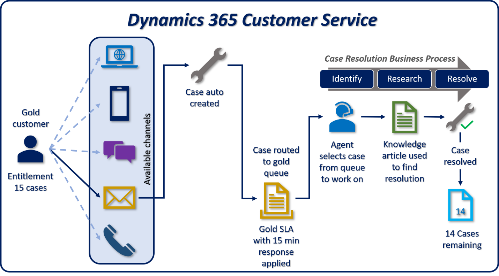

Dynamics 365 Customer Service helps you serve your customers with the right tools to resolve cases faster and increase customer satisfaction. Dynamics 365 Customer Service's tools help you manage caseloads, generate service-related activities, and proactively help agents find the best resolution to a customer’s problem. Dynamics 365 Customer Service also provides complete case management solutions to improve the personalized support you provide for your customers. 

It's important that you understand your customers when they request support. For example, some customers are entitled to different levels of service. Based on the customer and what they've purchased, you may have to adhere to quicker response times. Other customers may have contracts that allow them to open a specific number of cases for their products. Failure to meet those promises can affect your customer satisfaction and retention.

To optimize response times, drive faster, accurate case management and resolution, and meet important KPI goals, Dynamics 365 Customer Service includes the following entities and components:

* **Cases:** Cases are items that you need to resolve. Cases can include questions, problems, or anything else a customer may ask about.
* **Queues:** Queues are containers for similar cases that are waiting on a response from an agent. You can organize cases by similar topics, levels of difficulties, or other custom rules.
* **Entitlements:** Entitlements are numeric- or time-based contract records you use to manage how products are serviced, who from a customer account can open cases, and the channels through which you receive a case.
* **Service-level agreements:** Service-level agreements define the level of service or support promised to a customer. They include the KPIs that you need to reach to meet that service level. 
* **Knowledge article:** Knowledge articles are support articles available either internally or externally that customers or agents can reference to resolve a problem.
* **Routing rules:** Routing rules are criteria that decide which queue a case belongs in. 
* **Automatic Record Creation rules:** The automatic record creation and update rules primarily help administrators define rules to create any entity record from a set of available activities. For example, creating cases from the emails sent by customers. 
* **Business process flow:** Business process flows ensure that users enter data consistently and follow the same steps. For example, creating a customer service process that all customer service members adhere to.

Let’s review at an example of how all these different elements work together to provide a complete solution. The following graphic is a typical customer service support scenario where a customer has a support agreement with a service center. 

- We have a gold customer with a support contract, called an entitlement. The customer is entitled to open 15 cases over a one-year period. They can open cases from multiple channels. In the graphic, the customer sent an email. 
- After you receive the email, a record creation rule examines the email and the system creates a case automatically.
- After Dynamics 365 Customer Service creates the case, a routing rule places it in the gold queue. A service level agreement adds a first response by KPI that shows you must contact the customer within 15 minutes. 
- An agent from the gold queue picks the case to work on.
- Dynamics 365 Customer Service applies a pre-configured case resolution process to the case. It guides the agent through the resolution process. You can define different case resolution processes based on your needs. 
- During the research stage, the agent searches for a knowledge article that has a potential resolution and emails the article to the customer from the case record. After the customer confirms the information solved their issue, the agent resolves the case.
- After the case is resolved, the system updates the customer’s entitlement record, indicating that 14 cases remain on the customer's entitlement. 

Now that you know how a few of the different elements of Dynamics 365 Customer Service work together, let’s review how you can take advantage of them in different scenarios. First, we will discuss the account management options available in Dynamics 365 Customer Service.
