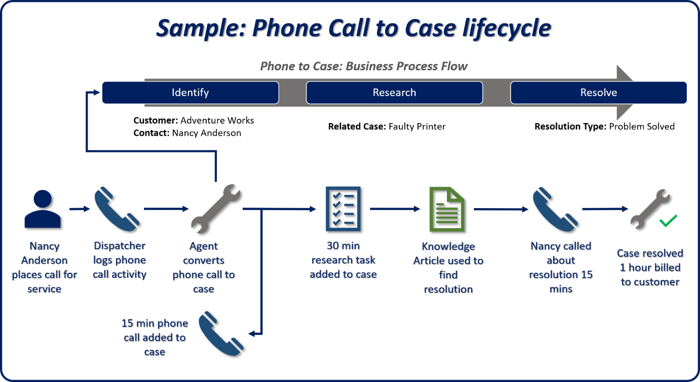

Dynamics 365 Customer Service not only makes it easier for you to work on and manage caseloads, it also has the same user experience whatever device you're using. It puts powerful case management capabilities at your fingertips.

One key element that makes it easy for you to find and manage cases is in the interactive dashboards. The dashboards include visual filters that you use to pare down the data displayed with multiple interactive charts. You drill down using the charts to find the most appropriate cases to work on. The interactive dashboards include: 

* **Tier 1 dashboard:** The Tier 1 dashboard has multiple streams of data from multiple entity types. It makes it easy for you to work with cases and related items such as activities or email. 
* **Tier 2 dashboard:** The Tier 2 dashboard has a single stream of data based on active cases. It includes multiple tiles and interactive charts for working with case data. 
* **Entity-specific dashboards:** The entity-specific dashboards are specific to an entity that includes multiple streams of data related to that specified entity. 

Case lifecycle management has multiple features on the case form to help you manage and resolve case records including:

* **Case general information:** Case general information shows key information about the case such as the case description, contact, product, and entitlement.
* **Service-level agreement (SLA):** The SLA shows a countdown timer for the applicable SLA indicators such as first response and resolve by timeframes. These visual cues help you ensure that you're meeting the SLAs for your customers.
* **Timeline:** The timeline shows all interactions (activities, notes, and posts) related to the case. You can:
    - Review relevant communication from earlier interactions in an aggregated view.
    - Manage or close open activities from within the timeline.
    - Record time spent on case-related activities to decide how much time to bill the customer.
* **Related:** This feature allows you to search the knowledge base within the case record. The system uses data from the case record to populate the search criteria.
    - Once you find a knowledge article, you can email to the customer directly from the case and attach it to the case record. This information can help you in the future with similar cases.
* **Business process flows:** You can define business process flows to help you resolve issues. Business process flows ensure that you take advantage of the most appropriate business processes based on the specific case you are working with.
 
The following graphic is a high-level overview of how all these components work together.

|  |  |
| ------------ | ------------- | 
|  | This video shows Dynamics 365 Customer Service's case management capabilities. |

> [!VIDEO https://www.microsoft.com/videoplayer/embed/RE4hQUp]

As you learned in the video, Dynamics 365 Customer Service reduces the overall case resolution time, allows you to support more customers, and helps increase your organization’s customer satisfaction rating.

Now let's turn our attention to knowledge management.
