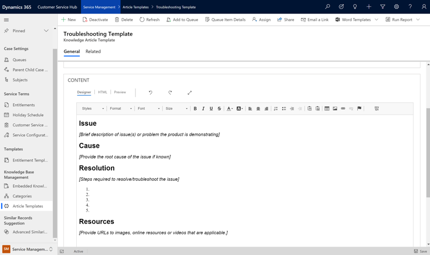

Dynamics 365 Customer Service's knowledge management capabilities help you and your customers alike with easy to find tips on how to resolve commonly reported issues and answers to frequently asked questions. Deploying knowledge management solutions helps organizations increase productivity and customer satisfaction. You can find resolutions with a structured knowledge repository. Customers can also access articles shared within customer-facing portals independently.

You can use the collective knowledge of your agents to document knowledge content. Other employees can reference this content internally, and by customers through a self-service portal.

The following screenshot shows the article template that you use to create knowledge articles.

> [!div class="mx-imgBorder"]
> 

 Dynamics 365 Customer Service knowledge management solution allows you to:

* **Create and design rich knowledge articles:** You can design article content with the included editor, where you can create dynamic HTML content like embedded images and hyperlinks.
* **Manage the article lifecycle:** You can manage the entire lifecycle of an article to ensure that it meets your company’s standards before you publish or store it in the knowledge base with automated business process flows. Rejected articles have the required changes noted to make it easy for the author to correct the issues.
* **Manage articles version history:** Article versioning lets you manage updates to articles without disrupting live or published articles. 
* **Translate articles:** If you support customers in multiple languages, you can make translated versions of knowledge articles available. When publishing articles with translations, you can publish all translations at the same time. 
* **Flexible article publishing:** You can publish articles as soon as they're approved or schedule articles that refer to future products, or support future scenarios, to publish later. 
* **Article expiration:** You can define expiration dates to ensure that article content is never outdated. 
* **Track and analyze article statistics:** You can track how many times an article is used, viewed, and sent to customers. Use this information to help decide potential topics for future articles or to see which topics are most referenced.

You can use Dynamics 365 Customer Service knowledge management capabilities to create knowledge articles for both employees and customers.

|  |  |
| ------------ | ------------- | 
|  | In this video, you’ll learn how easy it's to create and publish knowledge articles.|

> [!VIDEO https://www.microsoft.com/videoplayer/embed/RE4hW4d]

As you learned in the video, it's easy to create knowledge article content and publish it in multiple languages to assist customers all over the world. 

Knowledge articles reduce case resolution time and improve agent productivity. The information they contain helps you resolve customer issues. You can also use the articles as product documentation, answers to frequently asked questions, user guides, and more. 

Next, let’s examine how your organization can expand the service your customers receive through various digital engagement channels. 
