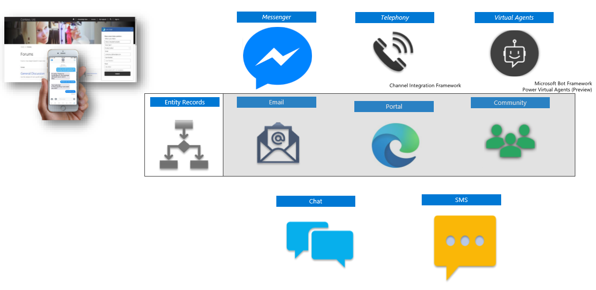

Service focused organizations understand the need to adjust their support strategy to provide customers with the best support options based on their needs. Customers want to engage with service organizations on their terms. They want to contact you when and how they feel most comfortable. Customers also want to know that when they do contact you, you'll have the information required to solve their issue.

One way that you can help customers is to offer various support channels for your customers. You can provide support via phone, email, live chat, virtual agents, social media, forums, and self-service knowledge bases. We call this range of options multi-channel support. When you give your customers multiple support options, you make it easier for them to start support requests. The increased request volume can be a challenge. It's also a challenge to give customers a comprehensive and equally satisfying experience across any channel they're using. 

The following graphic illustrates the various channels through which agents can communicate with their customers.

> [!div class="mx-imgBorder"]
> 

For organizations that offer live chat, virtual agents (bots), and phone support to their customers, it's critical that the same information is available through all channels. An agent who is working with a customer through a chat should take advantage of the same knowledge repositories as an agent talking on the phone. At the same time, as you transition customers across different channels or departments, agents should know the context of what has happened to that point. This knowledge transfer ensures that customers don't have to repeat any earlier tried resolution steps. 

Omnichannel for Dynamics 365 Customer Service gives you the following capabilities:

* **Session management:** You can work with multiple customer sessions simultaneously. You can also switch between sessions without losing the context of the conversation or any customer details. Within a session, you can access other necessary applications including other Dynamics 365 entities and other line-of-business applications. 
* **Customer interaction:** You can engage with customers through the channels your customers prefer, offering a personalized experience. Tools such as real-time sentiment analysis, quick replies, and knowledge base access help you understand your customers' needs, speed up communication, and help to resolving issues faster.
* **Customer context:** You have a single contextual view of the customer called the customer summary. The customer summary screen helps you understand the context of the conversation by giving you the important details in a single location. The details include:
    - **Customer:** Lets you access account or contact details about the customer you're communicating with. 
    - **Case:** Links your conversation to a new or existing case record to keep all relevant information together. 
    - **Recent cases:** Helps you understand a customer’s history with quick access to all recent cases that your organization helped the customer with. 
    - **Timeline:** You can easily access the customer's historical activities like phone conversations, emails, and tasks. This combined view eliminates the need to open additional screens to search for this information. 
    - **Conversation summary:** Allows you to know your customers better by giving you additional contextual details that help service the customer quickly and effectively. These details might include answers to pre-chat survey questions, browser or machine information, or even details about what customers were doing before they started the conversation.
* **Access to familiar Dynamics 365 tools:** You can take advantage of existing Dynamics 365 functionality, such as record searching, quick record creation, and agent presence information. 
* **Real-time notification:** You can route items to qualified agents who are available to help the customer. They'll be notified of incoming communication from customers automatically. 
* **Proactive chat:** You can engage customers while they're visiting customer portals by inviting them to chat conversations automatically, based on predefined rules that consider factors such as end-user data or time spent on a web page.
* **Power Virtual Agent integration:** You can route customers to bots automatically, which can help you triage and handle specific types of customer inquiries. Through triggers, virtual agents will know when to redirect conversations to live agents automatically. When agents receive a conversation from a virtual agent, Dynamics 365 Customer Service includes all earlier communication with the bot. 
    - Additionally, you can take advantage of bots in the user interface to give context-based recommendations to help agents in resolving issues faster. 
* **Skill-based routing:** Skill-based routing lets you route conversations to the best agent based on agent skills. This skill alignment improves automatic work distribution efficiency by ensuring the agent has the right skills to resolve a customer issue most effectively.
* **Agent scripts:** Agents can take advantage of pre-configured scripts for step-by-step guidance to resolve issues. You can configure and automate these steps based on session types to ensure adherence to the appropriate processes. 

Your organization can use Omnichannel for Dynamics 365 Customer Service to provide a true omnichannel support solution to your customers. This tool lets you engage with multiple customers at a time from a single interface. 

|  |  |
| ------------ | ------------- | 
|  | In this video, you’ll learn how to support customers in the Omnichannel for Dynamics 365 Customer Service interface and take advantage of the customer summary screen to gain insight into the conversation. |

> [!VIDEO https://www.microsoft.com/videoplayer/embed/RE4hQUu]

As you learned in the video, you can use Omnichannel for Dynamics 365 Customer Service to accept incoming conversation requests from your customers and open them across multiple sessions to keep their information separate. By taking advantage of tools available, you can check customer sentiment and take advantage of tools to help resolve customer issues. 

Omnichannel for Dynamics 365 Customer Service lets you engage with customers across modern channels such as chat, SMS, and Facebook Messenger. Each session gives you contextual information, so you can spend more time finding a resolution and less time on data intake. The system stores and maintains all session information until you close the session. With tools like sentiment analysis, knowledge article access, and ease of use functionalities, you can reduce call times, improve customer satisfaction ratings, and give personalized customer service. 

Next, let’s examine how you can take advantage of self-service customer portals to help customer work through common issues, instead of having to route everything to your agents.
