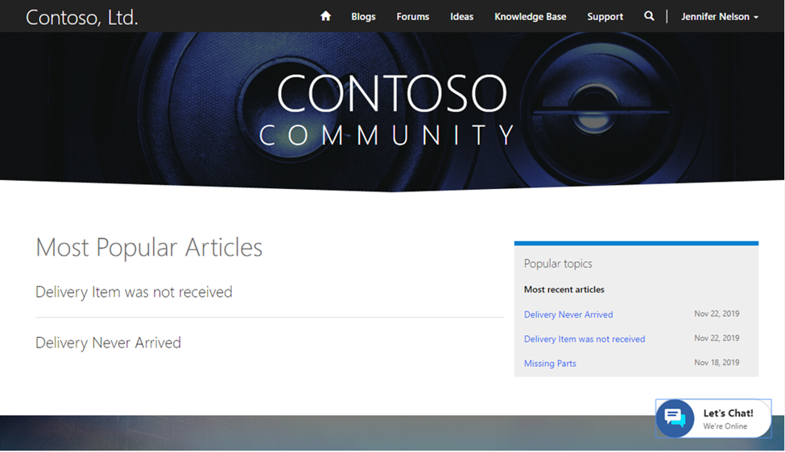

You have customers, and customers need support. With a customer self-service portal, your customers can sign into their account to create and monitor their support cases. You’ll get fewer emails and calls from individuals looking for updates, and you can capture better targeted data about a case.

A customer self-service portal is an additional way for your customers to interact with your agents. The knowledge base, for instance, allows your customers to search for product support and documentation. With infused intelligence, Dynamics 365 Customer Service portals can show customers knowledge base articles based on previously entered keywords. You can also direct your customers to forums, where they can engage with their peers who have similar interests or issues. When help is needed, they can submit new cases from the portal. 

The following screenshot is a customer self-service portal.

> [!div class="mx-imgBorder"]
> 

Through a customer self-service portal, your customers have easy access to the information they need to be successful. 

|  |  |
| ------------ | ------------- | 
|  | In this video, you’ll learn how you can take advantage of the tools available in a portal in different scenarios, and how customers can use the portal to start support requests. |

> [!VIDEO https://www.microsoft.com/videoplayer/embed/RE4hQUw]

As you learned in the video, customers can take advantage of self-service portals to locate information that is important to them through tools like forums, blogs, and knowledge articles. When more personal help is needed, they can start support requests and engage with both virtual and human agents. 

By implementing customer self-service portals, you can take advantage of data stored in Dynamics 365 Customer Service to create a complete self-service customer solution. 

Now that we've seen the types of information that you can find on customer-facing self-service portals, let’s examine a tool that can help you find which content needs to create for continually relevant support topics. 
