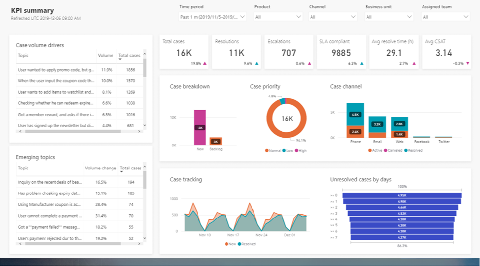

Dynamics 365 Customer Service Insights provides actionable insights into critical performance metrics, operational data, and emerging trends about to support issues. These insights help you evaluate and respond to customer issues affecting key performance indicators (KPIs) and customer satisfaction levels. 

Dynamics 365 Customer Service Insights analyzes your support cases and groups similar ones together into topics using AI. These groups allow you to focus on the issues that are having the biggest effect on your organization. You can make smarter decisions about what to optimize or automate to ensure delivery of exceptional customer service. Built-in dashboards, interactive charts, and visual filters give you deep views into operation data across multiple channels. By comparing data across topics, you can pinpoint and resolve issues before they affect customers. 

The following screenshot shows a Dynamics 365 Customer Service Insights KPI summary. 

> [!div class="mx-imgBorder"]
> 

By drilling into topics and reviewing the cases included, you can give feedback that influences which cases you include in topics in the future. The AI-driven technology allows you to make informed decisions about how to improve resolution rates, reduce wait times, and lower customer service costs. You can also use case resolution insights, backlog trends, and historical comparisons to evaluate agent performance. You can assess business affect and address inefficiencies in your system.

You can add common support issues found in Dynamics 365 Customer Service Insights in power virtual agents. It helps you build smarter bots quickly. With power virtual agents, you can create intelligent bots using a guided, no-code graphical interface without the need for data scientists or developers. 

|  |  |
| ------------ | ------------- | 
|  | In this video, you’ll watch Dynamics 365 Customer Service Insights in action.|

> [!VIDEO https://www.microsoft.com/videoplayer/embed/RE4hW4e]

As you learned in the video, you can use Dynamics 365 Customer Service Insights to gain a deeper understanding of your data to discover and adapt to current and emerging trends. You can act on these insights by using tools like power virtual agents to create automated bots. The bots interact with customers based on the topics found in Dynamics 365 Customer Service Insights.

Now that we've covered Dynamics 365 Customer Service, let's see how much you remember with a quick knowledge check.
