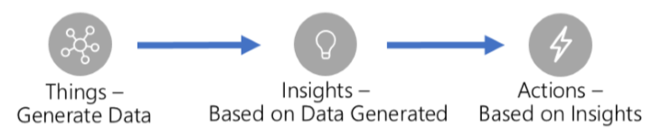
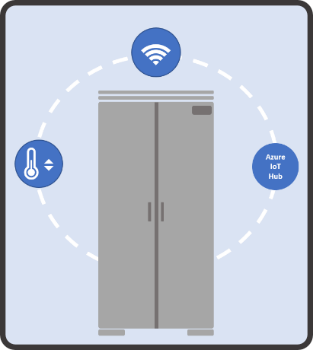
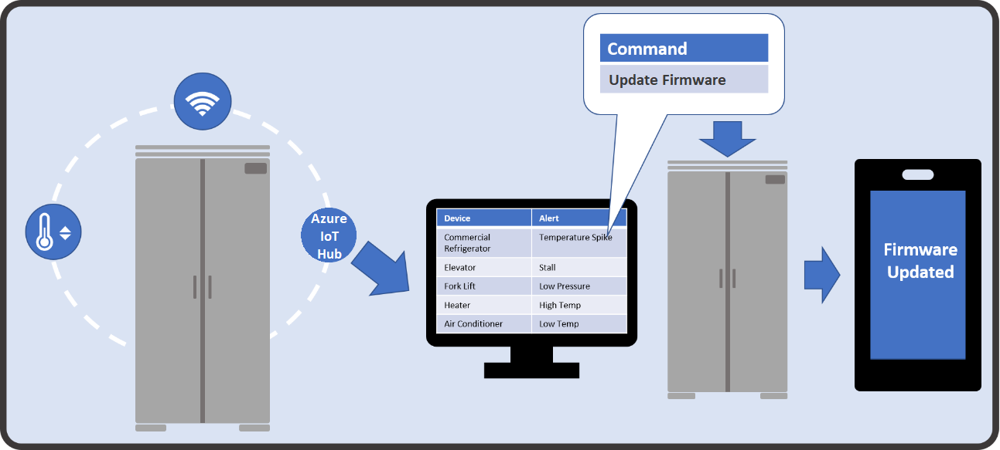

With more internet of things (IoT) devices connected to the internet, there's a large amount of telemetry available for you to capture, analyze, and act on. A complete IoT solution covers the following three key areas:

> [!div class="mx-imgBorder"]
>  

Dynamics 365 Field Service is an important part of the actions based on insights area. Connecting an IoT device to a customer asset allows you to detect and diagnose problems before your customer is aware of an issue. You can schedule an on-site visit proactively or send an automated command to reset the device. When technicians visit on-site, they use the Dynamics 365 Field Service app. The app includes the customer's details in the work order. Dynamics 365 for Field Service scheduling capabilities optimizes your visits and routes.

Dynamics 365 Field Service combines monitoring and preventative maintenance with the IoT to replace your traditional break-fix service model. It is a proactive, never-fail model. You capture the information transmitted by your IoT devices and turn that information into actionable items that you execute from a Dynamics 365 instance.
 
The following graphic shows an IoT refrigerator sharing temperature readings with the local IoT hub.

You can register your customers' assets such as appliances, equipment, sensors, or any IoT device with an Azure IoT Hub or in Azure IoT Central within Dynamics 365 or the Field Service app. You can group and register assets that have multiple sensors at one time to simplify deployment. For example, a refrigerator can have:

 - A temperature sensor that monitors the overall temperature of the unit.
 - Multiple moisture sensors that monitor the moisture levels of specific zones.
 - A motion sensor that monitors how often the door of the unit opens. 

The following graphic lists the possible IoT alerts.

Once you register an IoT device with a sensor as an asset and connect it to the internet, the device sends information like temperature readings to either an Azure IoT Hub or Azure IoT Central. When a device detects a spike or drop in temperature, Dynamics 365 creates an alert for the device. Based on the conditions in the alert, Dynamics 365 Field Service triggers an automated process that handles and resolves the alert. For example, if a compressor in a device fails, you want to dispatch a technician right away. You can create a work order automatically and add the correct compressor to the work order as a necessary part.

Sometimes, when a device triggers an alert it may not require on-site help. You can interact with the device remotely by sending commands to the device from Dynamics 365 Field Service. For example, if a device detects an increase in temperature, you can route it to a specific queue where a technician can send a command to the device remotely to update the Firmware. 

The following graphic is an IoT refrigerator that requests a remote update.

You can group devices into categories to make it easier to define the group's properties unique to the devices. Dynamics 365 Field Service stores every alert that devices trigger and all remote commands sent to the devices. You can view the device's history if necessary. Because Dynamics 365 Field Service stores the information, you can create business process flows to troubleshoot procedures, assist with sending commands remotely, route items to queues, or create work orders. All the information is available to your technicians in the Dynamics 365 Field Service app. They have a complete history available to them when they arrive at a customer location.

Dynamics 365 Field Service harnesses the data from your devices to help you detect, troubleshoot, and resolve issues remotely. You can create business process flows that find issues and start service requests.
 
|  |  |
| ------------ | ------------- | 
|  | In this video, you’ll learn how Dynamics 365 Field Service lets you register, monitor, and manage IoT devices. |

> [!VIDEO https://www.microsoft.com/videoplayer/embed/RE4hQUv]

As you learned in the video, Dynamics 365 Field Service lets you monitor your customers IoT devices and interact with those devices. 

With Dynamics 365 Field Service, you can create service solutions that detect and diagnose customer issues, troubleshoot remotely, and schedule on-site visits before your customer is aware of any issue. You can take advantage of the familiar tools included with Dynamics 365 Field Service like business process flows, to make finding the correct resolution to a problem easier. 

Now let's turn our attention to Universal Resource Scheduling (URS).
