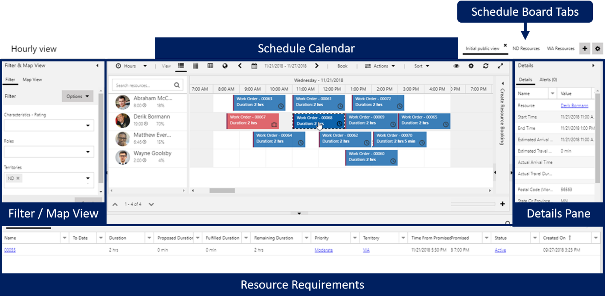

By dispatching the correct resources for the correct jobs, you can improve your overall operational efficiency. Your dispatchers need specific information at their disposal to schedule resources to work on items efficiently. Without the information, something might get scheduled incorrectly, or assigned to someone who isn't qualified. These situations can affect technician productivity, customer satisfaction, and organizational costs. To ensure you handle issues correctly, you need to understand: 

* What is currently scheduled?
* What do you need to schedule?
* Who is available?
* What does traffic look like?

We designed **Universal Resource Scheduling (URS)** to help you schedule resources efficiently by making it easy to find what you need to schedule and the most qualified resource to work on it. 

Universal Resource Scheduling includes two tools that help make scheduling resources easy:

* **Schedule board:** The schedule board gives you the tools necessary to manage and schedule resources. Within the schedule board, you work with and manage:
    - **Resources:** Resources include internal and external people, facilities such as rooms or workstations, and equipment. 
    - **Requirements:** Requirements are items that are ready for you to schedule but you haven't assigned to a specific resource. Requirements define the need for the item such as resource skills, time frames, and location details.
    - **Bookings:** Bookings are scheduled items for a specific day and time that have an assigned resource. 
* **Schedule assistant:** The Schedule assistant simplifies scheduling by offering suggestions of potential resources and time slots to schedule an item. Suggestions are based on requirements captured in the record such as skills needed, time windows, and more. 
 
The following graphic shows a quick overview of the different panels and components in the schedule board. 

> [!div class="mx-imgBorder"]
> 

* **Resource requirements:** Resource requirements are a list of active requirements that you need to schedule and assign to available resources. 
* **Filter and map panel:** The filter and map panel give you access to interactive filters and maps that can help you with scheduling. 
* **Details:** The details give you additional details of the item that is currently selected. 
* **Schedule calendar:** The schedule calendar is a list of resources and currently scheduled items. You can use the calendar to schedule new items and interact with existing scheduled items. 
* **Schedule board tabs:** The schedule board tabs give you access to different schedule boards configured for specific scenarios such as filtering items based on a territory. 

With the schedule board and the schedule assistant, you can handle multiple scheduling scenarios such as: 

* **Scheduling individual resources:** By taking advantage of the find availability on a requirement record, you can find qualified resources with availability to work the selected item easily. You can also handle items like scheduling conflicts or cancelations. 
    - **Rescheduling:** You can search for another time where the currently scheduled resource is available to work on the item. 
    - **Resource substitution:** You can search for a different qualified resource who has availability during the currently scheduled time. 
* **Scheduling multiple resources:** You can schedule multiple resources for a job at the same time. Depending on the scenario and what the customer needs, you can schedule the following scenarios: 
    - **Crews:** Schedules multiple predefined resources at the same time. For example, you can dispatch cleaning crews at one time. 
    - **Resource pools:** You can use resource pools as place holders to note a type of resource required, until you add a specific resource later. 
    - **Requirement groups:** You can schedule multiple resources of multiple types for a single requirement. For example, a medical exam might require a doctor, exam room, and a qualified nurse. 

With URS, you can find and schedule the most qualified resource for a specific item easily. 

|  |  |
| ------------ | ------------- | 
|  | In this video, you’ll learn how to use URS features like the schedule board and schedule assistant to manage common scheduling scenarios. |

> [!VIDEO https://www.microsoft.com/videoplayer/embed/RE4hOhB ]

As you learned in the video, URS allows you to use the schedule board and the schedule assistant to find the most qualified resource to work on an item and assign them to the job easily. When cancelations or scheduling conflicts arise, you can assign those jobs to other qualified resources easily.

Now let's turn our attention to Resource Scheduling Optimization (RSO).
