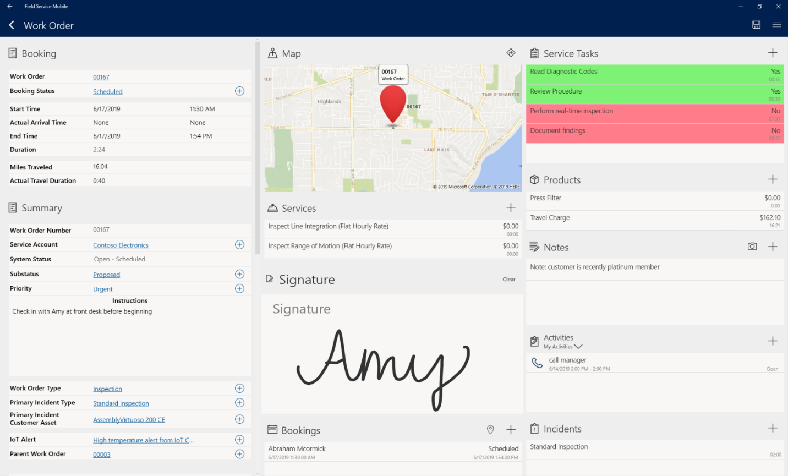

When you are in the field, you need specific information and items to service your customers effectively. Something as simple as not having the right part, or not knowing what was fixed in the past, can have a significant effect on your ability to resolve your customer's issue. We designed the Dynamics 365 Field Service mobile application with that thought in mind. The mobile app ensures that you have what you need when you need it. Whether working with your schedule, accessing customer data, or managing time-off, the access is available to you through the mobile application.

The following screenshot is a Dynamics 365 Field Service Mobile work order.

> [!div class="mx-imgBorder"]
> 

With the Field Service Mobile application, you have all the tools needed to: 

* **Manage your schedule:** With features like push notifications and routing information, you're aware of items assigned to you and can access features such as turn-by-turn directions to help ensure on-time arrivals.
* **Complete work orders anywhere:** Highly configurable offline filtering options ensure that you have the exact information you need whether you're working online, or in a remote corner of the world. 
* **Provide more personalized service:** You have a complete view of the customer you're servicing, including customer preferences and their service history.
* **Improve work order delivery:** While onsite, you have access to everything you need to execute the work order including: 
    - **Detailed booking information:** This information includes estimated versus actual time details, the current booking status, and travel information. 
    - **Work Order Details:** This information includes where the work order originated, what it's related to, and other details. 
    - **Service tasks information:** This information includes any tasks you'll need to complete in the work order record. 
    - **Products and service details:** This information includes all products you need to service. You can use features like barcode scanners to capture serial numbers from products installed. 
    - **Features on your mobile device:** You can take advantage of the capabilities on your mobile device to capture images, take video, or get customer signatures. The Dynamics 365 work order record stores all the information. 
* **Improve efficiency:** With the knowledge search feature, you can get the job done correctly right away. You have access to product manuals, surface bots to provide field assistance, and Dynamics 365 Remote Assist for real-time collaboration with subject matter experts. 

|  |  |
| ------------ | ------------- | 
|  | In this video, you’ll learn how to manage your daily work orders and ensure you're resolving customer issues quickly. |

> [!VIDEO https://www.microsoft.com/videoplayer/embed/RE4hLHV]

As you learned in the video, with the Dynamics 365 Field Service Mobile application, you can access your list of open work orders and complete the associated tasks. Integrated tools like signature capture and bar code scanning help you do what you need to need whether working on or offline.

Now let's turn our attention to Dynamics 365 Remote Assist.
