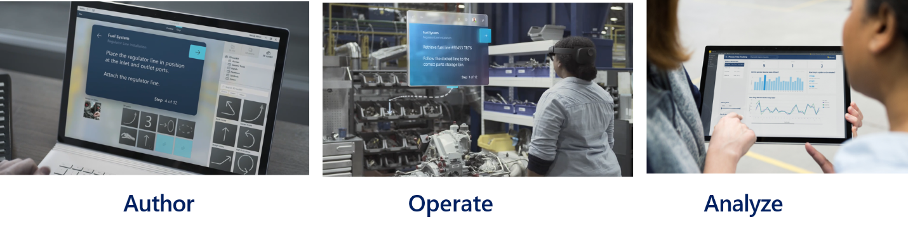

Training and onboarding employees are expensive and time-consuming tasks. With Dynamics 365 Guides, you can enhance the learning experience. Dynamics 365 Guides allows you to standardize your training processes with interactive step-by-step instructions that guide your employees to the tools and parts they need. You can create impactful learning experiences by integrating photos, video, and 3D models into a personalized training experience.

With Dynamics 365 Guides, you can:

* **Increase productivity:** Whether it’s doing complex procedures on the job or training away from the production line, Dynamics 365 Guides gives you heads-up, hands-free, step-by-step instruction in the flow of work. You can control the interface with your gaze leaving your hands free to do the work. Instruction cards move with you, following you as they move around equipment. The instructions point to the tools and parts you need, indicating how and where to use the tools. The experience is comfortable, simple to use, and reduces mental processing time, errors, and the need to rely on a buddy system.
* **Close knowledge gaps:** A series of step-by-step instruction cards with image and video support are connected visually to where you need to complete the work. Holographic guidance shows you where you need to complete the work. It allows you to get the job done faster, with fewer errors, and with greater retention of the skills.
* **Increase employee engagement:** Dynamics 365 Guides allows you to create step-by-step mixed-reality guidance for a task, without the need for specialized 3D or programming skills. You start with the authoring tool to create guides—step-by-step instructions with images, video, and 3D holograms. After creating the guide on a device, authors use HoloLens to connect the instruction cards and holograms to the physical workspace by picking them up and moving them to the correct location. Authors can use the default library of 3D holograms or they can import their own custom 3D models.
* **Generate data to improve processes:** Using Power BI dashboards, managers can see rich data about how the process is working for their people, enabling them to continually analyze and improve without doing expensive studies. Being part of the Dynamics 365 product family and powered by Microsoft Dataverse, Dynamics 365 Guides allows customers and partners access and integration opportunities.

> [!div class="mx-imgBorder"]
> 

You create guides with the no-code editor. It allows you to have the employees with the most knowledge on a topic creating the guides. Dynamics 365 Guides includes a library of 3D assets like arrows, rings, and hands to help you build guides without needing to build complex customer models. As you add items like images and video, they're converted and optimized automatically for Microsoft HoloLens. These visual references let you focus on the content of the training. You can also review the tasks and assignments you created in using HoloLens to enhance learning and standardize processes. 

You can take advantage of Dynamics 365 Guides in the field with Dynamics 365 Field Service. You can link Guides to service tasks on work orders. When you are onsite working on items, you can access guides to walk you through a process. This connection ensures that you are successful even when working in scenarios that may be outside your skill set. 

|  |  |
| ------------ | ------------- | 
|  | In this video, you’ll learn the power of Dynamics 365 Guides and its benefits. |

> [!VIDEO https://www.microsoft.com/videoplayer/embed/RE4juk1]

As you learned in the video, Dynamics 365 Guides can change how you learn. You can learn new skills with interactive training guides using HoloLens. It brings the classroom into real life.

With Dynamics 365 Guides, you can create interactive, hands-on learning easily.

Now that we have covered Dynamics 365 Field Service, Dynamics 365 Remote Assist, and Dynamics 365 Guides, let's see how much you remember with a quick knowledge check.
