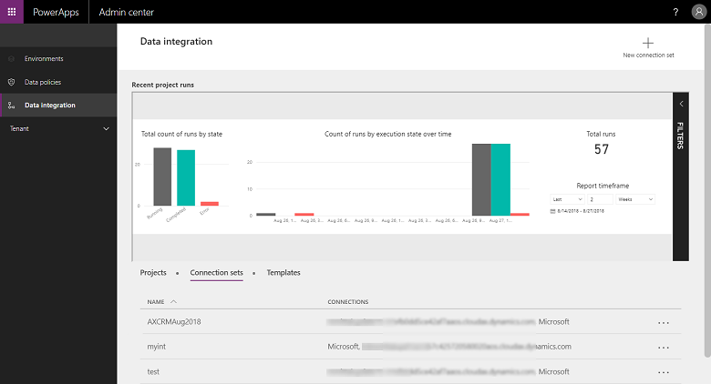

Dynamics 365 applications all have a purpose. For model-driven apps, sharing Microsoft Dataverse integrations between them isn't only simple, it's expected. Your marketing team will funnel qualified leads to your sales team. Your customer service team will manage support cases while your field service technicians are onsite resolving the issues.

The Data Integrator is a point-to-point integration service used to integrate data into Dataverse. It supports integrating data from multiple sources including:

- Dynamics 365 Finance and Supply Chain Management.
- Dynamics 365 Sales.
- Salesforce.com.

This following screenshot shows the Data Integrator.

Before you can create a data integration project, you must provision a connection to each of your applications. We unified the experience so that you no longer need to switch between portals. You can do all the tasks related to Data Integrator from the Power Platform admin center. 

In the prospect-to-cash integration scenario, you can use the data integration feature to synchronize data across instances of Dynamics 365 Supply Chain Management and Dynamics 365 Sales. 

Fortunately, your job is easy. The prospect-to-cash templates that are available with the data integration feature allow the flow of data about accounts, contacts, products, sales quotations, sales orders, and sales invoices between Dynamics 365 Supply Chain Management and Dynamics 365 Sales. 

Integration across Dynamics 365 applications allows you to keep a single view of your customer while managing your data and automating your business.

Next let's review how the model-driven apps integrate with other Microsoft products.
