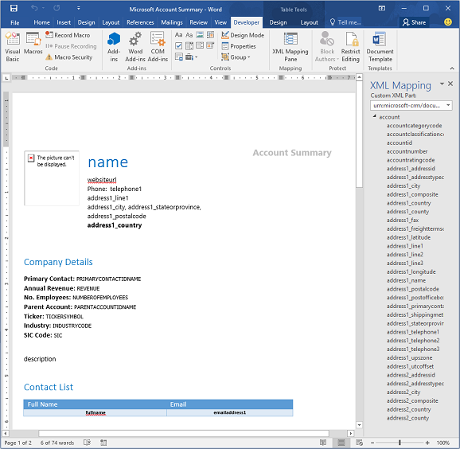

Model-driven apps in Dynamics 365 (Dynamics 365 Sales, Dynamics 365 Customer Service, Dynamics 365 Field Service, Dynamics 365 Marketing, and Dynamics 365 Project Service Automation) integrate across the Microsoft stack. Using connectors, it's possible to integrate with hundreds of software offerings. We'll discuss integrations with the most widely used Microsoft applications.

## Microsoft Outlook
You can use the Dynamics 365 App for Outlook to view information about Dynamics 365 contacts and leads while you’re working in Outlook. It allows you to view the information in the context of email messages, meetings, or appointments. For example, view phone numbers, company name, last and next activities, and recent records from Dynamics 365.

The following screenshot is the Outlook ribbon.

The Dynamics 365 App for Outlook also allows you to:

- Link email messages, meetings, and appointments to a Dynamics 365 record. For example, link an email message to a specific account, opportunity, or case. The Dynamics 365 App for Outlook also supports custom entities.
- Open Dynamics 365 records to find or enter more detailed information.
- Add a phone call, task, or appointment activity to Dynamics 365.
- Create a new Dynamics 365 record for any entity (record type).
- Add email templates, knowledge articles, and sales literature when you create an email message or set up a meeting.

## Microsoft Word

Word templates help you generate standardized documents about Dynamics 365 records using Microsoft Dataverse data. You can create organizational templates to simplify document generation. Users with permissions can create and share their own templates with others. For example, you can create a document template to manage a lightweight reporting need.

You can generate Word templates as a specific document from a template of the target entity. Templates are entity-specific and can include data from related entities. You select entity relationships and bring it in when you generate the template. Word templates are a unique reporting toolset. You can use many, many-to-one, and many-to-many relationships including lists of child records. 

The following screenshot is a sample Word template with mappings.

> [!IMPORTANT]
> - For performance reasons, the system limits templates to 100 related records. For example, an account template that lists related contacts displays 100 contacts, even if more related contacts exist in the system. 
> - Lists of records created from a custom template may not appear in the same order in Word documents as in the applications. In Word, records display in the order of the creation date and time.
> - Word templates aren't solution-aware and can't be migrated to other environments. You can use templates downloaded from one instance only within that instance. Instance-to-instance migration for Word templates isn't currently supported.
> - Macro-enabled Word documents (.docm) aren't supported.

## Microsoft Excel

Excel is one of the most popular data analysis tools for business users. The integration between model-driven apps in Dynamics 365 and Excel is a popular feature. 

The ease of exporting data from Dataverse to Excel is a significant benefit. It allows you to share Dataverse data with individuals or organizations that don't have a Power Platform license.

### Static and dynamics worksheets

You can export most views as static or dynamic worksheets. Exporting a static worksheet creates a local copy of the data. The system does not keep a connection between the Dataverse environment and the workbook, and the Dataverse security model no longer regulates access to the data. An exported dynamic workbook or pivot table keeps a link between the Dataverse data and the Excel file. The Dataverse security model is maintained, and you need privileges to refresh the data.

You can also export to Excel Online. This option opens the Excel file for the user in a window within Dynamics 365 or custom model-driven apps. Users with permissions can save data changes back to the Common Data Service. 

### Templates

Excel templates allow users to create up-to-date Excel reports without needing knowledge of Excel formulas, charts, or pivot tables. You can create Excel templates from a single view of Dataverse data. 

You can open templates in Excel online or download them and open them in Excel locally. Templates allow you to create these reports easily using pre-made Excel documents with current data. This ease of use allows you to create reports with current data instead of maintaining it outside the system. 

The following screenshot is the Export to Excel template.

You use the Excel pivot chart functionality to add charts and graphs to the document. Remember to add all charts and graphs above the existing table so that these elements won't be overwritten if the number of rows in the data table changes in the future. 

You upload organizational templates in the settings area under templates. You upload personal templates in the entity area where you find the related view under the Excel template node. 

> [!IMPORTANT]
> - Excel templates aren't solution-aware and can't be migrated to other environments. You can use templates downloaded from one instance only within that instance. Instance-to-instance migration for Excel templates isn't currently supported.
> - Unlike Word templates, which you generate from a specific record, you can generate Excel templates from views only. You must remind users to go to a view to access Excel templates. 
> - By default, pivot chart data isn't refreshed automatically; however, you can enable automatic refresh for any pivot chart. 

## Microsoft SharePoint

SharePoint’s document management capabilities keep your documents within reach of the Dynamics records they're supporting. You have options when it comes to working with document locations with Dynamics 365 and SharePoint. You can select different SharePoint sites and folder location, as necessary.

The following screenshot is the SharePoint **New** menu.

From the **Documents** menu, you can access the following items:

- **Document Location:** You can switch between the document location display in Dynamics 365 and another location if you have setup more than one document location.
- **Open Location:** You can open the current document’s location displayed in SharePoint.
- **Add Location:** You can add another document location to SharePoint and give it a name to display in Dynamics 365.
- **Edit Location:** You can edit the location in SharePoint and rename the location.

> [!Note]
> To use Microsoft OneNote integration with model-driven apps in Dynamics 365, you must first configure SharePoint integration. 

## Microsoft Teams

We built Teams on Office 365 groups, Microsoft Graph, and the same enterprise-level security, compliance, and manageability as the rest of Office 365. Teams uses identities stored in Azure Active Directory (Azure AD). Teams keeps working even when you're offline or experiencing spotty network conditions.

The following image is Microsoft Teams on a computer, tablet, and mobile device.

> [!div class="mx-imgBorder"]
> 

When you create a team, Teams creates:

- A new Office 365 group.
- A SharePoint Online site and document library to store team files.
- An Exchange Online shared mailbox and calendar.
- A OneNote notebook.
- Ties into other Office 365 apps such as Planner and Power BI.

The following screenshot shows connecting a record to a Teams channel.

> [!div class="mx-imgBorder"]
> 

The following screenshot shows viewing and associating files.

> [!div class="mx-imgBorder"]
> 

The following screenshot shows integration with Teams.

> [!div class="mx-imgBorder"]
> 

## Office 365 Groups

Office 365 Groups, available with Dynamics 365, provide an environment for collaboration with Office 365 users who don’t use Dynamics 365. For example, use Office 365 Groups when a sales team has a major opportunity requiring input from several people who don’t have access to Dynamics 365. Office 365 Groups is a single location to share documents, conversations, meetings, and notes. You can enable Office 365 Groups for any entity.

When evaluating collaboration options, you should consider Microsoft Teams integration with Dynamics 365 as a modern collaboration experience.

The following graphic shows how apps are at the intersection of Dynamics 365 users and Office 365 users.

> [!div class="mx-imgBorder"]
> 

Now we'll turn our attention to integrations with third-party apps.
