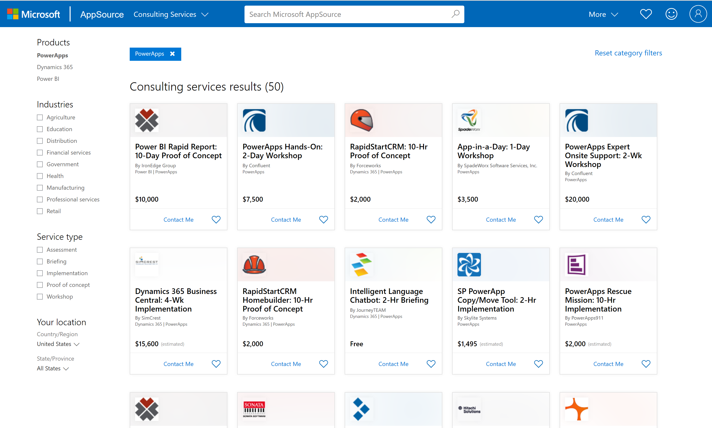
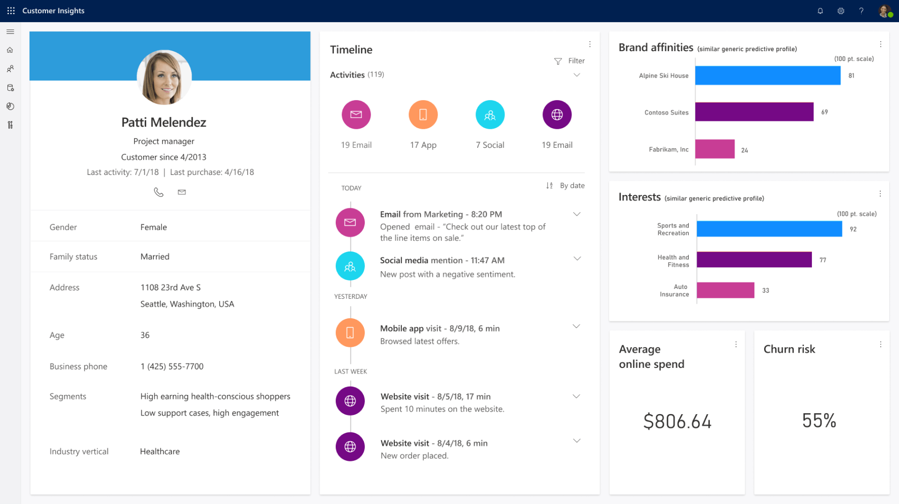
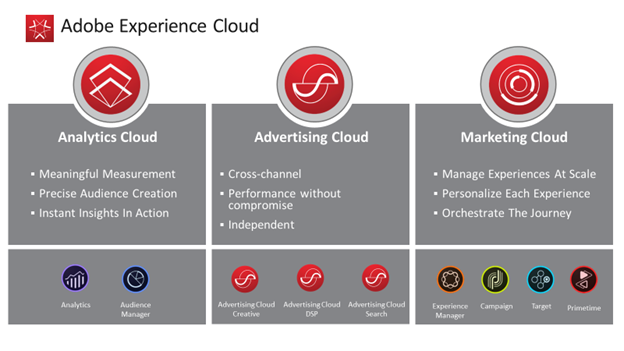
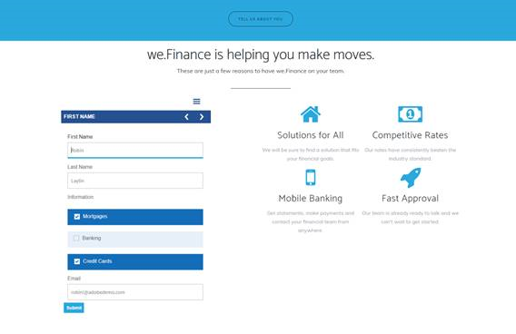

Model-driven apps in Dynamics 365 integrate not only with other Dynamics 365 apps and with the Microsoft stack, but also with third-party applications.

## Microsoft AppSource

With Microsoft AppSource, you can discover apps to add to your business solutions. 

* **Get the right app, right now.** Find top business solutions for your industry from Microsoft and select partners—including exclusive apps.
* **Build on what you have.** Add new capabilities to your existing business applications. From Dynamics to Power BI, you’ll find solutions to enhance what you already use.
* **Start with confidence.** Try any app for free before you buy it, then work with a trusted Microsoft partner to implement your new solution.

The following screenshot is search results from AppSource.

> [!div class="mx-imgBorder"]
> 

With AppSource you can:

* Market your services at scale easily.
* Reach 100 million commercial active users.
* Help business users do more with their existing Microsoft investments.
* Simplify the discovery, trial, and acquisitions of line-of-business apps and services.

## Dynamics 365 Customer Insights

To compete in today’s market, your organization needs to build meaningful relationships with your customers on a personal level. You need a complete, deep, and unified view of your customers across all the different areas where they interact to personalize their experience at scale effectively.

Dynamics 365 Customer Insights is an intuitive and flexible customer data platform (CDP). It helps you unlock insights, build a deeper understanding of your customers, and power personalized customer experiences. With Dynamics 365 Customer Insights, you can unify all your customer data across your various transactional, behavioral, and observational data sources into a single 360-degree view of the customer. 

The following screenshot is a customer insights overview.

> [!div class="mx-imgBorder"]
> 

With Dynamics 365 Customer Insights, you can:

* **Eliminate data silos and unify customer data:** You can easily connect and unify your data with prebuilt connectors to popular data sources. These connectors bring in the transactional, observational, and behavioral data that are most important to you. 
    -    By taking advantage of artificial intelligence and machine learning, you can resolve customer identities across these sources. The result is a single, unified customer profile that gives you a deep understanding of your customer. 
* **Enrich your audience intelligence:** With built-in functionality that uses Microsoft Graph, you can build a richer customer profile that incorporates audience intelligence. 
* **Deliver personalized customer experiences:** With contextual customer insights and tailored customer profile cards, you can infuse this data into business applications you use every day.
    -    You define what is most important to your organization and automate customer-centric experiences with customizable customer profiles, business measures, and customer segments.
    -    You embed insights into custom line-of-business applications built on Microsoft Power Platform. These insights ensure that your employees are equipped with the right data and guidance in the context of how they're working with customers at that moment. 

Dynamics 365 Customer Insights' components help you gain the insights you need to drive personalized experiences. Some of the key components that help provide this functionality include:

* **Customers:** Each customer will have a dedicated page that presents a consolidated view of the customer based on their profile data you've gathered from all your data sources. 
* **Segments:** You group customers into cohorts based on demographic, transactional, or behavioral customer attributes. These groups let you more target business activities such as promotional campaigns, sales activities, and customer support actions to achieve your business goals.
* **Measures:** You define the key performance indicators (KPIs) that best reflect the performance and health of your business such as a customer’s lifetime value or the number of active users that visited your online store. 

You can embed the information through customer insights cards into other Dynamics 365 applications such as Dynamics 365 Sales, Dynamics 365 Customer Service, or Dynamics 365 Field Service. This data lets you trigger automated workflows to respond to customer signals with tools like Power Automate. 

|  |  |
| ------------ | ------------- | 
|  | In this video, you'll learn how Dynamics 365 Customer Insights lets you unify customer data to create a 360-degree customer view that creates personalized, customer-centered experiences and processes. |

> [!VIDEO https://www.microsoft.com/videoplayer/embed/RE4ijs2]

As you learned in the video, you can ingest data from multiple common data sources, and with custom mapping and merging rules, create a unified customer profile. You define which customer data you want to capture and how to use it to drive action.

With Dynamics 365 Customer Insights and Power Platform, you get a complete view of your customers by unifying your transactional, observational, and behavioral data for consumers with prebuilt connectors. It lets you discover new customer segments, detect trends, and decide what the best next steps are for servicing your customers.

## Adobe Experience Cloud

Together, Microsoft and Adobe bring you the first large-scale solution built to accelerate the digital transformation of your business. You can transform the customer journey and improve sales and marketing return on investment (ROI) when you combine Microsoft Dynamics 365 with Adobe Experience Cloud solutions. Increase marketing ROI with strategic omni-channel campaigns that present the right content at the right time.

The following image shows the components of the Adobe Experience Cloud.

> [!div class="mx-imgBorder"]
> 

Adobe created digital marketing and continues to increase their leadership position. Adobe Experience Cloud establishes the foundation so that you can personalize experiences that make customers want to visit, download, engage, and keep coming back, because what you provided was exactly what they were looking for.

Adobe Experience Cloud includes:

- **Adobe Marketing Cloud** gives you everything you need to organize, access, and personalize marketing content. It gives deep insights into what’s working with your customers and the ability to deliver the best experiences to every customer across every channel consistently.
    - The products include: Experience Manager, Campaign, Target, and Primetime.
- **Adobe Analytics Cloud** finds insights from online and offline data, helping you build loyalty with existing and potential customers. It offers intelligence and precise audience creation so you can put real-time insights into action.
    - The products include: Analytics and Audience Manager.
- **Adobe Advertising Cloud** is the industry’s first end-to-end platform for managing advertising across traditional TV and digital formats. It makes it simple to deliver video, display, and search advertising across any screen in any format
    - The products include: Media Optimizer Display, Media Optimizer Search, and Media Optimizer.

You can manage a better customer experience by bringing all your sales and marketing data and processes together to gain a comprehensive view of your customers and create personal, consistent, and connected experiences they’ll love.

With personalized content on your website, you can captivate your audience across every device with relevant data based on audiences. You can then move high-value prospects through the journey more efficiently from anonymous to advocate, using embedded insights, predictive recommendations, and unified data across marketing, sales, and service.

With integration between Adobe Experience Manager and the model-driven apps in Dynamics 365, you can start collecting data like contact details and interests to create contacts and a data collection form to gather data for contacts and leads in Dynamics 365 Sales directly from the form.

The following screenshot is a data collection form.

> [!div class="mx-imgBorder"]
> 
 
Once known, you can nurture the lead through customer journey intelligently and improve sales and marketing ROI when you combine Microsoft Dynamics 365 with Adobe Experience Cloud solutions. Using collected data like client profiles, leads or opportunities plus Adobe Analytics and AI driven insights like lead scores provides the base for better segmentation and look alike modeling. 

With this insight and possible actions, you can tailor the customer experience to not only take a lead to a sale, but to gain an advocate for your brand.

Finally, once ready, you can streamline lead hand-offs between marketing and sales with automated workflows. 

With Adobe and Microsoft, you can transform the customer journey digitally.

Now that we've covered all the integrations for the model-driven apps in Dynamics 365, let’s review what you remember with a knowledge check.
