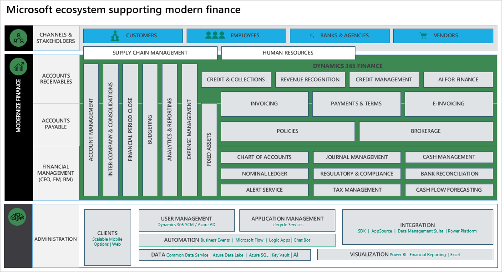
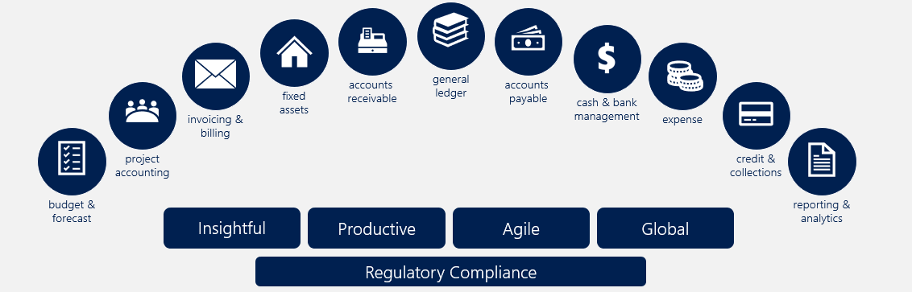
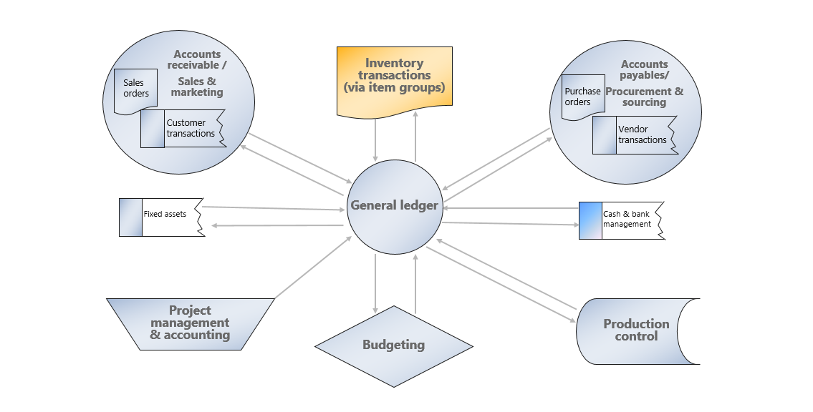
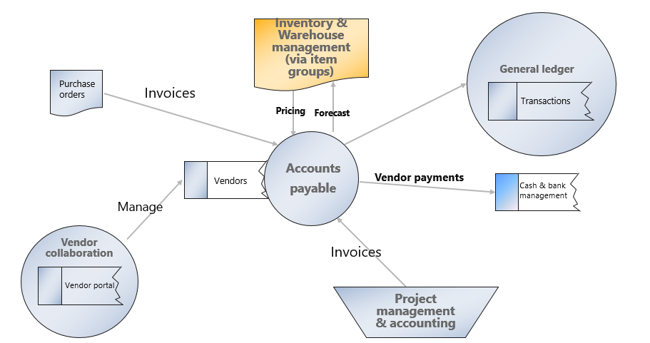
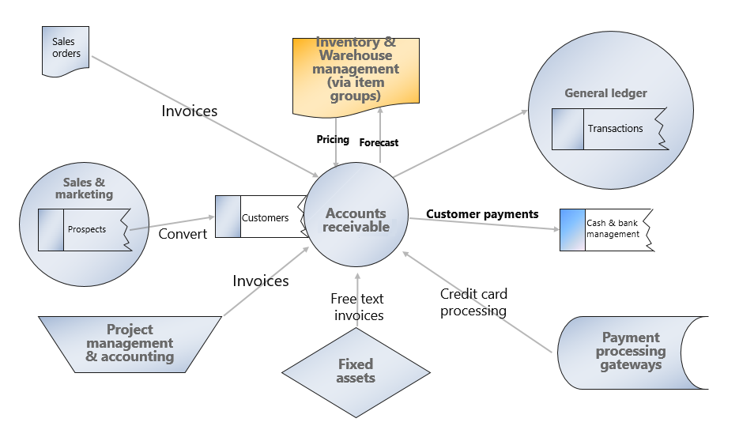

Today's CFOs must fulfill a range of responsibilities, such as reporting on the past, managing the present, and ensuring a sound future. They must navigate ever-changing local and global regulations and, more than ever, they must drive growth through strategic innovation. To meet these challenges head on, a CFO needs technology that delivers actionable intelligence for now, the next quarter, and next year. Microsoft Dynamics 365 Finance allows CFOs to instantly manage finances with current data and forecasts to support their decisions.
You can check the financial health of your organization across the globe and ensure regulatory compliance for every transaction in every locality where you operate.

## Benefits of Dynamics 365 Finance

Dynamics 365 Finance allows you to:

- **Drive strategic financial decisions:** You can assess the health of your business, improve financial controls, optimize cashflow, and make strategic decisions to drive growth faster. You achieve this growth with Dynamics 365 Finance’s unified, global, real-time financial reporting, AI embedded analytics, and predictive insights.
- **Unify and automate financial processes:** You enable smarter, faster actions and decisions with role-based workspaces that show interactive data visualization. These visualizations give you a high-level view of your key business metrics and the ability to monitor and improve the health of your business. This awareness allows you to prioritize and automate tasks to save time, reduce errors, and increase productivity with integrated tools and applications, such as Office 365.
- **Decrease global financial complexity and risk:** You can adapt to changing local and global financial requirements quickly with a flexible, guided, rules-based chart of accounts and dimensions. This tracking helps you manage your financial operations accurately even with regulatory requirements that change often. The no-code configuration service simplifies regulatory and tax reports, e-invoicing, and payments.
- **Accelerate your business growth:** With robust financial intelligence and embedded analytics in real time, you can adapt to changing market demands quickly and drive rapid business growth by unifying global financials and operations. It allows people to make fast, informed decisions.

Dynamics 365 Finance gives you workspaces with role-based views and functions. You can focus, prioritize, and perform with the aid of pertinent insights shared in both desktop and mobile views. This flexibility allows you to work anywhere on any device, promoting collaboration across departments, offices, and vendors.

By using built-in controls, you gain insights into your financial data and have 360-degree visibility across all operating units. These insights and visibility help you make intelligent decisions and stay competitive in the fast and ever-changing global market.

Dynamics 365 Finance:

- Helps you elevate financial performance, drive margin revenue growth with a centralized, global financial management solution, and deliver robust financial intelligence and embedded analytics in real time. All these features contribute to increased profitability.
- Allows you to adapt to diverse workforces and changing laws at the local level. Dynamics 365 Finance’s regulatory features include 37 countries and 42 languages. Its global electronic reporting features and configurable e-invoicing make it easy to adapt to frequent regulatory changes.
- Simplifies financial operations with tools like vendor invoice automations, vendor collaborations, quote to cash, budget planning, budget control, expense management, and recurring invoices.
- Allows you to achieve success locally and globally. It delivers true business value with correct and prompt regulatory reporting. It finds intelligent and predictive insights, in context and underpinned by machine learning data, which drives efficiencies, finds new market opportunities, and spurs innovation.

Dynamics 365 Finance gives you tools and services to transform your business functions and processes. It helps you meet your business requirements and supports the effort to modernize your finance functions. Integration with first- and third-party solutions helps make technology unification possible for administrative functions.

The following figure outlines the key business functions of the Microsoft system supporting modern finance with Dynamics 365 Finance.

 

### Accelerate your business growth

Dynamics 365 Finance helps you adapt to changing market demands quickly and drive business growth rapidly. It gives you unified global financials and operations features that allow you to make fast, informed decisions.

With built-in controls, you gain insight into your financial data and have a 360-degree visibility across all operating units. You can use these insights to make intelligent decisions to stay competitive in today's fast and ever-changing global market.

### Elevate your financial performance

Dynamics 365 Finance helps you drive margin revenue growth with a centralized, global financial management solution. It delivers robust financial intelligence and embedded analytics in real time to help increase profitability.

The following graphic shows the components of Dynamics 365 Finance.

Three main goals of a financial management system in any organization are:

* **Maximize profit:** Earning maximum profits in the short term and the long term depends on financial awareness. Dynamics 365 Finance keeps all financial transactions in a ledger and offers tools and features to provide insight into incurring costs and projected revenue so that you can make proper decisions.
    - The **general ledger** module is the core of Dynamics 365 Finance and we integrated it with other subledgers so each department can manage its own books without disrupting the general ledger.
    - The **cash and bank management** module allows you to manage your banks and balances and reconcile the bank statements with the general ledger.
* **Maximize wealth:** With Dynamics 365 Finance you can manage your cash flow, earn maximum wealth for your shareholders, and improve your organization's chances of success. Your organization must have a good cash flow to pay the daily expenses such as wages, rent, electricity bills, and more. Companies with a good cash flow can take advantage of opportunities such as getting cash discounts on purchases, making large-scale purchases, giving credit to customers, and more.
* **Operational consistency and efficiency:** Prompt month end closing, and correct reporting are imperative for overall operational health of your organization. These tasks are critical as you give the information to management and shareholders. Dynamics 365 Finance capabilities such as a shared chart of accounts across multiple legal entities and dashboards with a global view of an organization allow you to do more.

Dynamics 365 Finance’s tools, features, and workspace with built-in intelligent controls give you insights into your organization's cash flow, product supply, and demand. It can analyze customer demographics and costs of goods so that you can negotiate advantageous agreements with your vendors and customers.

* The **accounts payable** and **accounts receivable** modules offer you what you need to manage vendor and customer daily processes such as invoicing and generating or collecting payments.
* The **budgeting** module lets you estimate the total financial requirements properly by determining how much finance is necessary to operate and what the requirements are for fixed and working capital.
* The **sales and marketing, inventory management, procurement and sourcing, cost management**, and **cost control** modules in Dynamics 365 Supply Chain Management all contribute to making proper decisions to maximize the wealth of your organization.

The following graphic shows how the general ledger module interacts with other modules in the following scenarios:

> [!div class="mx-imgBorder"]
> 

* **Cash and bank management:** Dynamics 365 Finance records all incoming and outgoing funds in the general ledger. Each bank has a corresponding account in the general ledger chart of accounts. This module simplifies your ability to reconcile bank statements with financial management transactions in periodic processing.
* **Accounts payable:** Dynamics 365 Finance records all invoices and payment transactions in the general ledger. Your accounts payable clerks match the purchase order with the recorded invoice to determine if you should pay the vendor invoice. On the due date, Dynamics 365 Finance generates payments that affect the general ledger cash and bank management.

The following graphic shows the accounts payable integration.

> [!div class="mx-imgBorder"]
> 

* **Project management and accounting:** In both time and materials and fixed price projects, you need to make purchases at specific times. The project management and accounting module can interact with the procurement and sourcing module in Dynamics 365 Supply Chain Management to generate purchase orders, which you settle in the accounts payable module in Dynamics 365 Finance.

During project implementation, you can create invoices for customers. Your sales department can continue managing the quotes and converting them to invoices for ongoing projects, alongside their typical role of marketing goods and managing sales. Then, you can manage customer payments in the accounts receivable module.

The following graphic shows the accounts receivable integration.

> [!div class="mx-imgBorder"]
> 

Now let's review the core product capabilities for Dynamics 365 Finance, starting with the general ledger.
