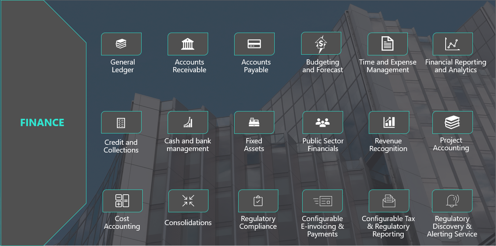
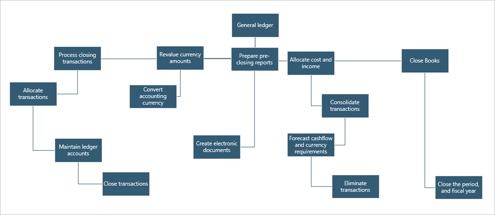
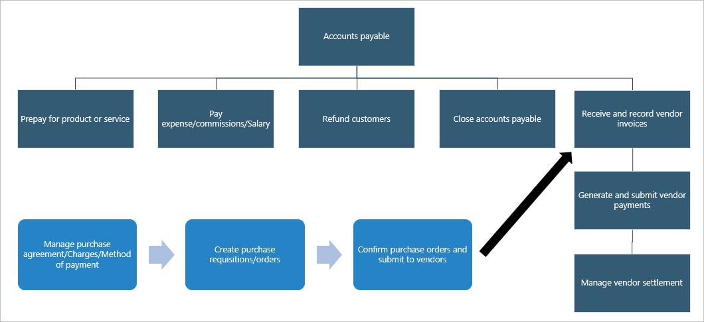
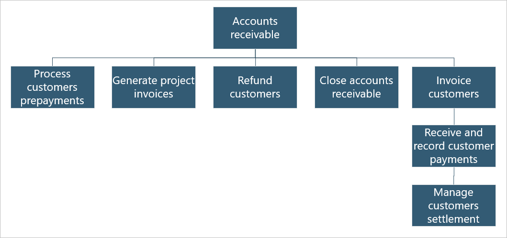
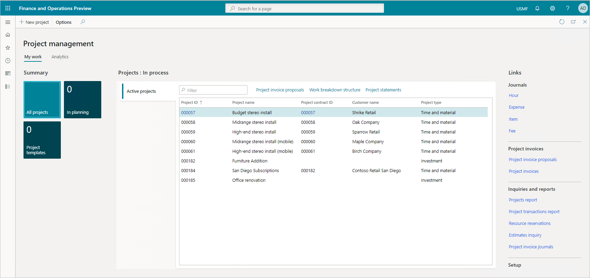
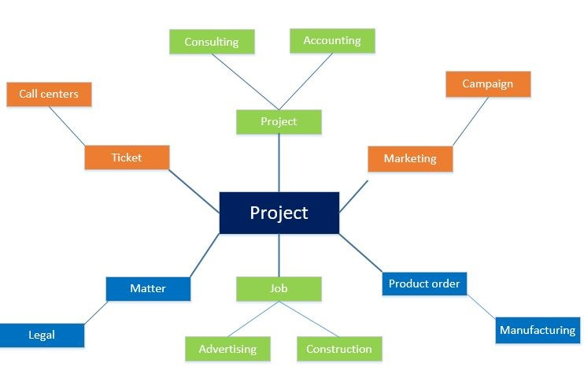
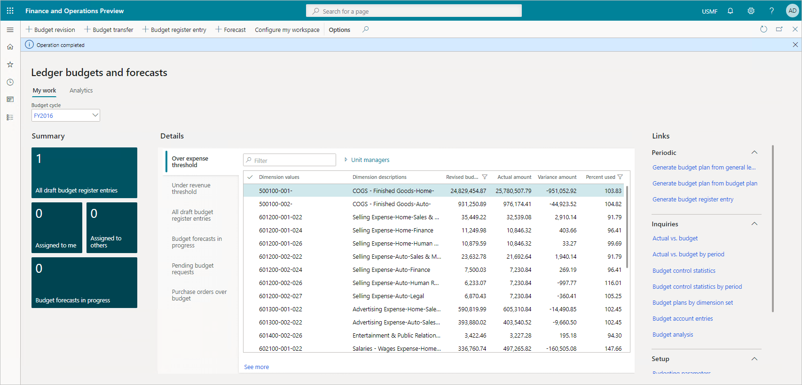
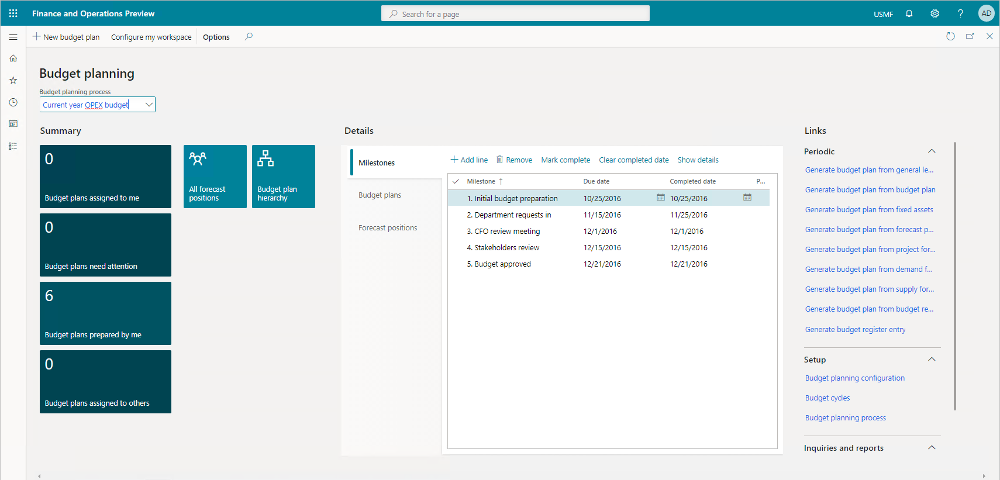

The following graphic lists Dynamics 365 Finance's major capabilities.

##  General ledger

The general ledger module is the core of Dynamics 365 Finance. It's integrated with other subledgers in financial management, so each department can manage its own books (subledgers) without disrupting the general ledger. It provides you with a central location to organize and manage all your organization’s financial records. You use this account information to prepare your financial statements.

You use general ledger to define and manage the legal entity’s financial records. The general ledger is the register of debit and credit entries. You classify these entries using the accounts that are listed in a chart of accounts. You can adjust to changing financial requirements with a flexible, guided, rules-based chart of accounts, financial dimensions, and global tax engine. You can track values efficiently and reduce reporting errors with centralized, automated processes for managing your capitalized assets from acquisition through disposal.

Incorporating a shared chart of accounts across legal entities enables organizations to streamline main reporting and the intercompany and consolidations business processes. 

The following figure illustrates the typical General ledger processes of a business:

  

|  |  |
| ------------ | ------------- | 
|  | In this video, you'll learn about the foundation of the general ledger. |
 
> [!VIDEO https://www.microsoft.com/videoplayer/embed/RE4iefW]

The video reviewed the chart of accounts, fiscal calendars, and financial dimensions and how they're the foundation of the general ledger module.

The general ledger defines and manages your financial records. The chart of accounts displays your register of debit and credit entries. It processes closing transactions, revalues currency amounts, and closes the fiscal periods.

## Accounts payable

With Dynamics 365 Finance accounts payable, you can distribute expenses, taxes, and charges across accounts. You manage your vendors, purchase orders, discounts, transactions, and invoices to reduce liability and generate greater income. You can also automate the review and payment of vendor invoices.

The following figure shows typical accounts payable business processes in an organization.

  
  
The general ledger is a record of all invoices and payment transactions. You match purchase orders to the invoices to see if you should pay the vendor invoice. When the invoice is due, your payable clerks generate the payments, which Dynamics 365 Finance records in the general ledger, and affects the cash and bank management.

You assign purchase orders, discount groups, payment, options, vendor holds, and more to your vendors and vendor group records. You can also create and manage transaction records with purchase orders, product receipts, and invoices. When creating and managing invoices, you can check on invoice approval, payment proposals, and invoice matches.

|  |  |
| ------------ | ------------- | 
|  | In this video, you'll learn about driving transactional values in the system. |
 
> [!VIDEO https://www.microsoft.com/videoplayer/embed/RE4i1fh]

This video showed creating purchase orders, invoicing, and how vendor master data drives transactional values in the system. 

You use accounts payable to set up and manage your vendors and vendor groups. Once complete, you assign purchase orders, discount groups, payment, options, vendor holds, and more to your vendors and vendor group records. You can also create and manage transaction records with purchase orders, product receipts, and invoices. When creating and managing invoices, you can check on invoice approval, payment proposals, and invoice matches.

## Accounts receivable

The Dynamics 365 Finance accounts receivable module tracks customer invoices and incoming payments. You create and manage customers, invoice sales orders, and incoming payments while completing the daily tasks in accounts receivable.

You can also invoice customers using free text invoices, recurring invoices, and batch invoices. When you receive a customer payment, you map it to the correct invoice. You can receive payments using many payment types, such as bills of exchange, cash, checks, credit cards, and electronic payments. Dynamics 365 Finance centralized payments module allows organizations with multiple legal entities to create and manage payments using a single legal entity that manages all payments. 

The following figure shows typical accounts receivable business processes in an organization.
 
  

|  |  |
| ------------ | ------------- | 
|  | In this video, you'll learn about accounts receivable. |
 
> [!VIDEO https://www.microsoft.com/videoplayer/embed/RE4i3Qu]

This video showed customers, sale orders, customer invoicing, and receiving customer payments.

In Dynamics 365 Finance, you can create and manage customers and review sales order default values, credit limits, and on hold functions. You can create and manage sales orders, journals, subscriptions, return orders, item requirements, and sales agreements. You invoice customers using free text invoices, recurring invoices, and batch invoices, then receive a customer payment and map it to the correct invoice.

## Project management and accounting

A project is a group of activities to provide a service, produce a product, or achieve a result. Projects consume resources and generate financial results in the form of revenues or assets. The Dynamics 365 Finance project management and accounting module allows you to plan, create, manage, control, and complete projects.

> [!div class="mx-imgBorder"]
>   

Project managers can work across multiple industries to provide a service, produce a product, or achieve a result. You can use the project management and accounting functionality in multiple industries, as shown in the following illustration.

> [!div class="mx-imgBorder"]
>  
 
For example, in a call center, a ticket describes the set of actions required to resolve a call. Consulting companies, such as management or technical consulting organizations or advertising agencies, refer to their activities as projects. In marketing, a campaign is the work delivered. In project-based manufacturing, a production order refers to the work to produce the finished goods. Whatever name you use, the projects involve resources, schedules, and costs. The project management and accounting functionality help with the planning, execution, and analysis of these projects.

Project managers:

- Oversee the resources and finances.
- Create project quotations, contracts, and funding sources to set project financial perimeters.
- Review a post hour journal.
- Create project invoice proposals as they move projects through phases.

The project type determines which invoicing procedure you apply. You can invoice the two external project types only—time and material projects and fixed-price projects. You always attach time and material projects and fixed-price projects to a project contract.

- **Time and material projects:** You base the customer invoice amount on transaction lines that you enter in projects. You can invoice transactions per project or per project contract.
- **Fixed-price projects:** You base the customer invoice amount on invoice billing schedules. You invoice through an on-account setup, called a billing schedule. You can invoice fixed-price projects per project or per project contract.

With either type of project, you may buy items. The module interacts with procurement and sourcing to generate a purchase order, which you settle in accounts payable.

During the execution of a project, you create invoices for your customers. The sales and marketing departments continue to manage the quotations and convert them into invoices for ongoing projects, alongside with their typical role of marketing the goods and managing the sales. You manage customer payments and refunds in accounts receivable.

By using a project contract, you can invoice one or more projects at the same time. The project contract also guarantees a consistent invoicing procedure for every subproject in a project structure. Every project you invoice must be associated with a project contract. The settings for a project contract apply to all projects and subprojects that are associated with that project contract.

 |  |  |
| ------------ | ------------- | 
|  | In this video, you'll learn about the lifecycle of a project quotation. |
 
> [!VIDEO https://www.microsoft.com/videoplayer/embed/RE4i1fi]

This video showed the lifecycle of a project quotation in Dynamics 365 Finance, including project quotations, a work breakdown structure, approval workflow, and converting a project quotation to a project.

With project accounting, you gain an overview of project attributes. Create project quotations, contracts, and funding sources to set project financial perimeters. Review a post hour journal and create project invoice proposals as you move projects through phases.

## Budgeting

With proper budgeting processes, organizations can benefit from forecasting and financial insights to compare actuals against allocated budget. 

The Dynamics 365 Finance budgeting module lets you estimate the total financial requirements properly by determining the operating requirements, the fixed capital requirements, and the working capital requirements of the organization.

> [!div class="mx-imgBorder"]
>   

The resource planning cycle consists of planning, budgeting, and forecasting activities. Dynamics 365 Finance supports the processes for both long-term strategic planning and quarterly and annual budget planning.

You use the budgeting module to create and assign budget codes, allocate funds, and plan for the future.

You can reduce operational expense by minimizing operational costs across business geographies with financial process automation, encumbrance, budget planning, and budget control.

After you set up and approve a budget in Dynamics 365 Finance, you convert the budget plan to a budget register entry. Budget register entries give you the tools to manage the budget and keep amounts traceable through budget codes.

Budget register entries let you revise original budgets, do transfers, and carry forward budget amounts from the previous year. Based on the established budget, you enable budget control. The level of control depends on your organizational culture and the organization's level of maturity.

Finally, you can educate employees about organizational targets and follow those targets through policies such as consider an online meeting instead of a travel.

Dynamics 365 Finance includes a budget control framework that lets you select either hard control or soft control. Hard control prevents postings that would go over the budget. Soft control warns you that you’ll exceed the available budget, but you can decide how to continue.

Dynamics 365 Finance budget control supports management of your financial resources through the:

- Chart of accounts
- Workflows
- User groups
- Source documents and journals
- Configurable calculation of available funds
- Budget cycles
- Thresholds. 

When controls are in place, you can plan, measure, manage, and forecast your financial resources throughout its fiscal year.

After you approve budgets in Dynamics 365 Finance, you use budget plans to generate budget register entries to record the expenditure budget for your organization. You can also create or import budget register entries from a third-party program.

Then you can set up budget planning processes to meet your policies, procedures, and requirements for budget preparation. You can view and edit budget plan documents using one or more layouts. You associate each layout with a template to view and edit the budget plan documents in Excel.

> [!div class="mx-imgBorder"]
>  
 
|  |  |
| ------------ | ------------- | 
|  | In this video, you'll learn some of the basics of budgeting. |
 
> [!VIDEO https://www.microsoft.com/videoplayer/embed/RE4i6rJ]

This video showed the basics of budget planning and forecasting, budget cycles, budget models, and how budget control can be configured to put a hard stop on transactions that exceed the overall budget.

You can use the budgeting module to create and assign budget codes, allocate funds, and plan for the future. You define who does budgeting, what you budget, and how the process works through a sole source of truth.

## Real-time cash flow visibility

Dynamics 365 Finance offers tools, features, and a workspace with built-in intelligent controls to give real-time insight into your cash flow, product supply, and demand. It can analyze customer demographics and the cost of goods so that you negotiate advantageous agreements with your vendors and customers.

You use the cash flow forecasting tools to analyze upcoming cash flow and currency requirements to estimate your future need for cash while checking on budgeting and inventory management. It gives you better oversight and preparation for the future.

To get a forecast of your cash flow, you complete the following tasks:

- Find and list all the liquidity accounts. Liquidity accounts are the accounts for cash or cash equivalents.
- Configure the behavior for forecasts of transactions that affect the liquidity accounts.

After you’ve completed these tasks, you calculate and analyze forecasts of the cash flow and upcoming currency requirements.

You can integrate cash flow forecasting with the general ledger, accounts payable, accounts receivable, and budgeting and inventory management. The forecasting process uses transaction information in the system, and the calculation process forecasts the expected cash effect of each transaction. 
 
Dynamics 365 Finance considers the following types of transactions when calculating the cash flow:

- **Sales orders:** Sales orders that aren't yet invoiced, and that result in physical or financial sales.
- **Purchase orders:** Purchase orders that aren't yet invoiced, and that result in physical or financial purchases.
- **Accounts receivable:** Open customer transactions or invoices that aren't yet paid.
- **Accounts payable:** Open vendor transactions or invoices that aren't yet paid.
- **Ledger transactions:** Transactions where it's specified that a future posting will occur.
- **Budget register entries:** Budget register entries selected for cash flow forecasts.
- **Demand forecasts:** Inventory forecast model lines selected for cash flow forecasts.
- **Supply forecasts:** Inventory forecast model lines selected for cash flow forecasts.

Although there's no direct integration with project management and accounting, there are several ways to include project transactions in the cash flow forecast. The system includes posted project invoices in the forecast as part of open customer transactions. The system includes project-initiated sales orders and purchase orders in the forecast as open orders after they're entered. You can also transfer project forecasts to a ledger budget model. You include the ledger budget model in the cash flow forecast as part of the budget register entries.

 |  |  |
| ------------ | ------------- | 
|  | In this video, you'll learn to better understand cash flow visibility. |
 
> [!VIDEO https://www.microsoft.com/videoplayer/embed/RE4mE0I]

This video showed the cash and bank management workspaces, cash flow forecasting, and how to reconcile a bank statement manually.

Using real-time cash flow visibility features, such as budgeting and inventory management integrations, you get better visibility into the future. You can set up cash flow forecasts and show vendor and purchase order cash flow forecasts. With tools that give you a full-circle view of your current and future needs, Dynamics 365 Finance is a powerful tool for organizations that want control and insight.

Now let us turn our attention to other capabilities of Dynamics 365 Finance.
