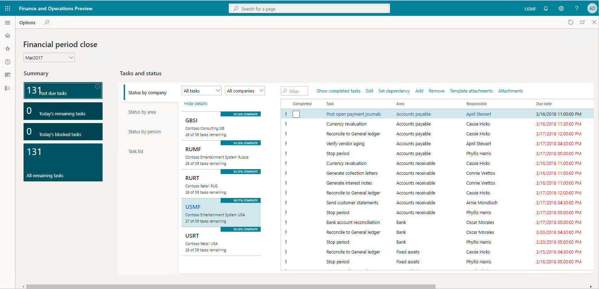

Dynamics 365 Finance has many capabilities.

## Credit and collections

A common challenge for CFOs is predicting when customers will pay. Slow and inconsistent payments restrict cash flow and inhibit both long-term planning and daily performance. The credit and collections functionality in Dynamics 365 Finance predicts when customers will pay invoices, based on a multi-tiered historical analysis. These predictions help you get your receivables collected on time and reduce the cost and effort of manual collections management.

You can track and manage the complete lifecycle of credit and collections including:

- Generating customer account statements.
- 360-degree visibility of customer aging data and overdue balances.
- Automating customer communication.
- Finalizing write-offs.

You can better allocate funds and spot credit risks before large orders ship. You’re equipped with effective strategies to get paid in full and on time. You collect revenue faster because you process your money faster.

You manage accounts receivable collections information in one central view, using the Dynamics 365 Finance Manage customer credit and collection workspace. You use this central view to manage collections. Collections agents can begin the collection process from customer lists that you generate using predefined collection criteria.

|  |  |
| ------------ | ------------- | 
|  | In this video, you'll learn about credit and collections in action. |
 
> [!VIDEO https://www.microsoft.com/videoplayer/embed/RE4iefY]

This video showed the credit and collections workspace. You reviewed basic configuration, collection letters, write-offs and overall credit, and the collections and dispute process in the system.

Visibility to customers that don't pay invoices on-time is important to managing cash flow and receivables. The credit and collections module addresses the customer credit, collection, and write-off process. Dynamics 365 Finance ties these transactions back to the proper financial transactions to provide you with one central view.

## Month, quarter, and year-end reviews

At the end of a fiscal year, you must generate closing transactions and prepare your accounts for the next fiscal year. You use the consolidation functionality to combine the financial results for several subsidiary legal entities into results for a single, consolidated organization. Prompt month end closing, and correct reporting are imperative for overall operational health of your organization.

Dynamics 365 Finance allows global businesses to do more with capabilities such as a shared chart of accounts across multiple legal entities and dashboards show a global view of your organization.

The financial period close workspace lets you track your financial closing processes across organizations, areas, and people. Depending on their view of the financial period close workspace, you'll see either all tasks and statuses for a closing schedule assigned to different employees, or just the tasks assigned to them.

> [!div class="mx-imgBorder"]
>   
 
With Dynamics 365 Finance, you can close the books faster and simplify global financial management with in-depth reporting capabilities, financial intelligence, and embedded real-time analytics. You can activate flexible and agile financial reporting that supports multiple legal entities and currencies in a single instance. That instance natively manages foreign exchange and shortens the end-of-month process.

You use the general ledger to complete closing procedures for a period or a year. Closing processes prepare the system for a new period. There are many tasks including preparing filings, inventory closing, consolidation, and more that you need to complete first.

To prepare the system for a new year, you must run the year-end close process. Each organization has different processes and steps for the end of a period.

As part of periodic tasks, you must complete the following tasks:

- Bank reconciliations.
- Configure financial period close.
- Prepare periodic filings.
- Run foreign currency revaluation processes.
- Perform financial consolidations.
- Process end of year tax reporting.

 ## Global attributes

Dynamics 365 Finance enables you to operate worldwide by supporting multiple currencies, language translations, jurisdictions, compliance regulations, and infinite dimensions.

In today’s global market, you might receive and send payments using different currencies. There are two types of currencies in Dynamics 365 Finance. The accounting currency is the main currency that you use. However, you'll need to report recorded financial transactions in different currency, called the reporting currency. You can repurpose a reporting currency and use it as a second accounting currency. You call using two accounting currencies dual currency.

With Dynamics 365 Finance, you can convert currencies and post transactions to currencies other than the one in which you completed the order. You can recognize jurisdiction and compliance based on locality, and the user interface displays different languages based on users’ personal settings.

If your organization has multiple legal entities and transacts in multiple currencies, then supporting currencies and their corresponding exchange rates is essential.

|  |  |
| ------------ | ------------- | 
|  | In this video, you'll learn about multiple currencies and languages in use. |

> [!VIDEO https://www.microsoft.com/videoplayer/embed/RE4ijs3]

This video showed how language capabilities allow you to conduct business in different regions, using simple user configuration setups for language translations.

Now that you've learned about Dynamics 365 Finance, let’s see what you remember with a knowledge check.
