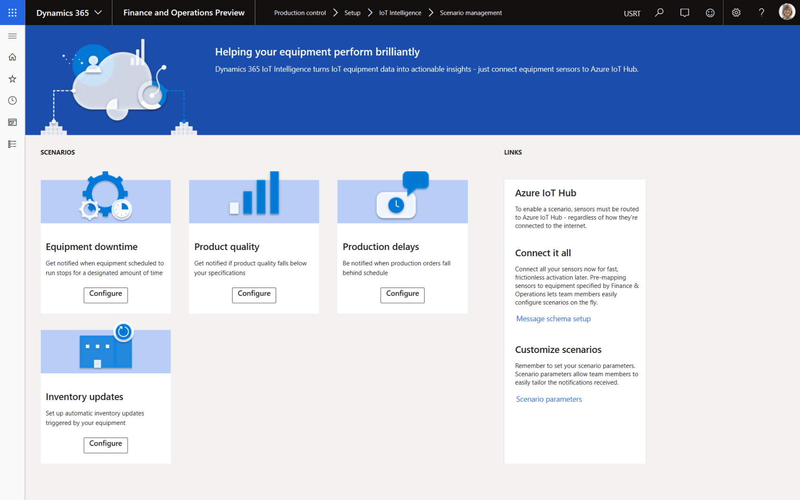
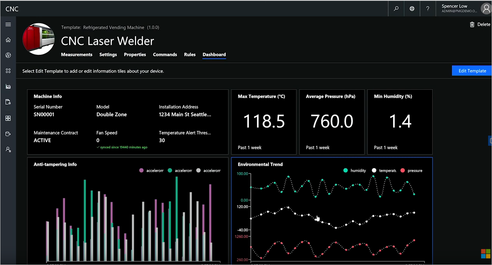

Dynamics 365 Supply Chain Management uses tools such as AI and machine learning to create a connected and modernized organization. By using AI and IoT across planning, production, inventory, warehouse, and transportation management, you can maximize operational efficiency, product quality, and profitability.

By connecting the production floor with IoT, you work smarter and make operations more intelligent than ever. The machines become smart machines.

> [!div class="mx-imgBorder"]
>   

Dynamics 365 Supply Chain Management drives automation and reduces downtime using IoT intelligence across any type of manufacturing process including:

- Discrete manufacturing.
- Lean manufacturing.
- Process manufacturing.
- Mixed-mode manufacturing.

You can do production planning in real time with planning optimization preview. It finds potential machine issues, prevents downtime, and increases product quality and yield.
 
> [!div class="mx-imgBorder"]
>   

Dynamics 365 Supply Chain Management optimizes production performance allowing you to: 

- **Make actionable decisions** with a real-time view of your entire production and stock. Proactively manage shop floor and equipment operations to improve uptime, throughput, and quality.
- **Drive efficiency across your assets, processes, and workforce** by using AI, machine learning, and mixed reality to predict and proactively resolve issues.
- **Do predictive maintenance** before disruptive failure occurs to avoid costly downtime of business-critical equipment.
- **Drive operational efficiency** with streamlined processes that help you deliver high-quality products on time, optimize their supply chain, and anticipate and avoid maintenance-related disruptions.
- **Create a connected factory** to drive smarter processes and operations by using IoT, AI, machine learning, and mixed reality to optimize people, processes, and equipment.
- **Simplify resource management** across any workload with an intelligent solution that tracks and manages your resources—from your workforce to machines and tools.
- **Create best-fit manufacturing processes**—discrete, lean, project, process, and mixed-mode—to address all your needs with a single solution.
- **Deliver mixed-mode manufacturing** to support all your manufacturing strategies, including make-to-stock, make-to-order, configure-to-order, and engineer-to-order.
- **Do production planning** in real time—reducing lead-time for new demands and supply—with planning optimization preview.
- **Accelerate product delivery** by automating the flow of information and materials through your resources and locations.

Now that we've learned about Dynamics 365 Supply Chain Management, let’s see what you remember with a knowledge check.
