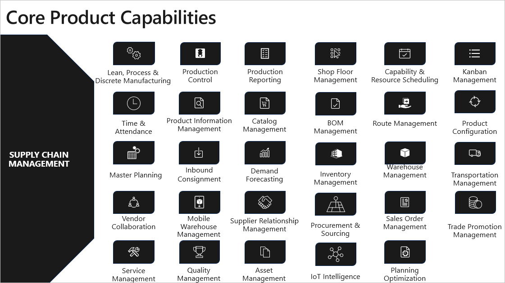
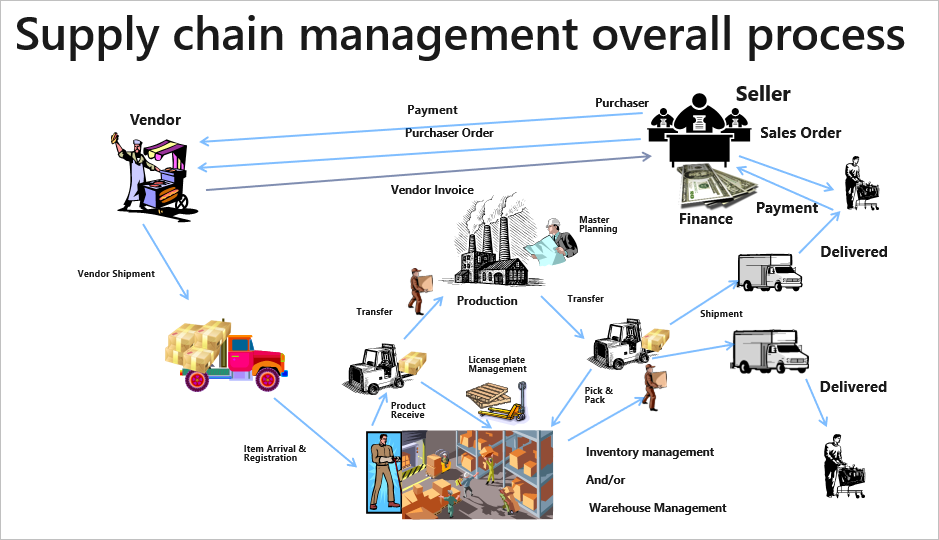
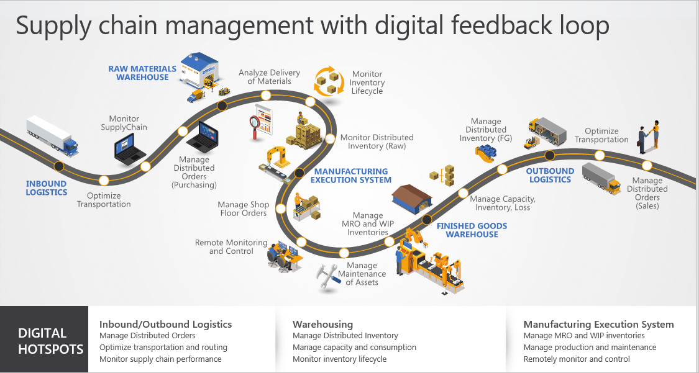

You make day-to-day decisions to align operational activities with the long-term goals of keeping excellence, promoting growth, and increasing profits. To make those decisions effectively, you need a central source of intelligence. You need a current understanding of your global workforce and supply chain, and the flexibility to collaborate anywhere, on any device. You need insights into your operations to drive change, rather than react to it.

Dynamics 365 Supply Chain Management gives you the real-time visibility and intelligence required to move from reactive to proactive operations. It unifies data and uses AI and IoT predictive insights to maximize operational efficiency, product quality, and profitability across:

- Order fulfillment
- Planning
- Procurement
- Production
- Inventory
- Warehousing
- Transportation

The following image illustrates the Dynamics 365 Supply Chain Management features.

  

Before we review specific product features and capabilities, let’s start with a product overview.

Dynamics 365 Supply Chain Management streamlines production oversight, delivering intelligent insights to every transaction.

  
 
The major benefits Dynamics 365 Supply Chain Management delivers include:

- **Increased operational efficiencies:** You can accelerate the speed and accuracy of your operations with streamlined processes. The processes coordinate people, assets, and resources effectively to reduce costs, improve service levels, and drive growth. You can simplify resource management across any workload with an intelligent solution that helps you track and manage your resources.
- **Improved strategic planning:** You can get a unified view of inventory, warehouse, manufacturing, service, and logistics with predictive analytics that turn data into insights to support better strategic decisions.
- **Optimized workforce productivity:** You get a single source of business intelligence that drives productivity from assets and resources, aligns employees toward strategic goals. It also enables real-time response to organizational and customer demands.
- **Automated and streamlined supply chain processes:** You get a complete view of your supply chain across geographies and time zones when you integrate sales and purchasing with supply chain management functions. Use AI, machine learning, and IoT to deliver intelligent insights on every transaction, from ordering to fulfillment to final delivery.
 
  

Now, let's turn our attention to product information in Dynamics 365 Supply Chain Management.
