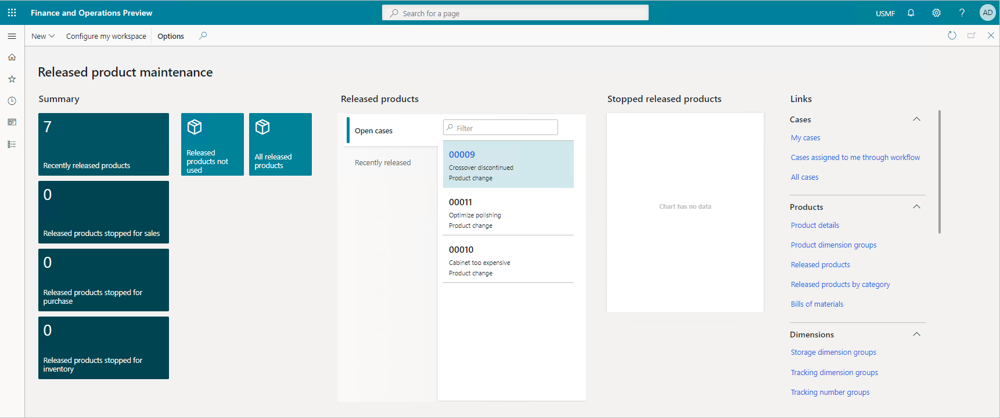

Product information management in Dynamics 365 Supply Chain Management is for the creation and maintenance of an enterprise product repository. This repository has the definitions of all the products an organization buys, stores, distributes, manufactures, and sells.

There are two product types:

- **Item**: You buy items that you use for consumption or distribution resale. You include items in the production of manufactured (BOM) items.
- **Service**: You use services, for example, to quantify hourly services.

  
 
There are three product subtypes:
 
  

- **Product:** A product is a uniquely identifiable product. It serves as a core product that doesn't vary. That's why you can’t associate product dimensions with the definition.
- **Product master:**  Product masters define how distinct products are described and how they behave in business processes. Based on these definitions, you generate distinct products. These distinct products are known as product variants.
- **Product variant:** Based on the choice of the configuration technology, you can either predefine the product variant using the product dimensions of its master, or configure it using a product configuration tool.

Product information gives larger organizations a centralized, structured approach to creating and maintaining core master data. This core master data includes product definitions. Smaller organizations that require a more decentralized approach can create and maintain their respective products with some restrictions. Dynamics 365 Supply Chain Management adds products are to the shared products repository automatically.

Examples of a product include a screwdriver, a carton of milk, or a piece of machinery. They’re all defined products. An example of a product master is clothing, such as a t-shirt, which is available in multiple sizes and colors. The various t-shirts are product variants.

  
 
At this point, a *product designer* creates the product dimension values needed for the variants. The product dimension includes colors (red, magenta, and green), sizes (small, medium, and large), and styles (V-neck and round neck). Once you define the values, a *product designer* creates the variants, which combine the dimensions into your specific options, such as red-small, red-medium, red-large, blue-small, and so on. 

You use category hierarchies for many reasons. Examples include classifying products, vendors, customers, or transactions for reporting and analysis purposes. Each category hierarchy has a structure of subcategories. You can create more than one category hierarchy. For example, you might create one category hierarchy for classifying purchased products and another hierarchy for classifying vendors.

Product attributes define the details that you want to keep for your products, such as brands, manufacture, model, and so on. They provide additional details that you want to record for a particular product or category.

Dynamics 365 Supply Chain Management helps you create and apply templates to speed up the product creation process and release new products to production to fulfill demand.

  
 
Dynamics 365 Supply Chain Management also makes it easy for product engineers and managers to manufacture the new product, approve BOMs quickly, accelerate product introductions, and approve products for production. It includes a *released product maintenance* workspace that makes it easy to accelerate product introductions. 

|  |  |
| ------------ | ------------- | 
|  | In this video, you'll learn the details of the product lifecycle and configuration. |
 
> [!VIDEO https://www.microsoft.com/videoplayer/embed/RE4iefZ]

The video showed the different aspects of the product lifecycle and the configurations that construct a product. 

The product information management module ensures that products share definitions, documentation, attributes, and identifiers. You configure and manage your data from a single location. This situation ensures that product information is consistent and correct. 

Next, let's take a look at the master planning functionality in Dynamics 365 Supply Chain Management.
