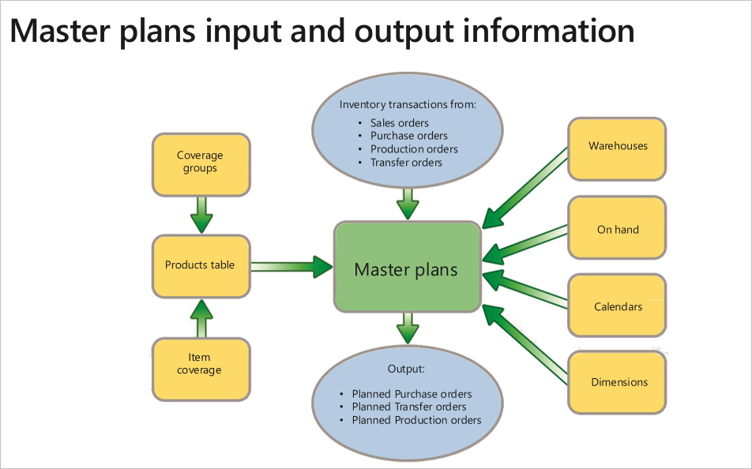
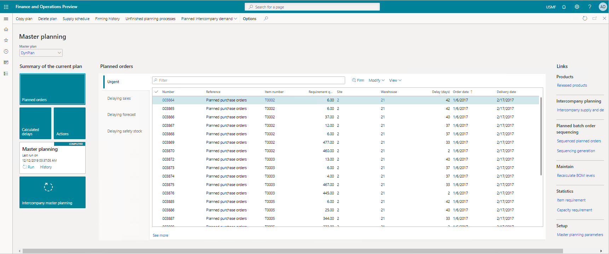
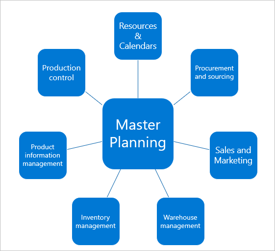

Dynamics 365 Supply Chain Management master planning allows you to synchronize production, storage, and transport with demand. The coordination of these elements maximizes efficiency, cuts costs, and supports profitability. Master planning assesses the following information:

- What is required to complete production?  
- What is currently available?  
- What is needed? More specifically, what must be manufactured, bought, transferred, or set aside as safety stock?  
 
  

Master planning allows you to do production planning in real-time, reducing lead-time for new demands and supply. It accelerates product delivery by automating the flow of information and materials through your resources and locations.

Predictive analytics help you optimize planning and improve the fulfillment, material sourcing, and logistics of their supply chain.

  

The purpose of master planning is to calculate how you can purchase the correct materials at the correct time and use the correct resources in the correct place. There are two types of master plans:

- **Static plans:** Static master planning uses the current data to generate a net requirements plan. This plan stays unchanged until the next time you run master planning. It's an operating plan that you use to base your decisions on and do your daily tasks.
- **Dynamic plans:** Dynamic master planning starts with the same net requirements plan generated by static master planning. However, you update the dynamic plan every time that the master data changes. You can update it when you create a new sales order, for example. These continual updates allow you to monitor the changing order network and item availability without disturbing the static plan that others are using for their work processes.

Dynamics 365 Supply Chain Management connects and optimizes production planning, scheduling, operations, and cost management. 

You can change the output of the schedule by running a regenerative or net change plan update, or both. Regenerative plans update all requirements. Net change plans only update the plan on items with new requirements that have come in since the last master planning run.

Master planning calculates requirements and results when generating planned orders. The three main master planning processes include:

- **Master planning:** The master plan calculates net requirements. It's based on actual current orders and allows you to control inventory replenishment on a short-term, day-to-day basis. You can also call it the net requirements plan.
- **Forecast plan:** The forecast plan calculates gross requirements. It's based on future projections and allows you to conduct long-term master planning of materials and capacity.
- **Intercompany master planning:** The intercompany master plan calculates net requirements across legal entities. It connects demand and supply between organizations not only for short-term, firm demand and supply, but also for long-term, planned demand and supply.

The following figure displays the primary modules integrated with master planning:
 
  

The outcome of running a master plan is planned purchase, production, or transfer orders. When you firm planned orders, they become an actual order.

|  |  |
| ------------ | ------------- | 
|  | The video shows an overview of master planning. |
 
> [!VIDEO https://www.microsoft.com/videoplayer/embed/RE4ibEC]

The video showed an overview of:

- Master resource scheduling.
- Demand forecasting.
- Intercompany planning.
- Master plan creation.
- Planned order creation.
- Master planning parameter configuration. 

You use master planning to view logistical information across sites, warehouses, and transportation modes. You combine sales and purchasing to gain planning insights on inventory, production, and warehouses to forecast, plan, and prepare for the future.

Now, let's take a look at sales order management in Dynamics 365 Supply Chain Management.
