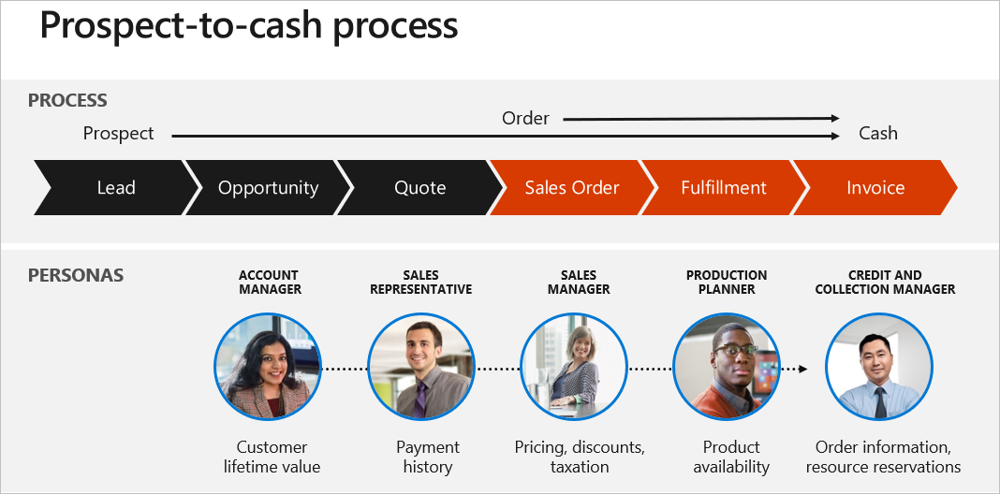
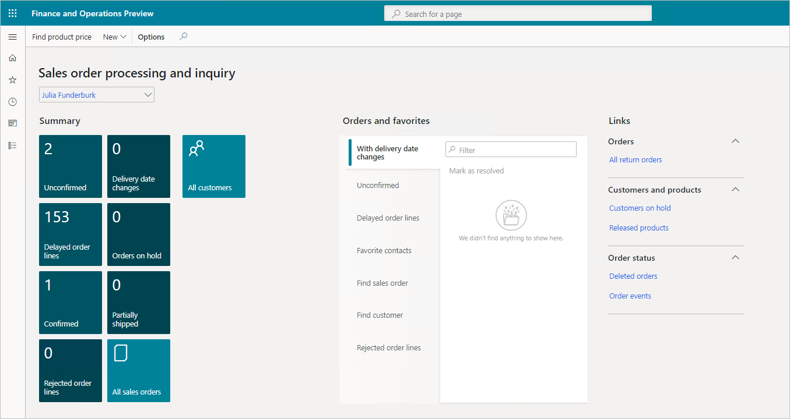

The order-to-cash process manages the life cycle of the sales process, which consists of the subprocesses of receiving and processing customer sales. You may require contractual sales agreements, to ensure customers fulfill commitments before you accept and process sales orders.

  

In the order-to-cash process, you receive orders via different methods, such as website, email, and telephone. You fulfill the orders through your logistics group. You can reserve the items before you pick, pack, and ship them to your customers. You invoice the orders and record the customer debts in the system. Your monitor the debts. When you receive the customer payments, you settle the payments and invoices.

Dynamics 365 Supply Chain Management helps organizations optimize fulfillment and reduce costs by synchronizing logistics across sites, warehouses, and transportation modes. This synchronization allows you to respond to customer demand quickly by automating the coordination of order-to-cash processes.

Dynamics 365 Supply Chain Management helps you choose delivery alternatives by combining all the relevant information in one interactive page. Now you can offset availability and shipping issues and fulfill orders faster. It includes the sales order processing and inquiry workspace that makes it easy for you to ensure customers get their items quickly.

  

Issuing a quotation closely matches the process for issuing a sales order. Most functionality found in the Sales order form is also available in the Sales quotation form. You convert quotations accepted by customers into sales orders. You can only confirm quotations created for a prospect when you convert the prospect to a customer.

Every sales order line transaction includes important data, such as unit numbers, pricing, delivery, and payment information. When you place an order, it must meet operational criteria. The criteria include quality checks, picking cycles, profit margins, bill of materials (BOM), formulas, and revisions.

Sales representatives create configuration models with embedded constraints. You can configure customer requirements and product attributes during the sales process. The model generates a list of required materials and routes automatically.

Customer returns are part of every business. Dynamics 365 Supply Chain Management tracks every return and the reason, giving you vital insights to minimize future returns. Customers return items for many reasons. For example, an item might be defective, or it might not meet the customer's expectations. The return process starts when a customer issues a request to return an item. After you receive the customer's request, Dynamics 365 Supply Chain Management creates a return order.

By unifying processes from sales to fulfillment, Dynamics 365 Supply Chain Management connects sales and purchasing with logistics, production, and warehouse management for a 360-degree view of your supply chain. It helps you reduce procurement costs and gain greater control by automating procure-to-pay processes including:

- **Improving customer orders and delivery** with correct delivery date estimates that consider material availability and capacity constraints across organizations, sites, and warehouses.
- **Optimizing fulfillment and reducing costs** by synchronizing logistics across sites, warehouses, and transportation modes.
- **Accelerating product delivery** by automating the flow of information and materials through your resources and locations.
- **Increasing quality and customer satisfaction** with integrated quality control capabilities, and finding and resolving issues through real-time, predictive insights.

|  |  |
| ------------ | ------------- | 
|  | This video shows components of the sales order management functionality, including customer trade agreements. |
> [!VIDEO https://www.microsoft.com/videoplayer/embed/RE4ieg4]

The video showed customer trade agreements, available to promise functionality from a sales order and customer rebates.

As orders come in and demand rises, you can check on organizational and warehouse impact using sales order management. You can create and process sales orders, relating to both products and customers and ensure that picking and packing lists are correct and ready for shipment. 

Now let's take a look at procurement and sourcing in Dynamics 365 Supply Chain Management.
