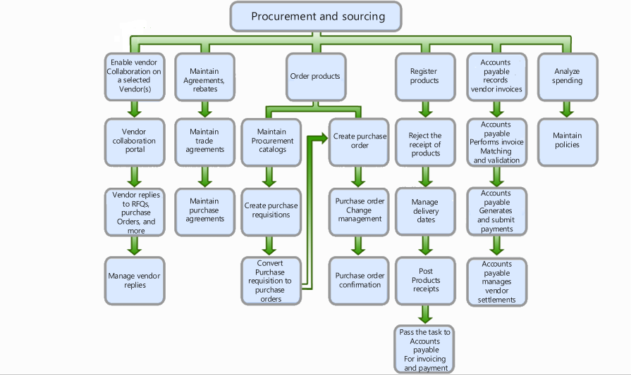
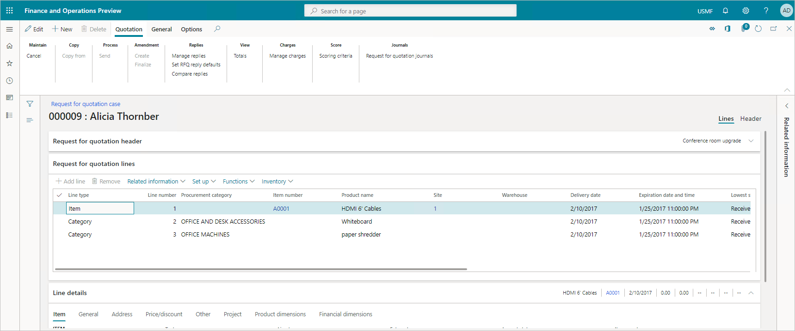
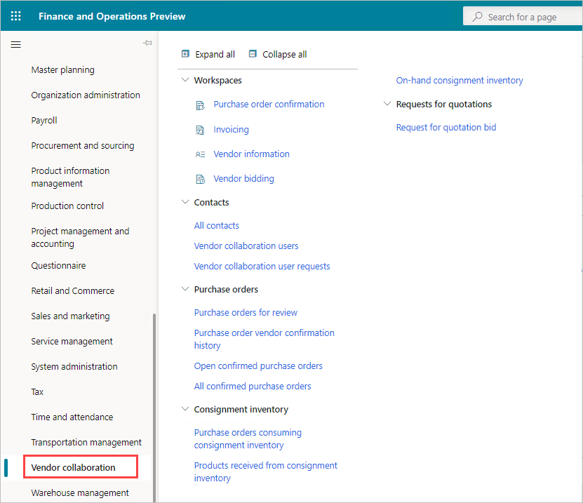

Maintaining clear communication with the vendors in your supply chain is vital to ensuring order accuracy and minimizing delays. A key aspect of supply chain management is to ensure the quality of vendor products.

Procurement and sourcing in Dynamics 365 Supply Chain Management covers all the steps, from finding a need for product and services through getting the product, registration, and receipt. It finds purchasing needs, locates suppliers, and monitors deliveries by suppliers. It helps you adhere to stringent product standards at every stage.

The following figure shows the typical processes involved in procurement and sourcing.

> [!div class="mx-imgBorder"]
>   

Dynamics 365 Supply Chain Management streamlines procurement processes by using a single application for procure-to-pay to manage contracts, manage agreements, monitor on-time delivery performance, and collaborate with external vendors.

A purchase requisition is a document created by employees who don't have permission to create purchase orders. The requestor—the employee or the manager of the employee—creates the purchase requisition and submits it to the purchasing department via workflow to be approved or authorized. 

The purchasing department then uses the purchase requisitions to generate the actual purchase orders for the items requested by the employee. 

Purchase requisitions are internal documents, but purchase orders are the equivalent of external documents that the purchasing department submits to vendors.

The request for quotation (RFQ) process invites suppliers to bid on specific products and services. The RFQ is a document you issue when you want to buy products. You choose to invite organizations to submit competitive bids.

  

The vendor collaboration interface portal exposes a limited set of information about purchase orders to external vendor users. With the vendor collaboration portal, you can:

- Create new vendor contacts.
- Provision new vendor users.
- Provide collaboration between purchasing agents and external vendors.
- Monitor consignment inventory.
- Work with purchase orders.
- View and submit vendor invoices.

  
  
In procurement and sourcing, you create purchasing policies to control the purchasing process. A purchasing policy is a collection of rules, such as accessing product categories or product catalogs, requisitions and more, that you set up to control the purchasing process.

Purchasing policies help you implement your procurement strategy by creating a policy structure that aligns with your strategic purchasing needs.

You find suppliers, onboard suppliers as new vendors, maintain vendor information, create agreements with their vendors, order items and services, maintain purchase orders, and confirm receipt of products. After you process vendor transactions, you can analyze spending and vendor performance. 

|  |  |
| ------------ | ------------- | 
|  | The video introduces you to procurement including purchase requisition, request for quotation, and more. |

> [!VIDEO https://www.microsoft.com/videoplayer/embed/RE4i6rK]

The video showed the lifecycle of a purchase requisition, request for quotation, and the conversion of a purchase requisition to a purchase order.

In Dynamics 365 Supply Chain Management, you can identify the supplies and materials needed based on upcoming jobs. Then you can locate the best suppliers based on current stock, costs, and time to delivery. Finally, you can monitor delivery time and communicate with your vendors. 

Next, we'll review asset management in Dynamics 365 Supply Chain Management. 
