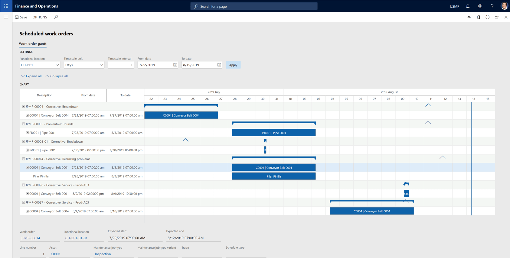
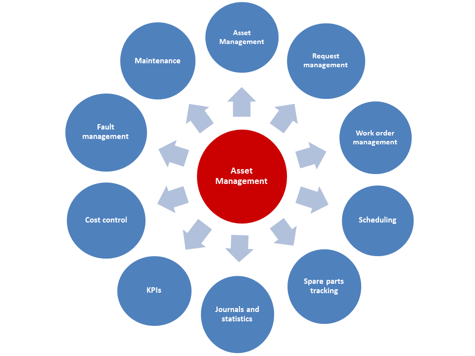
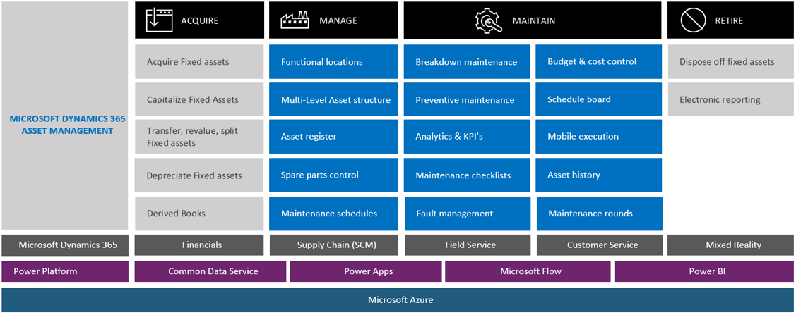

Dynamics 365 Supply Chain Management includes asset management, which maximizes the life of your assets by managing assets and maintenance jobs.

Asset management lets you do all the tasks that are related to managing and servicing all the equipment in a company efficiently. This equipment includes machines, production equipment, and vehicles.

You can extend the life and performance of your equipment by using IoT and mixed reality to plan, predict, and complete asset maintenance.

Assets and work orders are central parts of asset management. An asset is a machine or machine part that requires continuous maintenance and service. You can create assets in a hierarchical structure, and you can relate them functional locations. You can plan maintenance jobs at all levels in the asset structure.

> [!div class="mx-imgBorder"]
>   

You set up product information, asset specification, and required maintenance plans for each asset.

> [!div class="mx-imgBorder"]
>   

Asset management supports solutions across industries. It integrates with several modules, as shown in the following image.

> [!div class="mx-imgBorder"]
>   

With asset management, you can:

- **Maintain your assets effectively** from acquisition to retirement by streamlining tracking and monitoring KPIs to improve the overall equipment effectiveness (OEE) of your mission-critical assets.
- **Plan and predict maintenance effectively** to maximize the longevity and performance of high-value assets while reducing costs and production downtime.
- **Support various types of maintenance** such as predictive, corrective, condition, and preventative with a single solution.
- **Track and monitor the KPI of their devices**, create analytics on productivity, and schedule and do maintenance before failure occurs.  
 

|  |  |
| ------------ | ------------- | 
|  | The video shows asset management in action. |
> [!VIDEO https://www.microsoft.com/videoplayer/embed/RE4ieg1]

The video explored the process of creating a scheduled maintenance plan.

With asset management, you can track and monitor KPIs and analytics. You can schedule and perform asset maintenance to protect and improve asset performance. 

Now let's turn our attention to warehouse management.
