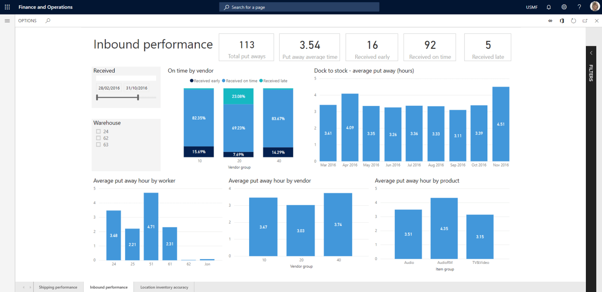

Warehouse management provides machine learning-enhanced guidance that recommends more effective inventory management and ensures that you won't run out of stock.

With Dynamics 365 Supply Chain Management's warehouse management functionality, you can:

- **Gain complete visibility of your warehouse operations and inventory** to manage capacity and consumption of your raw materials effectively and movement of finished goods in real time.
- **Automate and scale** your warehouse management to optimize use of space—from simple stock rooms to distribution centers. Effectively manage materials and finished goods with configurable machine learning-based guidance.
- **Get real-time intelligence about the health of your warehouse** with Power BI warehousing analytics that gives you full visibility of your inventory and receiving, picking, and shipping operations. Easily create no-code customized heatmaps of your warehouse processes.
- **Improve productivity with a mobile app** that you can tailor for employees and warehouses to simplify the performance of daily tasks.

Warehouse management in Dynamics 365 Supply Chain Management gives you visibility into your inventory, shipping, and receiving. You can review important data using mobile applications to create a warehouse management operation informed by better strategic decisions.

The warehouse management module lets you manage warehouse processes in manufacturing, distribution, and retail companies. The module has a wide range of features to support the warehouse facility at an optimal level, at any time. You can integrate warehouse management with other business processes such as transportation, manufacturing, quality control, purchase, transfer, sales, and returns.

With warehouse management, you can avoid running out of stock, or overstocking, through machine learning-enhanced guidance that recommends effective inventory management. You gain complete visibility of your warehouse operations and inventory, allowing you to manage capacity, the consumption of raw materials, and movement of finished goods in real time. You can automate and scale your warehouse management to optimize use of space—from simple stock rooms to distribution centers. You can also manage materials and finished goods with configurable machine learning-based guidance effectively.

You'll get real-time intelligence about the health of your warehouse with Power BI in-depth warehousing analytics. You'll have full visibility of your inventory and receiving, picking, and shipping operations. 

The following image shows the Dynamics 365 Supply Chain Management inbound performance overview.

> [!div class="mx-imgBorder"]
> 

With Dynamics 365 Supply Chain Management, it’s easy to process incoming purchase orders and streamline your inbound supply chain processes. You can optimize your outbound supply chain with automatic sales order release, efficient picking operations, and coordinated staging for shipment. With Dynamics 365 Supply Chain Management, it’s easier than ever to get products to customers quickly.

A work template defines the sequence of steps to get each item to the right staging location in the warehouse. With the warehousing mobile app, you can pick and place items quickly using any Android or Windows device. The solution supports both user-directed and system-directed picking. In this case, let’s use system-directed picking.

The warehousing mobile app is a powerful scanning solution for all inventory and warehouse operations. You can take advantage of advanced business intelligence on inbound receiving functions like counting, and on-hand precision and outbound shipping processes. Power BI analytics allows you to create custom reports from extensive capture data. Embedded strategies and guidance enable effective streamlining of picking procedures.

> [!div class="mx-imgBorder"]
>   

## Inbound scenario

For example, a shipment arrived at the warehouse. The vendor confirmed the delivery date, along with details about the shipped items. Using the warehousing mobile app, you can receive purchases from any handheld device quickly.

First, you enter the purchase order ID number, either by typing it or scanning it. Then you enter the quantity received for individual units or license plates (numbers assigned to each containment unit), and the system includes the conversion rate for reference. Using license plates to manage inventory reduces manual data entry and ensures efficient operations.

Next, you can use the app’s system-directed put-away capabilities for best warehouse placement. The solution determines the best put-away location based on flexible rules that consider item quantity, quality assurance requirements, and other customizable parameters. You can review the inventory status for the license plate as available, confirming that you received the purchase and put away.

## Outbound scenario

For example, to ensure efficient picking and shipping, the system grouped a sales order into a wave based on the order’s handling instructions and delivery requirements automatically. It determines which items need to be picked from where, based on rules that optimize the movement of goods.

First, you enter the license plate ID for the sales order, either by typing it, or scanning it. The system determines the best staging location to ensure the goods get to the customer quickly, by system-directed staging capabilities to load the items in the appropriate location for shipment. The system coordinates dock scheduling, so you know when and where to load the items for transport.

|  |  |
| ------------ | ------------- | 
|  | Watch this video to better understand warehouse management. |

> [!VIDEO https://www.microsoft.com/videoplayer/embed/RE4ijs4]

The video showed the basic warehouse configurations such as locations, zones, warehouses, and sites. It also explored the warehousing mobile app capabilities.

Now it's time to turn to the topic of manufacturing.
